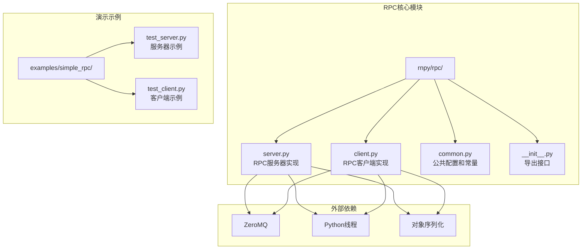
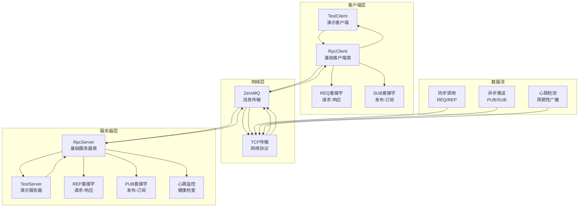
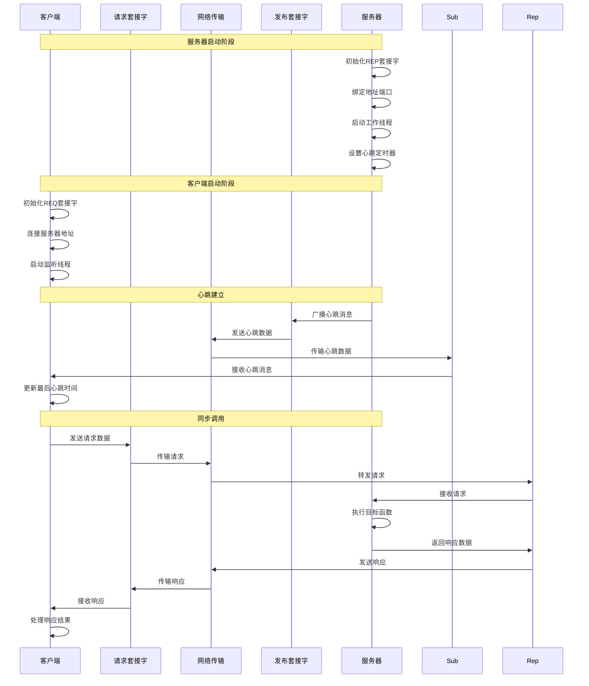
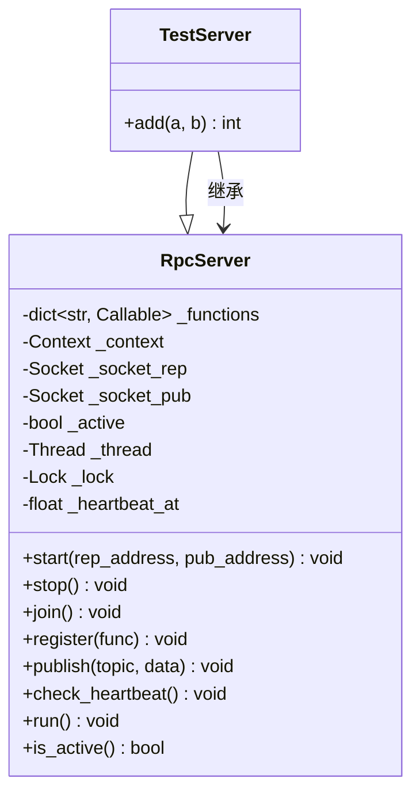
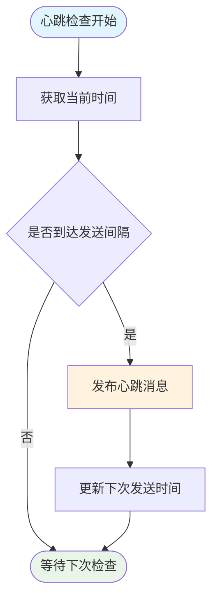
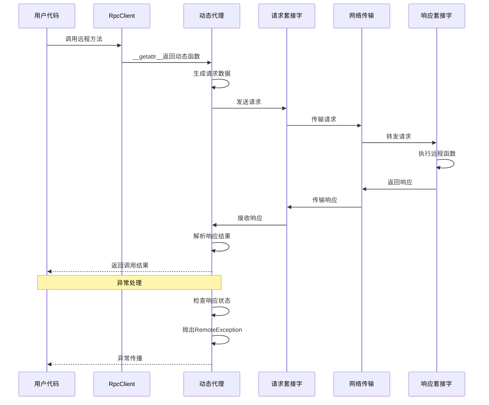
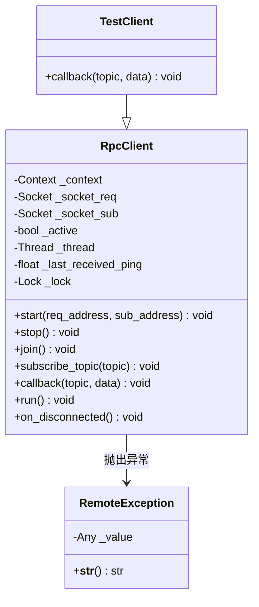
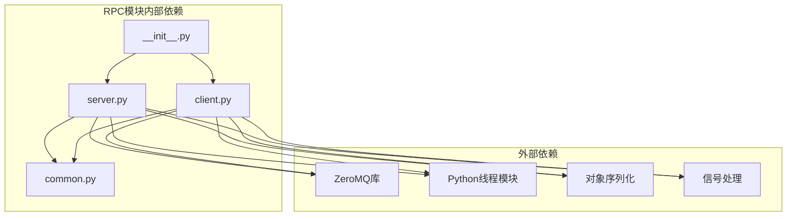
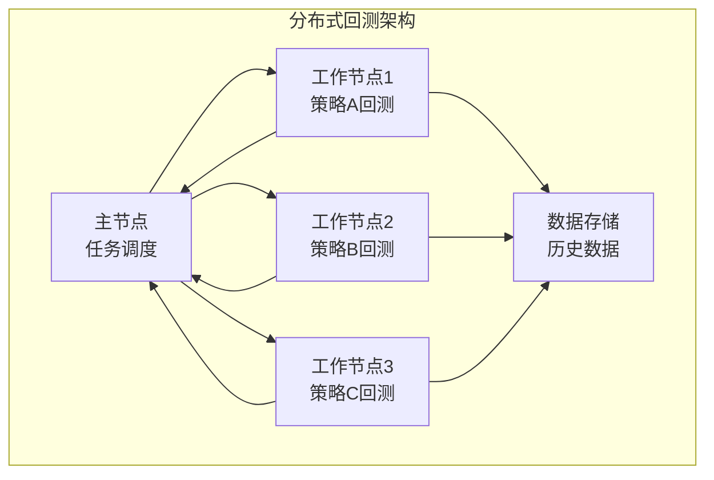
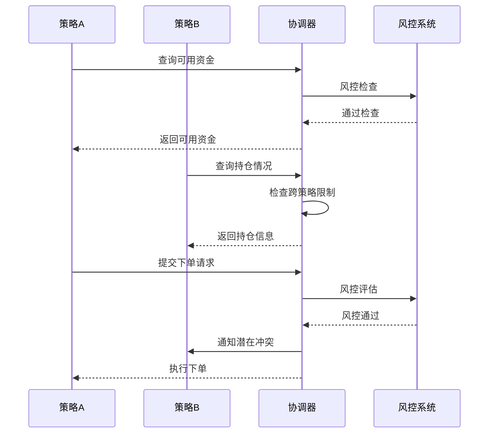

# RPC分布式示例

<cite>
**本文档引用的文件**
- [test_server.py](file://examples/simple_rpc/test_server.py)
- [test_client.py](file://examples/simple_rpc/test_client.py)
- [__init__.py](file://vnpy/rpc/__init__.py)
- [server.py](file://vnpy/rpc/server.py)
- [client.py](file://vnpy/rpc/client.py)
- [common.py](file://vnpy/rpc/common.py)
</cite>

## 目录
1. [简介](#简介)
2. [项目结构](#项目结构)
3. [核心组件](#核心组件)
4. [架构概览](#架构概览)
5. [详细组件分析](#详细组件分析)
6. [依赖关系分析](#依赖关系分析)
7. [性能考虑](#性能考虑)
8. [故障排除指南](#故障排除指南)
9. [结论](#结论)
10. [附录](#附录)

## 简介

VeighNa框架的RPC分布式通信示例提供了一个完整的分布式消息传递解决方案，基于ZeroMQ实现。该示例展示了如何构建高性能的进程间通信系统，支持请求-响应模式和发布-订阅模式，适用于量化交易中的各种分布式场景。

RPC模块采用双模式架构设计：
- **请求-响应模式**：用于同步方法调用和远程过程调用
- **发布-订阅模式**：用于异步事件推送和数据广播

这种设计使得系统能够同时支持同步调用和异步通知，满足量化交易中对实时性和可靠性的双重需求。

## 项目结构

RPC分布式示例的项目结构清晰地分离了核心功能和演示代码：

**图表来源**
- [__init__.py](file://vnpy/rpc/__init__.py#L1-L9)
- [server.py](file://vnpy/rpc/server.py#L1-L141)
- [client.py](file://vnpy/rpc/client.py#L1-L170)

**章节来源**
- [__init__.py](file://vnpy/rpc/__init__.py#L1-L9)
- [test_server.py](file://examples/simple_rpc/test_server.py#L1-L39)
- [test_client.py](file://examples/simple_rpc/test_client.py#L1-L35)

## 核心组件

### RPC服务器 (RpcServer)

RpcServer是分布式通信的核心组件，负责处理客户端的远程调用请求并管理服务生命周期。

**主要特性：**
- **函数注册机制**：通过装饰器模式自动注册可调用函数
- **双Socket架构**：同时支持请求-响应和发布-订阅通信
- **线程安全设计**：使用锁机制保护共享资源
- **心跳监控**：内置健康检查机制确保连接状态

**关键数据结构：**
- `_functions`: 字典存储可调用函数映射
- `_context`: ZeroMQ上下文管理
- `_socket_rep`: 请求-响应套接字
- `_socket_pub`: 发布-订阅套接字

### RPC客户端 (RpcClient)

RpcClient提供透明的远程过程调用接口，允许客户端像调用本地函数一样调用远程服务。

**主要特性：**
- **动态代理生成**：通过`__getattr__`实现动态方法调用
- **异常封装**：将远程异常转换为本地异常类型
- **超时控制**：支持可配置的请求超时机制
- **异步事件处理**：支持订阅主题并处理推送消息

**关键数据结构：**
- `_socket_req`: 请求套接字
- `_socket_sub`: 订阅套接字
- `__getattr__`: 动态方法生成器
- `callback`: 异步回调处理函数

**章节来源**
- [server.py](file://vnpy/rpc/server.py#L11-L141)
- [client.py](file://vnpy/rpc/client.py#L29-L170)

## 架构概览

RPC分布式系统的整体架构采用客户端-服务器模式，结合ZeroMQ的多种消息传递模式：

**图表来源**
- [test_server.py](file://examples/simple_rpc/test_server.py#L6-L39)
- [test_client.py](file://examples/simple_rpc/test_client.py#L6-L35)
- [server.py](file://vnpy/rpc/server.py#L24-L28)
- [client.py](file://vnpy/rpc/client.py#L37-L41)

### 进程间通信建立流程

**图表来源**
- [server.py](file://vnpy/rpc/server.py#L42-L62)
- [client.py](file://vnpy/rpc/client.py#L88-L111)
- [common.py](file://vnpy/rpc/common.py#L8-L11)

## 详细组件分析

### 服务器端实现详解

#### 函数注册机制

服务器通过装饰器模式实现函数注册，提供了简洁的API接口：

**图表来源**
- [server.py](file://vnpy/rpc/server.py#L11-L141)
- [test_server.py](file://examples/simple_rpc/test_server.py#L6-L25)

#### 心跳机制实现

心跳机制是RPC系统健康监控的关键组件，确保客户端能够及时发现服务器状态变化：

**图表来源**
- [server.py](file://vnpy/rpc/server.py#L129-L141)
- [common.py](file://vnpy/rpc/common.py#L8-L11)

**章节来源**
- [server.py](file://vnpy/rpc/server.py#L116-L141)
- [test_server.py](file://examples/simple_rpc/test_server.py#L17-L24)

### 客户端实现详解

#### 动态方法调用机制

客户端通过Python的描述符协议实现透明的远程调用：

**图表来源**
- [client.py](file://vnpy/rpc/client.py#L55-L86)
- [client.py](file://vnpy/rpc/client.py#L61-L84)

#### 异步事件处理

客户端支持异步事件订阅和处理，通过回调机制实现松耦合的消息处理：

**图表来源**
- [client.py](file://vnpy/rpc/client.py#L29-L170)
- [test_client.py](file://examples/simple_rpc/test_client.py#L6-L22)

**章节来源**
- [client.py](file://vnpy/rpc/client.py#L11-L27)
- [test_client.py](file://examples/simple_rpc/test_client.py#L17-L21)

### 配置和部署流程

#### 服务器端配置步骤

1. **导入和继承**：从RpcServer基类继承，实现自定义业务逻辑
2. **函数注册**：使用`register()`方法注册可调用函数
3. **地址绑定**：设置请求和发布套接字的网络地址
4. **启动服务**：调用`start()`方法启动服务器
5. **心跳管理**：系统自动维护心跳机制

#### 客户端配置步骤

1. **导入和继承**：从RpcClient基类继承，实现回调处理
2. **主题订阅**：使用`subscribe_topic()`方法订阅感兴趣的主题
3. **连接服务器**：设置请求和订阅套接字的服务器地址
4. **启动客户端**：调用`start()`方法启动客户端
5. **异常处理**：实现`callback()`方法处理异步消息

**章节来源**
- [test_server.py](file://examples/simple_rpc/test_server.py#L27-L39)
- [test_client.py](file://examples/simple_rpc/test_client.py#L24-L35)

## 依赖关系分析

RPC模块的依赖关系相对简单，主要依赖于ZeroMQ库和标准Python库：

**图表来源**
- [__init__.py](file://vnpy/rpc/__init__.py#L1-L9)
- [server.py](file://vnpy/rpc/server.py#L6-L8)
- [client.py](file://vnpy/rpc/client.py#L6-L8)
- [common.py](file://vnpy/rpc/common.py#L1-L5)

### 错误处理策略

RPC系统实现了多层次的错误处理机制：

1. **网络层错误**：通过ZeroMQ的连接管理和重连机制处理网络异常
2. **应用层错误**：捕获远程函数执行异常并返回详细错误信息
3. **超时处理**：客户端侧的请求超时机制防止无限等待
4. **心跳检测**：服务器端的心跳机制检测客户端连接状态

**章节来源**
- [client.py](file://vnpy/rpc/client.py#L72-L84)
- [client.py](file://vnpy/rpc/client.py#L164-L170)
- [server.py](file://vnpy/rpc/server.py#L102-L107)

## 性能考虑

### 线程模型优化

RPC系统采用单线程事件循环配合工作线程的设计，平衡了性能和复杂度：

- **事件循环线程**：处理ZeroMQ套接字的轮询和I/O操作
- **工作线程**：执行具体的业务逻辑和函数调用
- **锁机制**：保护共享资源，避免竞态条件

### 内存管理

- **对象缓存**：使用LRU缓存机制缓存动态生成的方法代理
- **连接池**：ZeroMQ上下文作为轻量级连接池管理多个套接字
- **垃圾回收**：合理释放不再使用的套接字和上下文资源

### 网络优化

- **TCP保活**：启用TCP Keep-Alive机制检测断开连接
- **批量处理**：支持批量发布消息减少网络开销
- **负载均衡**：可扩展到多服务器部署支持水平扩展

## 故障排除指南

### 常见问题诊断

#### 连接失败问题

**症状**：客户端无法连接到服务器
**可能原因**：
1. 网络地址配置错误
2. 防火墙阻止连接
3. 服务器未正确启动

**解决方法**：
1. 验证服务器地址格式（tcp://host:port）
2. 检查防火墙设置
3. 确认服务器已成功绑定端口

#### 超时问题

**症状**：远程调用长时间无响应
**可能原因**：
1. 服务器过载或阻塞
2. 网络延迟过高
3. 请求参数过大

**解决方法**：
1. 增加超时时间配置
2. 优化服务器处理逻辑
3. 分割大数据请求

#### 心跳丢失

**症状**：客户端报告服务器无响应
**可能原因**：
1. 服务器崩溃或重启
2. 网络分区
3. 心跳间隔配置不当

**解决方法**：
1. 检查服务器日志
2. 验证网络连通性
3. 调整心跳容忍度配置

### 调试技巧

1. **启用详细日志**：在开发环境中增加日志输出
2. **监控网络状态**：使用网络工具检查连接状态
3. **性能分析**：使用性能分析工具识别瓶颈
4. **单元测试**：编写测试用例验证RPC功能

**章节来源**
- [client.py](file://vnpy/rpc/client.py#L164-L170)
- [server.py](file://vnpy/rpc/server.py#L87-L93)

## 结论

VeighNa框架的RPC分布式通信示例提供了一个成熟、可靠的分布式消息传递解决方案。通过ZeroMQ的高效消息传递和Python的优雅语法，该系统实现了以下关键优势：

1. **简洁易用**：通过继承基类即可快速实现分布式功能
2. **高性能**：ZeroMQ提供低延迟、高吞吐量的消息传递
3. **可靠性**：内置心跳机制和异常处理确保系统稳定性
4. **灵活性**：支持同步调用和异步推送两种模式

该RPC系统特别适用于量化交易场景，如分布式回测、多策略协调和数据同步等应用。通过合理的配置和优化，可以构建稳定高效的分布式量化系统。

## 附录

### 应用场景示例

#### 分布式回测系统

#### 多策略协调系统

### 配置最佳实践

1. **网络配置**：使用内网IP地址，避免跨网络延迟
2. **端口规划**：为不同服务分配独立的端口号
3. **超时设置**：根据业务特点调整超时时间和重试策略
4. **监控告警**：建立完善的监控体系及时发现异常
5. **安全考虑**：在生产环境启用网络安全措施