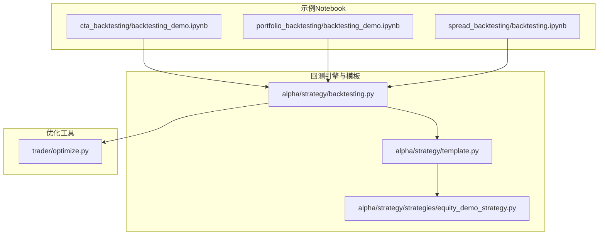
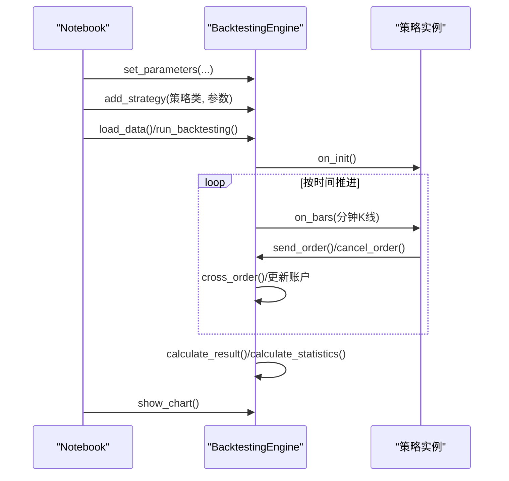
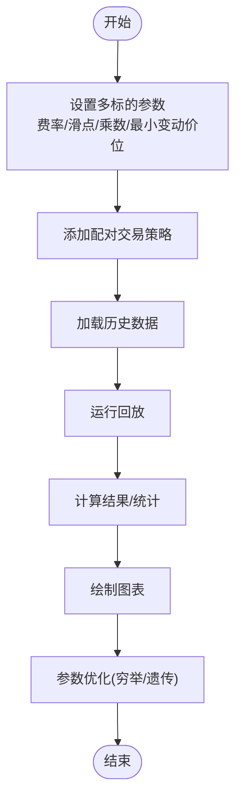
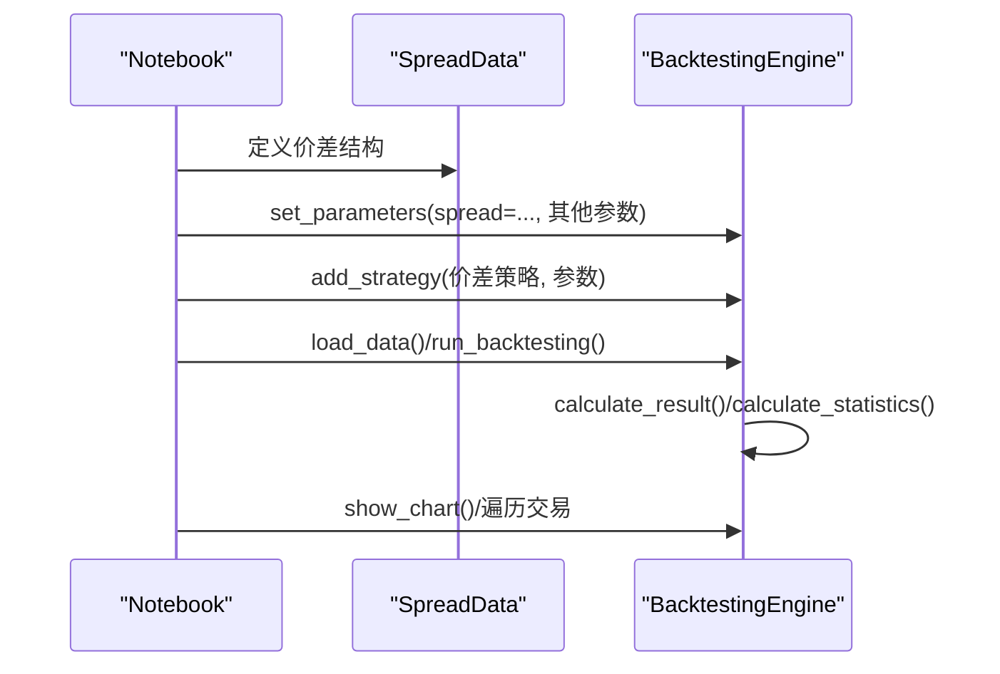
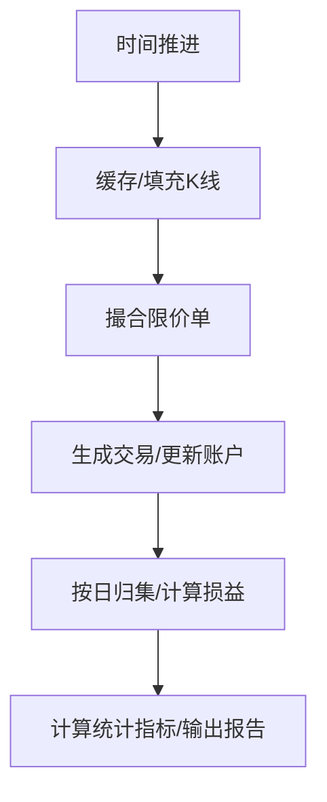
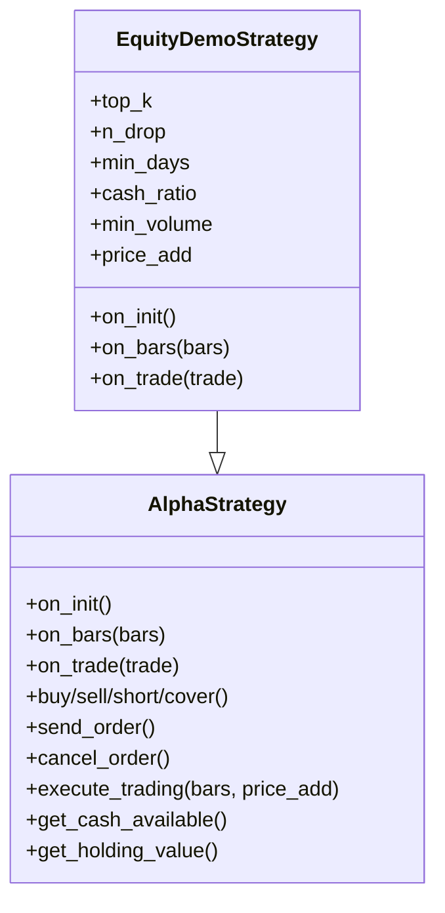
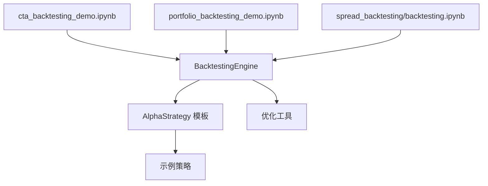

# 回测示例

<cite>
**本文引用的文件**   
- [examples/cta_backtesting/backtesting_demo.ipynb](file://examples/cta_backtesting/backtesting_demo.ipynb)
- [examples/portfolio_backtesting/backtesting_demo.ipynb](file://examples/portfolio_backtesting/backtesting_demo.ipynb)
- [examples/spread_backtesting/backtesting.ipynb](file://examples/spread_backtesting/backtesting.ipynb)
- [vnpy/trader/optimize.py](file://vnpy/trader/optimize.py)
- [vnpy/alpha/strategy/backtesting.py](file://vnpy/alpha/strategy/backtesting.py)
- [vnpy/alpha/strategy/template.py](file://vnpy/alpha/strategy/template.py)
- [vnpy/alpha/strategy/strategies/equity_demo_strategy.py](file://vnpy/alpha/strategy/strategies/equity_demo_strategy.py)
</cite>

## 目录
1. [引言](#引言)
2. [项目结构](#项目结构)
3. [核心组件](#核心组件)
4. [架构总览](#架构总览)
5. [详细组件分析](#详细组件分析)
6. [依赖分析](#依赖分析)
7. [性能考虑](#性能考虑)
8. [故障排查指南](#故障排查指南)
9. [结论](#结论)
10. [附录](#附录)

## 引言
本文件面向使用 VeighNa 框架进行量化回测的开发者，围绕三类典型回测场景提供系统化的示例与解析：单策略回测、组合策略回测与价差套利回测。内容覆盖数据准备、策略编写、回测执行、结果分析、参数调优与性能评估，并对滑点、手续费与资金管理等关键概念进行深入说明，辅以流程图与时序图帮助理解。

## 项目结构
本节聚焦与回测示例直接相关的目录与文件，展示从 Notebook 示例到回测引擎与优化模块的组织关系。



**图表来源**
- [examples/cta_backtesting/backtesting_demo.ipynb](file://examples/cta_backtesting/backtesting_demo.ipynb#L1-L120)
- [examples/portfolio_backtesting/backtesting_demo.ipynb](file://examples/portfolio_backtesting/backtesting_demo.ipynb#L1-L117)
- [examples/spread_backtesting/backtesting.ipynb](file://examples/spread_backtesting/backtesting.ipynb#L1-L131)
- [vnpy/alpha/strategy/backtesting.py](file://vnpy/alpha/strategy/backtesting.py#L22-L120)
- [vnpy/alpha/strategy/template.py](file://vnpy/alpha/strategy/template.py#L15-L120)
- [vnpy/alpha/strategy/strategies/equity_demo_strategy.py](file://vnpy/alpha/strategy/strategies/equity_demo_strategy.py#L12-L102)
- [vnpy/trader/optimize.py](file://vnpy/trader/optimize.py#L26-L130)

**章节来源**
- [examples/cta_backtesting/backtesting_demo.ipynb](file://examples/cta_backtesting/backtesting_demo.ipynb#L1-L120)
- [examples/portfolio_backtesting/backtesting_demo.ipynb](file://examples/portfolio_backtesting/backtesting_demo.ipynb#L1-L117)
- [examples/spread_backtesting/backtesting.ipynb](file://examples/spread_backtesting/backtesting.ipynb#L1-L131)
- [vnpy/alpha/strategy/backtesting.py](file://vnpy/alpha/strategy/backtesting.py#L22-L120)
- [vnpy/alpha/strategy/template.py](file://vnpy/alpha/strategy/template.py#L15-L120)
- [vnpy/trader/optimize.py](file://vnpy/trader/optimize.py#L26-L130)

## 核心组件
- 回测引擎 BacktestingEngine：负责加载历史数据、驱动回放、撮合订单、生成每日损益、计算统计指标与可视化。
- 策略模板 AlphaStrategy：定义策略生命周期回调、下单接口、头寸管理与目标仓位执行逻辑。
- 优化工具 OptimizationSetting 与 run_bf_optimization/run_ga_optimization：提供参数空间枚举与遗传算法优化能力。
- 示例策略 EquityDemoStrategy：演示多标的择时与再平衡思路，体现目标仓位与滑点处理。

**章节来源**
- [vnpy/alpha/strategy/backtesting.py](file://vnpy/alpha/strategy/backtesting.py#L22-L120)
- [vnpy/alpha/strategy/template.py](file://vnpy/alpha/strategy/template.py#L15-L120)
- [vnpy/trader/optimize.py](file://vnpy/trader/optimize.py#L26-L130)
- [vnpy/alpha/strategy/strategies/equity_demo_strategy.py](file://vnpy/alpha/strategy/strategies/equity_demo_strategy.py#L12-L102)

## 架构总览
下图展示了从 Notebook 驱动到回测引擎、策略模板与优化模块的整体交互。

```mermaid
sequenceDiagram
participant NB as "Notebook"
participant ENG as "BacktestingEngine"
participant STR as "AlphaStrategy"
participant TPL as "AlphaStrategy Template"
participant OPT as "Optimization Tools"
NB->>ENG : 设置参数/添加策略
NB->>ENG : 加载数据/运行回测
ENG->>STR : 初始化回调(on_init)
loop 历史数据回放
ENG->>STR : 分钟线回调(on_bars)
STR->>ENG : 下单/撤单
ENG->>ENG : 订单撮合/更新账户
end
ENG->>ENG : 计算每日损益/统计指标
NB->>OPT : 参数优化(穷举/遗传)
OPT-->>NB : 返回最优参数组合
```

**图表来源**
- [examples/cta_backtesting/backtesting_demo.ipynb](file://examples/cta_backtesting/backtesting_demo.ipynb#L18-L105)
- [examples/portfolio_backtesting/backtesting_demo.ipynb](file://examples/portfolio_backtesting/backtesting_demo.ipynb#L24-L93)
- [examples/spread_backtesting/backtesting.ipynb](file://examples/spread_backtesting/backtesting.ipynb#L39-L107)
- [vnpy/alpha/strategy/backtesting.py](file://vnpy/alpha/strategy/backtesting.py#L150-L226)
- [vnpy/alpha/strategy/template.py](file://vnpy/alpha/strategy/template.py#L43-L120)
- [vnpy/trader/optimize.py](file://vnpy/trader/optimize.py#L99-L230)

## 详细组件分析

### 单策略回测（CTA）
- 数据与参数准备：通过 Notebook 设置交易品种、周期、起止时间、费率、滑点、合约乘数、最小变动价位与初始资金。
- 策略编写：示例中使用 ATR+RSI 策略类，策略需实现初始化与分钟线回调逻辑。
- 回测执行：加载历史数据、运行回放、计算每日损益与统计指标、绘制曲线。
- 结果分析：输出总收益、年化收益、最大回撤、夏普比率、收益回撤比等指标；可导出交易明细。



**图表来源**
- [examples/cta_backtesting/backtesting_demo.ipynb](file://examples/cta_backtesting/backtesting_demo.ipynb#L18-L105)
- [vnpy/alpha/strategy/backtesting.py](file://vnpy/alpha/strategy/backtesting.py#L150-L226)
- [vnpy/alpha/strategy/template.py](file://vnpy/alpha/strategy/template.py#L43-L120)

**章节来源**
- [examples/cta_backtesting/backtesting_demo.ipynb](file://examples/cta_backtesting/backtesting_demo.ipynb#L18-L105)
- [vnpy/alpha/strategy/backtesting.py](file://vnpy/alpha/strategy/backtesting.py#L150-L226)
- [vnpy/alpha/strategy/template.py](file://vnpy/alpha/strategy/template.py#L43-L120)

### 组合策略回测（Pair Trading）
- 多标的并行回测：Notebook 中为两个合约分别设置费率、滑点、乘数与最小变动价位。
- 策略参数优化：通过 OptimizationSetting 定义目标（如夏普比率）与参数区间，支持穷举与遗传算法优化。
- 执行流程：加载数据、运行回测、计算结果与统计、绘图；随后进行参数优化并输出结果。



**图表来源**
- [examples/portfolio_backtesting/backtesting_demo.ipynb](file://examples/portfolio_backtesting/backtesting_demo.ipynb#L24-L93)
- [vnpy/trader/optimize.py](file://vnpy/trader/optimize.py#L99-L230)

**章节来源**
- [examples/portfolio_backtesting/backtesting_demo.ipynb](file://examples/portfolio_backtesting/backtesting_demo.ipynb#L24-L93)
- [vnpy/trader/optimize.py](file://vnpy/trader/optimize.py#L99-L230)

### 价差套利回测（Spread Trading）
- 价差构建：通过 SpreadData 定义构成腿、变量符号、权重方向、价格公式与交易乘数等。
- 回测参数：设置价差级别数据周期、起止时间、费率、滑点、乘数、最小变动价位与初始资金。
- 执行与分析：加载数据、运行回放、计算结果与统计、绘制图表；可遍历交易明细并进行参数优化。



**图表来源**
- [examples/spread_backtesting/backtesting.ipynb](file://examples/spread_backtesting/backtesting.ipynb#L24-L107)
- [vnpy/alpha/strategy/backtesting.py](file://vnpy/alpha/strategy/backtesting.py#L150-L226)

**章节来源**
- [examples/spread_backtesting/backtesting.ipynb](file://examples/spread_backtesting/backtesting.ipynb#L24-L107)
- [vnpy/alpha/strategy/backtesting.py](file://vnpy/alpha/strategy/backtesting.py#L150-L226)

### 回测引擎与撮合机制
- 数据加载与回放：按时间序列推进，缓存与填充缺失时段的K线，驱动策略回调。
- 订单撮合：基于当日高低价与涨跌停限制判断是否成交，按委托价格与滑点处理成交价，计算手续费与成交金额，更新账户与持仓。
- 每日损益与统计：按日归集交易，计算换手、手续费、交易盈亏、持有盈亏与净盈亏；生成资金曲线、回撤、日频损益分布等。



**图表来源**
- [vnpy/alpha/strategy/backtesting.py](file://vnpy/alpha/strategy/backtesting.py#L579-L797)
- [vnpy/alpha/strategy/backtesting.py](file://vnpy/alpha/strategy/backtesting.py#L170-L226)
- [vnpy/alpha/strategy/backtesting.py](file://vnpy/alpha/strategy/backtesting.py#L228-L402)

**章节来源**
- [vnpy/alpha/strategy/backtesting.py](file://vnpy/alpha/strategy/backtesting.py#L579-L797)
- [vnpy/alpha/strategy/backtesting.py](file://vnpy/alpha/strategy/backtesting.py#L170-L226)
- [vnpy/alpha/strategy/backtesting.py](file://vnpy/alpha/strategy/backtesting.py#L228-L402)

### 策略模板与示例策略
- AlphaStrategy 模板：提供 on_init/on_bars/on_trade 生命周期回调、下单/撤单封装、目标仓位与再平衡执行、资金与头寸查询等通用能力。
- EquityDemoStrategy 示例：演示多标的择时、持有期控制、现金比例管理与最小交易单位处理，体现目标仓位与滑点处理的实际应用。



**图表来源**
- [vnpy/alpha/strategy/template.py](file://vnpy/alpha/strategy/template.py#L15-L206)
- [vnpy/alpha/strategy/strategies/equity_demo_strategy.py](file://vnpy/alpha/strategy/strategies/equity_demo_strategy.py#L12-L102)

**章节来源**
- [vnpy/alpha/strategy/template.py](file://vnpy/alpha/strategy/template.py#L15-L206)
- [vnpy/alpha/strategy/strategies/equity_demo_strategy.py](file://vnpy/alpha/strategy/strategies/equity_demo_strategy.py#L12-L102)

## 依赖分析
- Notebook 示例依赖回测引擎与策略类；组合与价差示例分别针对多标的与价差场景。
- 回测引擎依赖策略模板与常量对象；优化模块提供参数空间枚举与多进程并行优化。
- 关键耦合点：策略通过引擎发送订单，引擎根据合约设置计算手续费与涨跌停约束，引擎按日汇总交易并计算指标。



**图表来源**
- [examples/cta_backtesting/backtesting_demo.ipynb](file://examples/cta_backtesting/backtesting_demo.ipynb#L18-L105)
- [examples/portfolio_backtesting/backtesting_demo.ipynb](file://examples/portfolio_backtesting/backtesting_demo.ipynb#L24-L93)
- [examples/spread_backtesting/backtesting.ipynb](file://examples/spread_backtesting/backtesting.ipynb#L39-L107)
- [vnpy/alpha/strategy/backtesting.py](file://vnpy/alpha/strategy/backtesting.py#L22-L120)
- [vnpy/alpha/strategy/template.py](file://vnpy/alpha/strategy/template.py#L15-L120)
- [vnpy/trader/optimize.py](file://vnpy/trader/optimize.py#L26-L130)

**章节来源**
- [examples/cta_backtesting/backtesting_demo.ipynb](file://examples/cta_backtesting/backtesting_demo.ipynb#L18-L105)
- [examples/portfolio_backtesting/backtesting_demo.ipynb](file://examples/portfolio_backtesting/backtesting_demo.ipynb#L24-L93)
- [examples/spread_backtesting/backtesting.ipynb](file://examples/spread_backtesting/backtesting.ipynb#L39-L107)
- [vnpy/alpha/strategy/backtesting.py](file://vnpy/alpha/strategy/backtesting.py#L22-L120)
- [vnpy/alpha/strategy/template.py](file://vnpy/alpha/strategy/template.py#L15-L120)
- [vnpy/trader/optimize.py](file://vnpy/trader/optimize.py#L26-L130)

## 性能考虑
- 并行优化：穷举与遗传算法均采用多进程池并行评估不同参数组合，显著缩短搜索时间。
- 数据回放：按时间排序推进，避免重复加载与无谓计算；缺失时段以最新收盘价填充，减少空窗影响。
- 指标计算：使用向量化库进行日频指标计算（如累计收益、回撤、滚动统计），降低 Python 循环开销。
- 可视化：Plotly 子图渲染，便于快速洞察收益、回撤与分布特征。

**章节来源**
- [vnpy/trader/optimize.py](file://vnpy/trader/optimize.py#L99-L230)
- [vnpy/alpha/strategy/backtesting.py](file://vnpy/alpha/strategy/backtesting.py#L150-L226)
- [vnpy/alpha/strategy/backtesting.py](file://vnpy/alpha/strategy/backtesting.py#L228-L402)

## 故障排查指南
- 数据为空或时间范围非法：检查起止时间、合约是否存在历史数据；确保时间顺序正确。
- 资金归零或爆仓：统计阶段会检测资金是否持续为正，若出现负值需调整参数或风控。
- 撮合失败或未成交：确认滑点、最小变动价位与涨跌停限制设置；检查委托价格是否在当日K线范围内。
- 参数优化无结果：核对优化目标名称与参数区间；确保生成的参数组合非空。

**章节来源**
- [vnpy/alpha/strategy/backtesting.py](file://vnpy/alpha/strategy/backtesting.py#L112-L148)
- [vnpy/alpha/strategy/backtesting.py](file://vnpy/alpha/strategy/backtesting.py#L228-L402)
- [vnpy/trader/optimize.py](file://vnpy/trader/optimize.py#L83-L96)

## 结论
本文基于 VeighNa 的回测示例，系统梳理了单策略、组合策略与价差套利三类场景的实现路径与关键要点。通过策略模板与回测引擎的清晰分层、优化工具的高效并行、以及严谨的资金与风控处理，开发者可以快速搭建稳定可靠的量化策略回测系统，并在此基础上开展参数调优与性能评估。

## 附录
- 关键概念速览
  - 滑点处理：以委托方向与最佳报价为基础，结合最小变动价位进行价格四舍五入。
  - 手续费计算：按成交金额乘以对应方向费率累加，支持不同合约差异化设置。
  - 资金管理：通过可用现金、头寸市值与目标仓位执行再平衡，控制整体风险暴露。
- 参数调优建议
  - 先穷举小范围网格验证有效性，再用遗传算法进行全局搜索。
  - 将“夏普比率”作为主要优化目标，兼顾“收益回撤比”与“最大回撤”等稳健性指标。
  - 对多标的场景，注意不同合约的费率与滑点差异，避免因个别合约极端成本导致整体劣化。