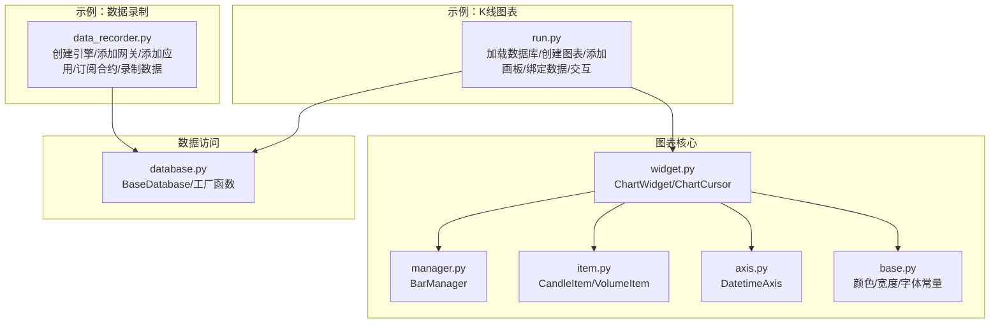
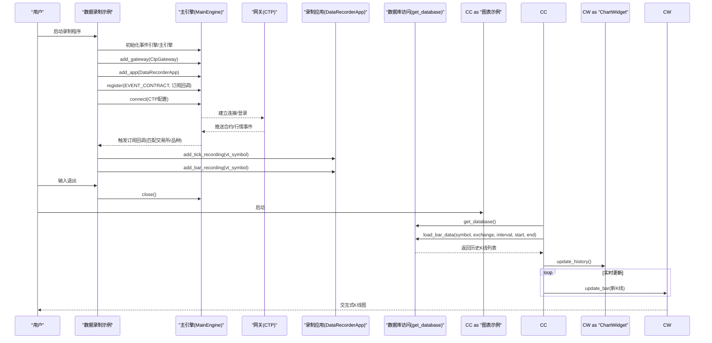
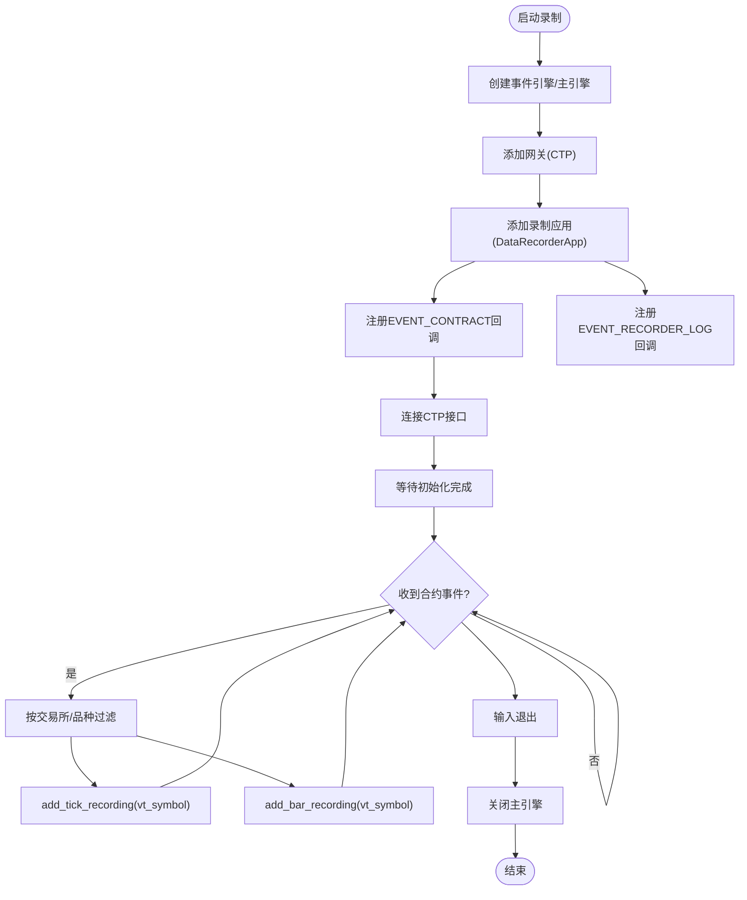
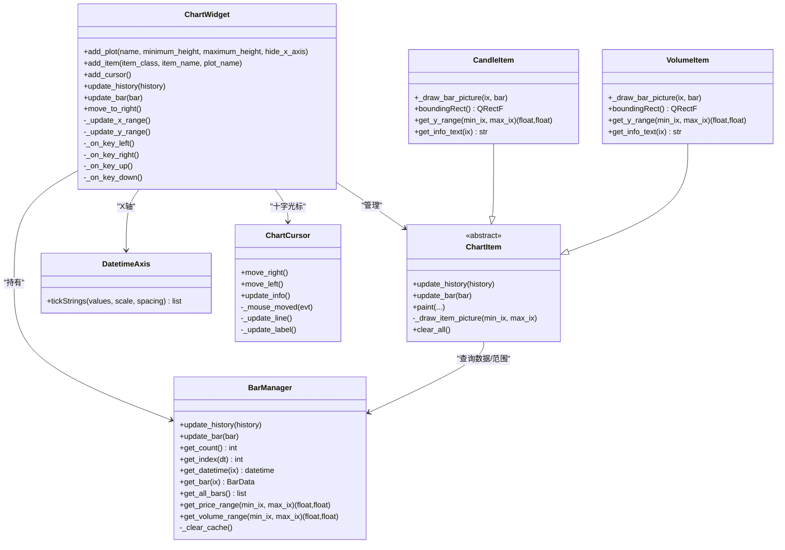
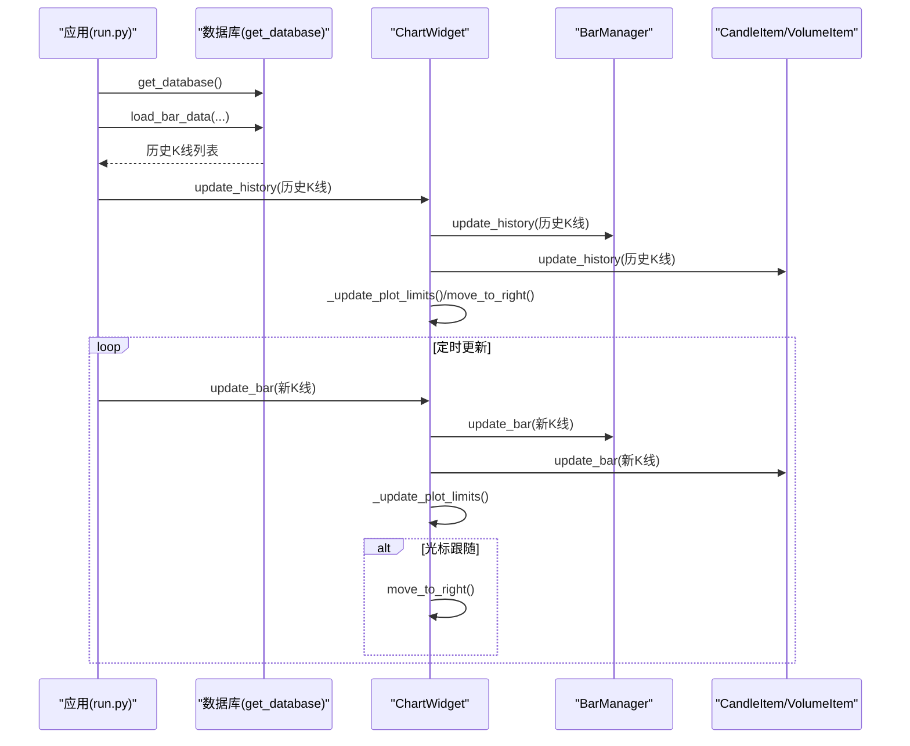
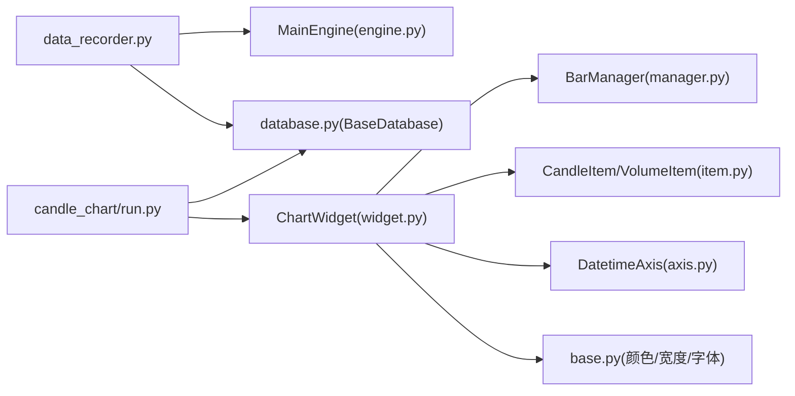

# 数据录制和图表示例

<cite>
**本文引用的文件**
- [examples/data_recorder/data_recorder.py](file://examples/data_recorder/data_recorder.py)
- [examples/candle_chart/run.py](file://examples/candle_chart/run.py)
- [vnpy/chart/widget.py](file://vnpy/chart/widget.py)
- [vnpy/chart/manager.py](file://vnpy/chart/manager.py)
- [vnpy/chart/item.py](file://vnpy/chart/item.py)
- [vnpy/chart/axis.py](file://vnpy/chart/axis.py)
- [vnpy/chart/base.py](file://vnpy/chart/base.py)
- [vnpy/trader/database.py](file://vnpy/trader/database.py)
- [vnpy/trader/engine.py](file://vnpy/trader/engine.py)
</cite>

## 目录
1. [简介](#简介)
2. [项目结构](#项目结构)
3. [核心组件](#核心组件)
4. [架构总览](#架构总览)
5. [详细组件分析](#详细组件分析)
6. [依赖关系分析](#依赖关系分析)
7. [性能考量](#性能考量)
8. [故障排查指南](#故障排查指南)
9. [结论](#结论)
10. [附录](#附录)

## 简介
本文件围绕VeighNa框架中的“数据录制”与“K线图表”两个示例，提供从配置到使用的全流程说明，涵盖数据源接入、录制规则、存储策略、K线图表的实现原理与自定义方法、交互与可视化流程，以及扩展与性能优化建议。目标读者既包括初学者，也包括希望构建生产级数据录制与可视化的工程师。

## 项目结构
本次文档聚焦以下示例与核心图表模块：
- 示例一：数据录制
  - 文件：examples/data_recorder/data_recorder.py
  - 功能：通过CTP接口连接期货市场，自动订阅并录制Tick与分钟K线数据，支持日志事件监听与安全退出。
- 示例二：K线图表
  - 文件：examples/candle_chart/run.py
  - 功能：加载数据库中的历史K线，动态叠加K线与成交量，提供鼠标/键盘交互与滚动缩放。

**图表来源**
- [examples/data_recorder/data_recorder.py](file://examples/data_recorder/data_recorder.py#L65-L142)
- [examples/candle_chart/run.py](file://examples/candle_chart/run.py#L9-L44)
- [vnpy/chart/widget.py](file://vnpy/chart/widget.py#L20-L323)
- [vnpy/chart/manager.py](file://vnpy/chart/manager.py#L9-L171)
- [vnpy/chart/item.py](file://vnpy/chart/item.py#L12-L334)
- [vnpy/chart/axis.py](file://vnpy/chart/axis.py#L10-L45)
- [vnpy/chart/base.py](file://vnpy/chart/base.py#L4-L22)
- [vnpy/trader/database.py](file://vnpy/trader/database.py#L52-L160)

**章节来源**
- [examples/data_recorder/data_recorder.py](file://examples/data_recorder/data_recorder.py#L1-L147)
- [examples/candle_chart/run.py](file://examples/candle_chart/run.py#L1-L44)

## 核心组件
- 数据录制器（示例）：通过主引擎添加网关与应用，注册合约事件回调以自动添加Tick与分钟K线录制任务；同时订阅录制日志事件进行输出。
- 图表组件（veighna_chart）：ChartWidget作为容器，管理多个Plot区域与图表项；BarManager负责K线数据索引与范围缓存；CandleItem/VolumeItem绘制K线与成交量；DatetimeAxis将索引转换为时间刻度；ChartCursor提供十字光标与信息面板。

**章节来源**
- [examples/data_recorder/data_recorder.py](file://examples/data_recorder/data_recorder.py#L65-L142)
- [vnpy/chart/widget.py](file://vnpy/chart/widget.py#L20-L323)
- [vnpy/chart/manager.py](file://vnpy/chart/manager.py#L9-L171)
- [vnpy/chart/item.py](file://vnpy/chart/item.py#L12-L334)
- [vnpy/chart/axis.py](file://vnpy/chart/axis.py#L10-L45)
- [vnpy/chart/base.py](file://vnpy/chart/base.py#L4-L22)

## 架构总览
下图展示了数据录制与图表显示的端到端流程：示例程序通过主引擎连接交易接口，接收合约与行情事件，触发录制任务；历史数据通过数据库访问接口读取，图表组件负责渲染与交互。

**图表来源**
- [examples/data_recorder/data_recorder.py](file://examples/data_recorder/data_recorder.py#L65-L142)
- [examples/candle_chart/run.py](file://examples/candle_chart/run.py#L9-L44)
- [vnpy/trader/database.py](file://vnpy/trader/database.py#L139-L160)
- [vnpy/chart/widget.py](file://vnpy/chart/widget.py#L155-L181)

## 详细组件分析

### 数据录制器（示例）
- 配置要点
  - 日志开关与级别：通过全局设置激活日志、控制台输出与日志级别。
  - CTP登录参数：用户名、密码、经纪商、交易/行情服务器地址、产品名称、授权编码。
  - 录制范围：通过交易所与品种列表筛选目标合约。
- 工作流程
  - 创建事件引擎与主引擎，添加网关与录制应用。
  - 注册合约事件回调，当收到合约推送时，若满足条件则添加Tick与分钟K线录制任务。
  - 注册录制日志事件，统一输出到控制台与日志文件。
  - 连接接口并等待初始化完成后，提供输入以安全退出。
- 存储策略
  - 录制应用负责将Tick与分钟K线写入数据库；示例通过事件机制输出日志，便于监控入库状态。

**图表来源**
- [examples/data_recorder/data_recorder.py](file://examples/data_recorder/data_recorder.py#L65-L142)

**章节来源**
- [examples/data_recorder/data_recorder.py](file://examples/data_recorder/data_recorder.py#L25-L142)

### K线图表组件（ChartWidget）
- 组件职责
  - ChartWidget：管理多个Plot区域、图表项、BarManager、DatetimeAxis与ChartCursor；提供历史数据更新、单根K线增量更新、滚动与缩放、键盘与滚轮交互。
  - BarManager：维护K线字典、时间索引映射、索引到时间映射，缓存价格与成交量范围，支持批量更新与单条更新。
  - CandleItem/VolumeItem：基于QPicture重绘可见区间的K线与成交量，按涨跌采用不同颜色。
  - DatetimeAxis：将索引转换为日期时间字符串，支持换行显示。
  - ChartCursor：提供垂直/水平线、坐标标签、信息面板，支持鼠标移动与左右键步进。
- 数据绑定与更新
  - 历史数据：update_history将K线列表写入BarManager并刷新所有图表项。
  - 实时更新：update_bar写入最新K线，必要时自动滚动至最右侧。
  - Y轴范围：根据当前可见区间计算价格/成交量范围，避免全量扫描。
- 交互能力
  - 键盘：左/右移动、上/下放大缩小。
  - 鼠标：十字光标联动、信息面板随光标位置更新。
  - 缩放：pyqtgraph视图箱联动，X轴同步，Y轴按项计算范围。

**图表来源**
- [vnpy/chart/widget.py](file://vnpy/chart/widget.py#L20-L323)
- [vnpy/chart/manager.py](file://vnpy/chart/manager.py#L9-L171)
- [vnpy/chart/item.py](file://vnpy/chart/item.py#L12-L334)
- [vnpy/chart/axis.py](file://vnpy/chart/axis.py#L10-L45)

**章节来源**
- [vnpy/chart/widget.py](file://vnpy/chart/widget.py#L20-L323)
- [vnpy/chart/manager.py](file://vnpy/chart/manager.py#L9-L171)
- [vnpy/chart/item.py](file://vnpy/chart/item.py#L12-L334)
- [vnpy/chart/axis.py](file://vnpy/chart/axis.py#L10-L45)
- [vnpy/chart/base.py](file://vnpy/chart/base.py#L4-L22)

### 图表序列与交互流程
- 历史加载与首次渲染
  - 示例通过数据库工厂函数获取具体数据库实现，加载指定时间段的历史K线。
  - 将历史数据传入ChartWidget.update_history，内部写入BarManager并触发各图表项重绘。
- 实时更新
  - 使用定时器周期性调用update_bar，将新K线写入并自动滚动至最右侧。
- 交互更新
  - 鼠标移动触发ChartCursor更新，联动各Plot的垂直/水平线与信息面板。
  - 键盘/滚轮事件更新X轴范围与缩放比例，Y轴范围按可见区间重新计算。

**图表来源**
- [examples/candle_chart/run.py](file://examples/candle_chart/run.py#L9-L44)
- [vnpy/chart/widget.py](file://vnpy/chart/widget.py#L155-L181)
- [vnpy/chart/manager.py](file://vnpy/chart/manager.py#L21-L56)

**章节来源**
- [examples/candle_chart/run.py](file://examples/candle_chart/run.py#L9-L44)
- [vnpy/chart/widget.py](file://vnpy/chart/widget.py#L155-L181)

### 数据库访问与存储策略
- 抽象接口
  - BaseDatabase定义了保存与加载K线/Tick数据、删除与概览查询的抽象方法。
- 工厂函数
  - get_database根据全局设置选择具体数据库实现，默认尝试vnpy_{name}模块，不存在时回退到vnpy_sqlite。
- 存储策略建议
  - 批量写入：录制应用通常批量提交K线/Tick，减少IO开销。
  - 分片与时区：按时间分片存储，统一转换为数据库时区，便于查询与展示。
  - 清理策略：定期清理过期或重复数据，避免索引膨胀。

**章节来源**
- [vnpy/trader/database.py](file://vnpy/trader/database.py#L52-L160)

### 主引擎与事件流
- 主引擎负责：
  - 初始化事件引擎并启动。
  - 管理网关、引擎、应用的注册与生命周期。
  - 提供日志与通知等通用能力。
- 事件流在录制示例中体现为：
  - 合约事件触发订阅逻辑。
  - 录制日志事件统一输出。

**章节来源**
- [vnpy/trader/engine.py](file://vnpy/trader/engine.py#L81-L200)
- [examples/data_recorder/data_recorder.py](file://examples/data_recorder/data_recorder.py#L87-L130)

## 依赖关系分析
- 组件耦合
  - ChartWidget与BarManager强耦合，后者提供数据与范围查询。
  - ChartItem与BarManager弱耦合，仅在绘制时查询数据。
  - DatetimeAxis依赖BarManager进行索引到时间的转换。
  - 示例与图表模块解耦，通过数据库接口与ChartWidget进行数据交互。
- 外部依赖
  - pyqtgraph用于高性能图形渲染与交互。
  - 数据库模块通过工厂函数动态加载，支持多实现切换。

**图表来源**
- [examples/data_recorder/data_recorder.py](file://examples/data_recorder/data_recorder.py#L65-L142)
- [examples/candle_chart/run.py](file://examples/candle_chart/run.py#L9-L44)
- [vnpy/chart/widget.py](file://vnpy/chart/widget.py#L20-L323)
- [vnpy/chart/manager.py](file://vnpy/chart/manager.py#L9-L171)
- [vnpy/chart/item.py](file://vnpy/chart/item.py#L12-L334)
- [vnpy/chart/axis.py](file://vnpy/chart/axis.py#L10-L45)
- [vnpy/chart/base.py](file://vnpy/chart/base.py#L4-L22)
- [vnpy/trader/database.py](file://vnpy/trader/database.py#L139-L160)
- [vnpy/trader/engine.py](file://vnpy/trader/engine.py#L81-L200)

**章节来源**
- [vnpy/chart/widget.py](file://vnpy/chart/widget.py#L20-L323)
- [vnpy/chart/manager.py](file://vnpy/chart/manager.py#L9-L171)
- [vnpy/chart/item.py](file://vnpy/chart/item.py#L12-L334)
- [vnpy/chart/axis.py](file://vnpy/chart/axis.py#L10-L45)
- [vnpy/chart/base.py](file://vnpy/chart/base.py#L4-L22)
- [vnpy/trader/database.py](file://vnpy/trader/database.py#L52-L160)
- [vnpy/trader/engine.py](file://vnpy/trader/engine.py#L81-L200)

## 性能考量
- 可见区间重绘
  - 图表项仅重绘可见区间，避免全量重绘，显著提升大屏数据滚动性能。
- 下采样与范围缓存
  - Plot启用下采样模式；BarManager缓存价格与成交量范围，减少重复计算。
- 批量更新
  - 历史数据批量写入，单根K线增量更新时仅更新必要区域。
- IO与索引
  - 数据库批量写入，合理设计索引（如symbol+exchange+interval+datetime），提高查询效率。
- 交互响应
  - 事件驱动的更新与缓存结合，确保键盘/滚轮/鼠标交互的流畅性。

[本节为通用性能建议，不直接分析具体文件]

## 故障排查指南
- 录制无数据
  - 检查合约事件是否触发订阅回调，确认交易所与品种列表匹配。
  - 查看录制日志事件输出，定位连接或订阅异常。
- 图表空白或不更新
  - 确认历史数据已成功加载并传入update_history。
  - 检查update_bar是否持续被调用，以及move_to_right是否触发。
- 数据库无法加载
  - 检查全局数据库设置与模块导入路径，确保vnpy_{name}存在或回退到vnpy_sqlite可用。
- 交互卡顿
  - 检查是否有过多图表项同时重绘；适当减少Plot数量或降低刷新频率。

**章节来源**
- [examples/data_recorder/data_recorder.py](file://examples/data_recorder/data_recorder.py#L87-L130)
- [examples/candle_chart/run.py](file://examples/candle_chart/run.py#L9-L44)
- [vnpy/trader/database.py](file://vnpy/trader/database.py#L139-L160)
- [vnpy/chart/widget.py](file://vnpy/chart/widget.py#L155-L181)

## 结论
通过数据录制示例与K线图表模块，VeighNa提供了从数据采集、存储到可视化的完整链路。录制侧强调事件驱动与日志可观测性，图表侧强调可扩展的项模型与高性能渲染。结合合理的存储策略与交互设计，可构建稳定高效的量化数据管线。

[本节为总结性内容，不直接分析具体文件]

## 附录
- 快速上手清单
  - 数据录制：准备CTP登录参数，配置录制交易所与品种，启动程序并观察日志。
  - 图表展示：准备历史K线数据，创建ChartWidget，添加K线与成交量项，启用十字光标，运行交互。
- 自定义建议
  - 新增图表项：继承ChartItem，实现绘制、边界矩形、Y轴范围与信息文本。
  - 自定义样式：修改base.py中的颜色、线宽、字体，影响所有图表项。
  - 时间轴定制：替换DatetimeAxis的tickStrings策略，适配不同粒度的时间显示。
  - 数据源扩展：实现BaseDatabase子类，接入新数据库驱动并通过工厂函数加载。

[本节为概念性内容，不直接分析具体文件]