# 示例和教程

<cite>
**本文引用的文件**
- [README.md](file://README.md)
- [examples/veighna_trader/run.py](file://examples/veighna_trader/run.py)
- [examples/no_ui/run.py](file://examples/no_ui/run.py)
- [examples/data_recorder/data_recorder.py](file://examples/data_recorder/data_recorder.py)
- [examples/candle_chart/run.py](file://examples/candle_chart/run.py)
- [examples/client_server/run_server.py](file://examples/client_server/run_server.py)
- [examples/client_server/run_client.py](file://examples/client_server/run_client.py)
- [examples/simple_rpc/test_server.py](file://examples/simple_rpc/test_server.py)
- [examples/simple_rpc/test_client.py](file://examples/simple_rpc/test_client.py)
- [examples/notebook_trading/demo_notebook.ipynb](file://examples/notebook_trading/demo_notebook.ipynb)
- [examples/cta_backtesting/backtesting_demo.ipynb](file://examples/cta_backtesting/backtesting_demo.ipynb)
- [examples/portfolio_backtesting/backtesting_demo.ipynb](file://examples/portfolio_backtesting/backtesting_demo.ipynb)
- [examples/spread_backtesting/backtesting.ipynb](file://examples/spread_backtesting/backtesting.ipynb)
- [examples/alpha_research/download_data_rq.ipynb](file://examples/alpha_research/download_data_rq.ipynb)
- [examples/alpha_research/download_data_xt.ipynb](file://examples/alpha_research/download_data_xt.ipynb)
- [examples/czsc_strategy/README.md](file://examples/czsc_strategy/README.md)
- [examples/czsc_strategy/czsc_multi_timeframe_strategy.py](file://examples/czsc_strategy/czsc_multi_timeframe_strategy.py)
- [examples/czsc_strategy/czsc_adapter.py](file://examples/czsc_strategy/czsc_adapter.py)
- [examples/czsc_strategy/backtesting_demo.ipynb](file://examples/czsc_strategy/backtesting_demo.ipynb)
- [examples/czsc_strategy/run_baostock_backtest.py](file://examples/czsc_strategy/run_baostock_backtest.py)
</cite>

## 更新摘要
**变更内容**
- 新增CZSC多时间框架交易策略示例章节
- 添加缠论适配层和多周期策略实现详解
- 更新回测示例部分，包含Baostock数据源和真实多周期回测
- 扩展策略参数和回测结果分析

## 目录
1. [简介](#简介)
2. [项目结构](#项目结构)
3. [核心组件](#核心组件)
4. [架构总览](#架构总览)
5. [详细组件分析](#详细组件分析)
6. [CZSC多时间框架交易策略](#czsc多时间框架交易策略)
7. [依赖分析](#依赖分析)
8. [性能考虑](#性能考虑)
9. [故障排除指南](#故障排除指南)
10. [结论](#结论)
11. [附录](#附录)

## 简介
本教程面向使用 VeighNa 量化交易框架的开发者，围绕"示例与教程"目标，系统讲解以下主题：
- GUI 应用程序的运行与配置
- Alpha 投研示例（数据准备、工作流）
- 回测示例（CTA、组合、价差、CZSC多时间框架）
- 分布式部署示例（RPC 服务/客户端、简单 RPC）
- 每个示例的运行说明与代码解析路径，确保可运行性与实用性

## 项目结构
仓库中与示例和教程直接相关的主要目录与文件如下：
- examples/veighna_trader：Veighna Trader 图形化应用示例
- examples/no_ui：无界面脚本示例（守护进程式策略运行）
- examples/data_recorder：行情录制示例
- examples/candle_chart：K线图表示例
- examples/client_server：RPC 服务端与客户端示例
- examples/simple_rpc：轻量级 RPC 示例
- examples/notebook_trading：Jupyter Notebook 交互式交易示例
- examples/cta_backtesting / portfolio_backtesting / spread_backtesting：回测示例
- examples/alpha_research：Alpha 投研数据准备与工作流示例
- **examples/czsc_strategy：CZSC多时间框架交易策略示例**

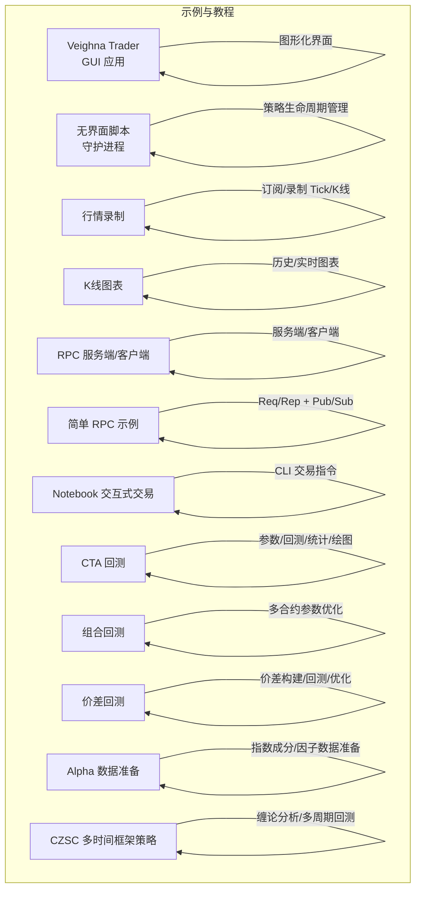

**章节来源**
- [README.md:1-343](file://README.md#L1-L343)

## 核心组件
- 事件驱动引擎与主引擎：贯穿所有示例，负责模块装配、事件分发与生命周期管理
- 图形界面框架：基于 Qt 的 MainWindow/Widget，提供可视化操作
- RPC 服务与客户端：支持跨进程/跨机器的分布式部署
- 回测引擎：支持参数扫描、遗传算法优化等
- Alpha 实验室：数据准备、因子工程、模型训练与策略回测一体化工作流
- **CZSC适配层：连接vnpy与缠论分析框架，提供多周期技术分析能力**

**章节来源**
- [examples/veighna_trader/run.py:1-87](file://examples/veighna_trader/run.py#L1-L87)
- [examples/no_ui/run.py:1-126](file://examples/no_ui/run.py#L1-L126)
- [examples/data_recorder/data_recorder.py:1-147](file://examples/data_recorder/data_recorder.py#L1-L147)
- [examples/candle_chart/run.py:1-44](file://examples/candle_chart/run.py#L1-L44)
- [examples/client_server/run_server.py:1-74](file://examples/client_server/run_server.py#L1-L74)
- [examples/client_server/run_client.py:1-28](file://examples/client_server/run_client.py#L1-L28)
- [examples/simple_rpc/test_server.py:1-39](file://examples/simple_rpc/test_server.py#L1-L39)
- [examples/simple_rpc/test_client.py:1-35](file://examples/simple_rpc/test_client.py#L1-L35)
- [examples/notebook_trading/demo_notebook.ipynb:1-157](file://examples/notebook_trading/demo_notebook.ipynb#L1-L157)
- [examples/cta_backtesting/backtesting_demo.ipynb:1-800](file://examples/cta_backtesting/backtesting_demo.ipynb#L1-L800)
- [examples/portfolio_backtesting/backtesting_demo.ipynb:1-117](file://examples/portfolio_backtesting/backtesting_demo.ipynb#L1-L117)
- [examples/spread_backtesting/backtesting.ipynb:1-131](file://examples/spread_backtesting/backtesting.ipynb#L1-L131)
- [examples/alpha_research/download_data_rq.ipynb:1-195](file://examples/alpha_research/download_data_rq.ipynb#L1-L195)
- [examples/alpha_research/download_data_xt.ipynb:1-800](file://examples/alpha_research/download_data_xt.ipynb#L1-L800)
- [examples/czsc_strategy/czsc_adapter.py:1-494](file://examples/czsc_strategy/czsc_adapter.py#L1-L494)

## 架构总览
下图展示了示例中涉及的关键组件与交互关系，包括新增的CZSC多时间框架策略。

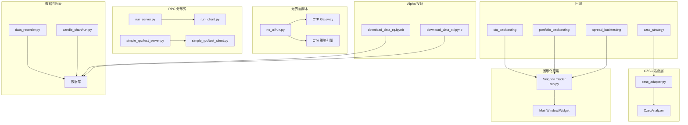

**图表来源**
- [examples/veighna_trader/run.py:1-87](file://examples/veighna_trader/run.py#L1-L87)
- [examples/no_ui/run.py:1-126](file://examples/no_ui/run.py#L1-L126)
- [examples/data_recorder/data_recorder.py:1-147](file://examples/data_recorder/data_recorder.py#L1-L147)
- [examples/candle_chart/run.py:1-44](file://examples/candle_chart/run.py#L1-L44)
- [examples/client_server/run_server.py:1-74](file://examples/client_server/run_server.py#L1-L74)
- [examples/client_server/run_client.py:1-28](file://examples/client_server/run_client.py#L1-L28)
- [examples/simple_rpc/test_server.py:1-39](file://examples/simple_rpc/test_server.py#L1-L39)
- [examples/simple_rpc/test_client.py:1-35](file://examples/simple_rpc/test_client.py#L1-L35)
- [examples/cta_backtesting/backtesting_demo.ipynb:1-800](file://examples/cta_backtesting/backtesting_demo.ipynb#L1-L800)
- [examples/portfolio_backtesting/backtesting_demo.ipynb:1-117](file://examples/portfolio_backtesting/backtesting_demo.ipynb#L1-L117)
- [examples/spread_backtesting/backtesting.ipynb:1-131](file://examples/spread_backtesting/backtesting.ipynb#L1-L131)
- [examples/alpha_research/download_data_rq.ipynb:1-195](file://examples/alpha_research/download_data_rq.ipynb#L1-L195)
- [examples/alpha_research/download_data_xt.ipynb:1-800](file://examples/alpha_research/download_data_xt.ipynb#L1-L800)
- [examples/czsc_strategy/czsc_adapter.py:1-494](file://examples/czsc_strategy/czsc_adapter.py#L1-L494)

## 详细组件分析

### GUI 应用示例（Veighna Trader）
- 运行方式：创建 QApp，初始化事件引擎与主引擎，添加网关与应用模块，启动主窗口
- 关键点：可按需启用/禁用网关与应用；示例默认启用 CTP 网关与 CTA 策略、回测、数据管理等应用
- 适用场景：快速搭建图形化交易环境，进行策略开发与回测

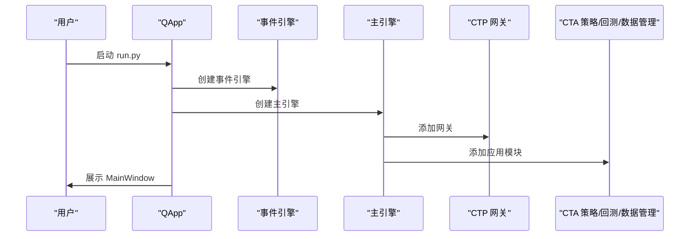

**图表来源**
- [examples/veighna_trader/run.py:38-82](file://examples/veighna_trader/run.py#L38-L82)

**章节来源**
- [examples/veighna_trader/run.py:1-87](file://examples/veighna_trader/run.py#L1-L87)

### 无界面脚本示例（守护进程式运行）
- 运行方式：父进程监控交易时段，子进程在交易时段启动，连接 CTP，初始化策略引擎并启动策略
- 关键点：日志配置、事件监听、策略初始化与启动、策略活跃状态控制、定时退出
- 适用场景：自动化、无人值守策略运行

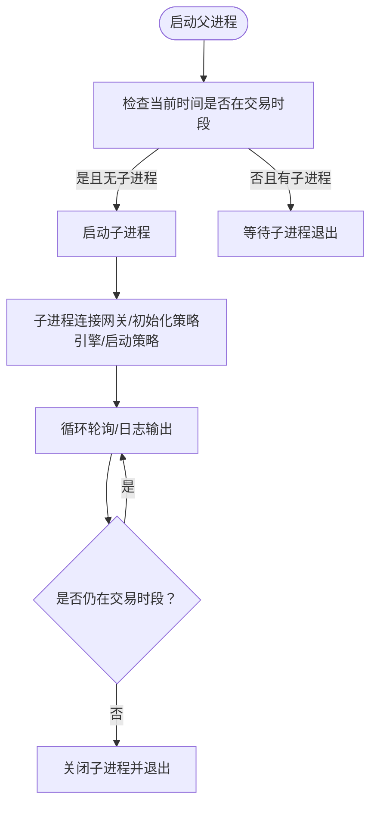

**图表来源**
- [examples/no_ui/run.py:97-121](file://examples/no_ui/run.py#L97-L121)
- [examples/no_ui/run.py:56-95](file://examples/no_ui/run.py#L56-L95)

**章节来源**
- [examples/no_ui/run.py:1-126](file://examples/no_ui/run.py#L1-L126)

### 行情录制示例
- 运行方式：连接 CTP，注册合约事件回调，按交易所与产品类型筛选合约，自动添加 Tick/K线录制任务
- 关键点：EVENT_CONTRACT 订阅、RecorderEngine 任务管理、日志事件处理、安全退出
- 适用场景：批量录制历史/实时行情，支撑回测与研究

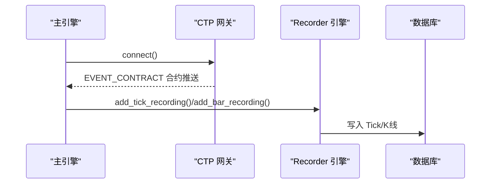

**图表来源**
- [examples/data_recorder/data_recorder.py:87-109](file://examples/data_recorder/data_recorder.py#L87-L109)
- [examples/data_recorder/data_recorder.py:114-129](file://examples/data_recorder/data_recorder.py#L114-L129)

**章节来源**
- [examples/data_recorder/data_recorder.py:1-147](file://examples/data_recorder/data_recorder.py#L1-L147)

### K线图表示例
- 运行方式：从数据库加载历史 K线，创建 ChartWidget，添加蜡烛图与成交量图层，绑定游标与定时器
- 关键点：历史数据更新、增量更新、实时推送
- 适用场景：可视化展示与分析

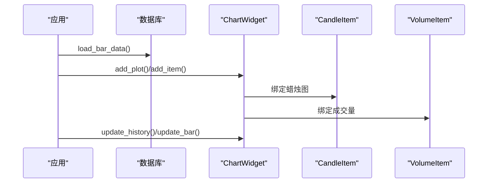

**图表来源**
- [examples/candle_chart/run.py:12-37](file://examples/candle_chart/run.py#L12-L37)

**章节来源**
- [examples/candle_chart/run.py:1-44](file://examples/candle_chart/run.py#L1-L44)

### RPC 服务端与客户端示例（Veighna RPC Service）
- 运行方式：服务端启动 RpcServiceApp，配置网关与 RPC 地址；客户端以 RpcGateway 连接服务端
- 关键点：EVENT_LOG 与 EVENT_RPC_LOG 事件处理、服务端启动地址、客户端连接参数
- 适用场景：分布式架构、多进程/多机器协同

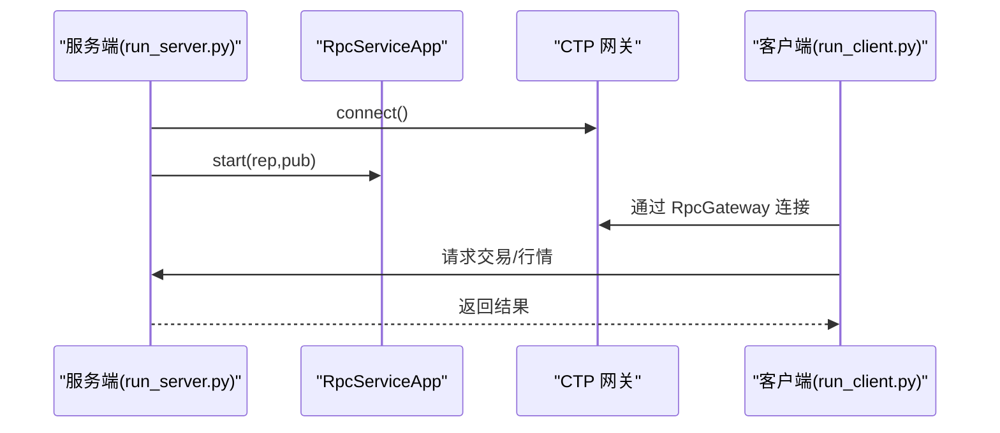

**图表来源**
- [examples/client_server/run_server.py:13-62](file://examples/client_server/run_server.py#L13-L62)
- [examples/client_server/run_client.py:9-23](file://examples/client_server/run_client.py#L9-L23)

**章节来源**
- [examples/client_server/run_server.py:1-74](file://examples/client_server/run_server.py#L1-L74)
- [examples/client_server/run_client.py:1-28](file://examples/client_server/run_client.py#L1-L28)

### 简单 RPC 示例（轻量级）
- 运行方式：服务端继承 RpcServer，注册方法；客户端继承 RpcClient，订阅主题并发起请求
- 关键点：rep/pub 地址配置、publish/subscribe、回调处理
- 适用场景：快速验证 RPC 通路与消息传递

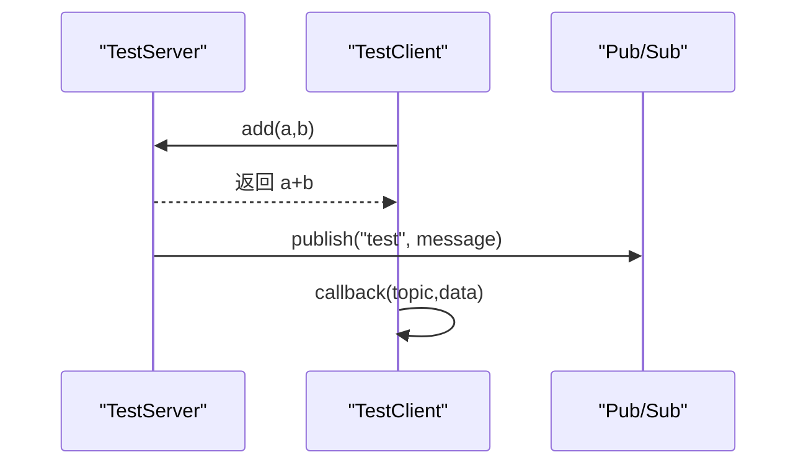

**图表来源**
- [examples/simple_rpc/test_server.py:27-38](file://examples/simple_rpc/test_server.py#L27-L38)
- [examples/simple_rpc/test_client.py:24-34](file://examples/simple_rpc/test_client.py#L24-L34)

**章节来源**
- [examples/simple_rpc/test_server.py:1-39](file://examples/simple_rpc/test_server.py#L1-L39)
- [examples/simple_rpc/test_client.py:1-35](file://examples/simple_rpc/test_client.py#L1-L35)

### Notebook 交互式交易示例
- 运行方式：初始化 CLI 交易，连接网关，查询合约、账户、持仓、委托，订阅行情并下单/撤单
- 关键点：connect_ctp.json 配置、get_all_* 查询、subscribe/get_tick、buy/cancel_order
- 适用场景：快速验证接口与交易流程

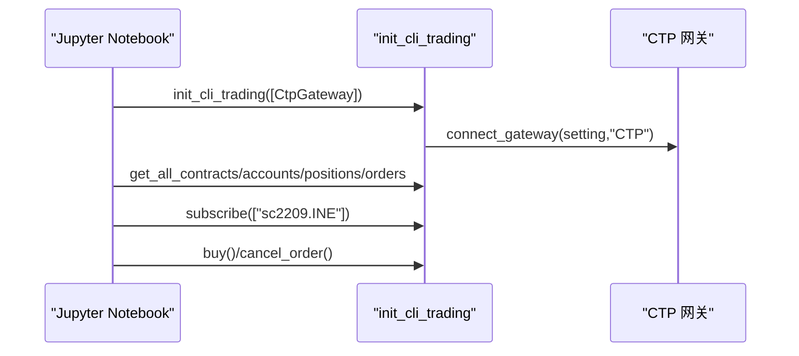

**图表来源**
- [examples/notebook_trading/demo_notebook.ipynb:23-125](file://examples/notebook_trading/demo_notebook.ipynb#L23-L125)

**章节来源**
- [examples/notebook_trading/demo_notebook.ipynb:1-157](file://examples/notebook_trading/demo_notebook.ipynb#L1-L157)

### CTA 回测示例
- 运行方式：设置参数（vt_symbol、interval、start/end、费率/滑点/合约乘数/最小交易量/初始资金），添加策略，加载数据，运行回测，计算统计指标与绘制图表
- 关键点：BacktestingEngine 参数设置、策略初始化与回放、统计指标输出、Plotly 可视化
- 适用场景：策略验证与参数优化

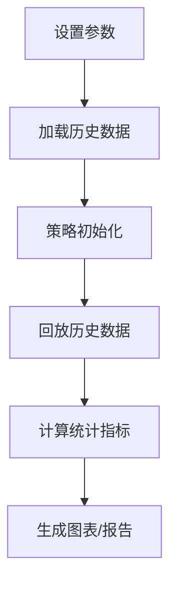

**图表来源**
- [examples/cta_backtesting/backtesting_demo.ipynb:16-35](file://examples/cta_backtesting/backtesting_demo.ipynb#L16-L35)
- [examples/cta_backtesting/backtesting_demo.ipynb:58-70](file://examples/cta_backtesting/backtesting_demo.ipynb#L58-L70)

**章节来源**
- [examples/cta_backtesting/backtesting_demo.ipynb:1-800](file://examples/cta_backtesting/backtesting_demo.ipynb#L1-L800)

### 组合回测示例
- 运行方式：设置多合约参数（rates/slippages/sizes/priceticks），添加 PairTradingStrategy，加载数据，运行回测，计算统计与绘图；支持参数优化（GA/暴力搜索）
- 关键点：多合约参数字典、OptimizationSetting 配置、run_ga_optimization/run_bf_optimization
- 适用场景：多标的组合策略回测与优化

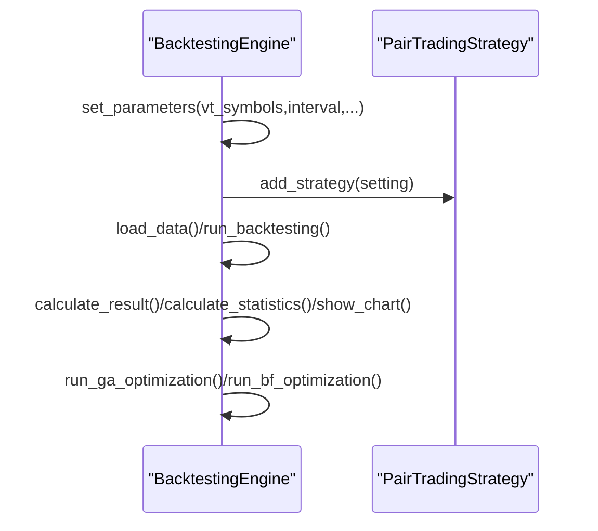

**图表来源**
- [examples/portfolio_backtesting/backtesting_demo.ipynb:24-53](file://examples/portfolio_backtesting/backtesting_demo.ipynb#L24-L53)
- [examples/portfolio_backtesting/backtesting_demo.ipynb:77-92](file://examples/portfolio_backtesting/backtesting_demo.ipynb#L77-L92)

**章节来源**
- [examples/portfolio_backtesting/backtesting_demo.ipynb:1-117](file://examples/portfolio_backtesting/backtesting_demo.ipynb#L1-L117)

### 价差回测示例
- 运行方式：构建 SpreadData（legs、变量符号、方向、价格公式、交易乘数、活跃合约、最小挂单量），设置参数，添加 StatisticalArbitrageStrategy，加载数据，运行回测与优化
- 关键点：SpreadData 编译开关（多进程优化需关闭编译）、参数优化设置
- 适用场景：价差交易策略研究与优化

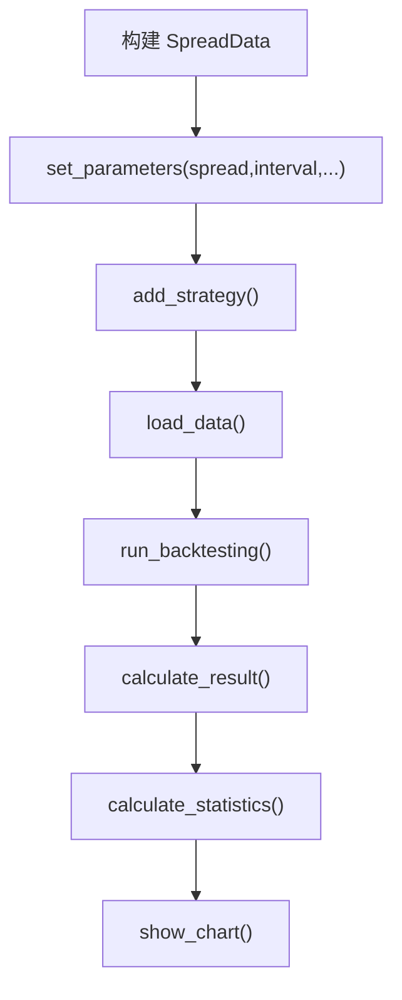

**图表来源**
- [examples/spread_backtesting/backtesting.ipynb:24-55](file://examples/spread_backtesting/backtesting.ipynb#L24-L55)
- [examples/spread_backtesting/backtesting.ipynb:66-71](file://examples/spread_backtesting/backtesting.ipynb#L66-L71)

**章节来源**
- [examples/spread_backtesting/backtesting.ipynb:1-131](file://examples/spread_backtesting/backtesting.ipynb#L1-L131)

### Alpha 投研示例（数据准备）
- RQData 数据准备：创建 AlphaLab，初始化数据服务，下载指数成分与历史行情，保存到本地，添加合约设置
- 迅投研数据准备：初始化数据服务，查询指数成分，遍历下载日线数据，保存到本地
- 关键点：数据服务初始化、历史请求、数据保存、合约设置（费率/大小/最小变动价位）

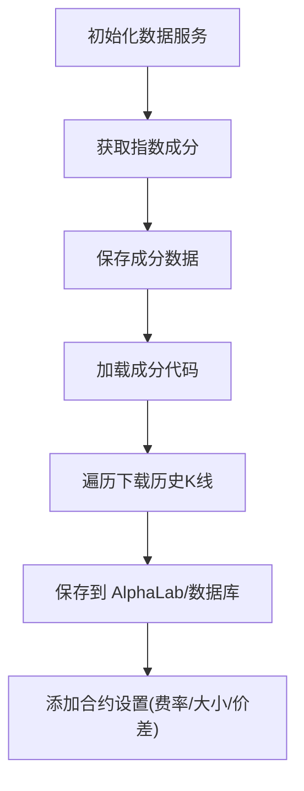

**图表来源**
- [examples/alpha_research/download_data_rq.ipynb:50-106](file://examples/alpha_research/download_data_rq.ipynb#L50-L106)
- [examples/alpha_research/download_data_rq.ipynb:114-170](file://examples/alpha_research/download_data_rq.ipynb#L114-L170)
- [examples/alpha_research/download_data_xt.ipynb:63-87](file://examples/alpha_research/download_data_xt.ipynb#L63-L87)
- [examples/alpha_research/download_data_xt.ipynb:90-153](file://examples/alpha_research/download_data_xt.ipynb#L90-L153)

**章节来源**
- [examples/alpha_research/download_data_rq.ipynb:1-195](file://examples/alpha_research/download_data_rq.ipynb#L1-L195)
- [examples/alpha_research/download_data_xt.ipynb:1-800](file://examples/alpha_research/download_data_xt.ipynb#L1-L800)

## CZSC多时间框架交易策略

### 策略概述
基于缠论（CZSC）技术分析框架和"波段交易战法"理论，实现的多时间周期协同CTA策略。策略运行在VeighNa(vnpy)框架上，利用5分钟真实K线数据，通过BarGenerator合成三个周期（5分钟/30分钟/4小时），实现"三级分仓+通道突破+信号过滤+结构性止损"的完整波段交易系统。

### 核心理念
策略采用"低胜率+高盈亏比"模型：
- 接受大量小额亏损（胜率约23%）
- 靠少数大盈利交易获利（盈亏比3-5倍）
- 通过结构性止损让利润充分奔跑
- 通过以损定量控制风险上限

**口诀**：破上轨买入，破下轨卖出

### 策略设计

#### 级别映射
| PDF级别 | 实际周期 | 仓位比例 | 职责 |
|---------|---------|---------|------|
| 1F | 5分钟 | 20% | 精确入场/快速出场 |
| 5F | 30分钟 | 30% | 趋势确认/中级止损 |
| 30F | 4小时 | 50% | 大趋势/终极止损 |

#### 入场规则
1. 5分钟价格突破中枢上沿（破上轨）
2. 距离4H中枢下沿 <= 30%（建仓范围限制）
3. 30分钟趋势不为DOWN（趋势确认）
4. 5分钟最后一笔方向向上（笔方向确认）
5. 无30分钟空头背驰信号

满足全部条件 → 一次性三级建仓

#### 出场规则——纯结构性止损

**分级出场**：
- 破5m中枢下沿 → 卖出5m仓位(20%)
- 破30m中枢下沿 → 卖出30m仓位(30%)
- 破4H中枢下沿 → **无条件全仓清**（终极止损）

**信号过滤**（减少交易磨损）：
- 5m破下轨但距30m下轨 <= 5% → 不卖
- 30m破下轨但距4H下轨 <= 5% → 不卖

**利润锁定**：
- 总盈利 >= 20% + 破5m下轨 → 全清
- 总盈利 >= 30% → 全清

**主观安全网**：
- 总亏损超过10% → 无条件全清

#### 以损定量——仓位计算
公式：`总仓位比例 = (10/H_5m)*20% + (10/H_30m)*30% + (10/H_4h)*50%`

其中H为当前价到各级别中枢下沿的距离百分比。确保即使所有下轨被打穿，最大亏损也控制在10%以内。

#### 加仓逻辑
平仓后如果信号再次出现（价格重新突破上轨），可重新买入对应级别：
- 5m重新进场：需有30m或4H底仓
- 30m重新进场：需有4H底仓

### CZSC适配层API
| 方法 | 返回值 | 说明 |
|------|--------|------|
| `update(bar)` | None | 更新K线数据 |
| `is_ready(min_bars)` | bool | 数据是否就绪 |
| `get_trend_type()` | TrendType | UP/DOWN/CONSOLIDATION |
| `check_divergence()` | DivergenceResult | 背驰检测 |
| `get_last_bi_direction()` | str | 最后一笔方向 |
| `get_last_fx()` | Fx | 最近分型 |
| `get_last_zs()` | ZSInfo | 最近中枢(zg/zd/gg/dd) |
| `check_upper_break(price)` | bool | 是否突破中枢上沿 |
| `check_lower_break(price)` | bool | 是否跌破中枢下沿 |
| `get_distance_to_lower(price)` | float | 到下沿距离百分比 |

### 策略参数
| 参数 | 默认值 | 说明 |
|------|--------|------|
| total_capital | 1,000,000 | 总资金 |
| max_distance_pct | 0.30 | 建仓范围(距4H下轨最大距离) |
| filter_distance_pct | 0.05 | 信号过滤阈值(5%) |
| profit_lock_pct_1 | 0.20 | 利润锁定第一档(20%) |
| profit_lock_pct_2 | 0.30 | 利润锁定第二档(30%) |
| subjective_stop_pct | 0.10 | 主观止损安全网(10%) |
| risk_factor | 10 | 以损定量系数 |
| ratio_5m | 0.20 | 5m仓位比例 |
| ratio_30m | 0.30 | 30m仓位比例 |
| ratio_4h | 0.50 | 4h仓位比例 |
| min_bars_5m | 100 | 5m预热期 |
| min_bars_30m | 30 | 30m预热期 |
| min_bars_4h | 12 | 4h预热期 |

### 回测结果
#### 测试条件
- **数据源**: Baostock 5分钟K线（前复权）
- **回测区间**: 2021-01-01 ~ 2022-12-31
- **初始资金**: 100万
- **手续费**: 万三 + 印花税千一（仅卖出）
- **A股限制**: 禁止做空

#### 测试标的（9只小市值股票）
| 股票 | 代码 | 板块 |
|------|------|------|
| 东湖高新 | 600133 | 上证 |
| 中贝通信 | 603220 | 上证 |
| 东睦股份 | 600114 | 上证 |
| 联创电子 | 002036 | 深证 |
| 华夏航空 | 002928 | 深证 |
| 汉钟精机 | 002158 | 深证 |
| 星星科技 | 300256 | 创业板 |
| 晶瑞电材 | 300655 | 创业板 |
| 彩讯股份 | 300634 | 创业板 |

#### 最终版绩效（PDF纯结构止损版）
| 股票 | 收益率 | 胜率 | 最大回撤 | 夏普比率 |
|------|--------|------|---------|---------|
| 东湖高新 | -4.62% | 26.45% | 17.53% | -0.16 |
| 中贝通信 | -19.43% | 21.71% | 25.21% | -0.58 |
| **东睦股份** | **+12.40%** | 23.50% | 15.44% | 0.28 |
| 联创电子 | -7.43% | 19.42% | 28.22% | -0.16 |
| 华夏航空 | -1.76% | 23.63% | 28.58% | -0.05 |
| **汉钟精机** | **+28.98%** | 23.53% | 14.33% | **0.61** |
| 星星科技 | -13.27% | 23.16% | 37.91% | -0.28 |
| **晶瑞电材** | **+9.14%** | 19.57% | 28.27% | 0.19 |
| **彩讯股份** | **+3.97%** | 25.40% | 24.87% | 0.10 |
| **均值** | **+0.89%** | 22.93% | 24.48% | -0.01 |

#### 策略版本迭代对比
| 版本 | 核心变化 | 平均收益 | 盈利股 | 特征 |
|------|---------|---------|--------|------|
| v1 原始版 | 单仓+固定止损止盈 | -5.15% | 1/9 | 交易频繁，手续费侵蚀 |
| v11 冷却期版 | 单仓+144根冷却期 | +1.50% | 6/9 | 高胜率低盈亏比 |
| 波段战法分层出场版 | 三级分仓+分层出场 | +3.24% | 5/9 | 盈亏比3.49 |
| **PDF纯结构止损版** | **三级分仓+纯破下轨止损** | **+0.89%** | **4/9** | **让利润奔跑，汉钟+29%** |

### 使用方法
#### 运行回测
```bash
cd examples/czsc_strategy
pip install baostock
python run_baostock_backtest.py
```

首次运行会从Baostock下载数据并缓存到 `data_cache/` 目录，后续运行直接从缓存加载。

#### 参数调优建议
1. **信号过滤阈值**(filter_distance_pct): 增大→减少出场次数；减小→更快止损
2. **建仓范围**(max_distance_pct): 增大→更多入场机会；减小→更严格筛选
3. **以损定量系数**(risk_factor): 增大→仓位更重；减小→仓位更轻
4. **利润锁定门槛**: 降低→更快兑现利润；升高→让利润多跑一会

### 重要说明
1. 本策略基于2021-2022年历史数据回测，不代表未来表现
2. A股T+1限制下禁止做空，仅做多
3. 未考虑涨跌停限制，实际交易可能无法以信号价成交
4. 数据为Baostock前复权数据，与实时数据可能存在差异
5. **本策略仅供学习研究，不构成投资建议**

### 依赖
- vnpy (VeighNa量化交易框架)
- czsc (缠论分析库)
- baostock (历史数据源)
- pandas, numpy

**章节来源**
- [examples/czsc_strategy/README.md:1-194](file://examples/czsc_strategy/README.md#L1-L194)
- [examples/czsc_strategy/czsc_multi_timeframe_strategy.py:1-518](file://examples/czsc_strategy/czsc_multi_timeframe_strategy.py#L1-L518)
- [examples/czsc_strategy/czsc_adapter.py:1-494](file://examples/czsc_strategy/czsc_adapter.py#L1-L494)
- [examples/czsc_strategy/backtesting_demo.ipynb:1-277](file://examples/czsc_strategy/backtesting_demo.ipynb#L1-L277)
- [examples/czsc_strategy/run_baostock_backtest.py:1-1048](file://examples/czsc_strategy/run_baostock_backtest.py#L1-L1048)

## 依赖分析
- 组件耦合：示例普遍依赖事件引擎与主引擎，通过 add_gateway/add_app 装配模块；RPC 示例依赖 RpcServiceApp/RpcGateway；回测示例依赖对应 backtesting 引擎；Alpha 示例依赖 AlphaLab 与数据服务；**CZSC示例依赖CZSC适配层与缠论分析框架**
- 外部依赖：CTP 接口、数据库、数据服务（RQData/迅投研/Baostock）、ZeroMQ（RPC）、Plotly（可视化）、**czsc（缠论分析库）**

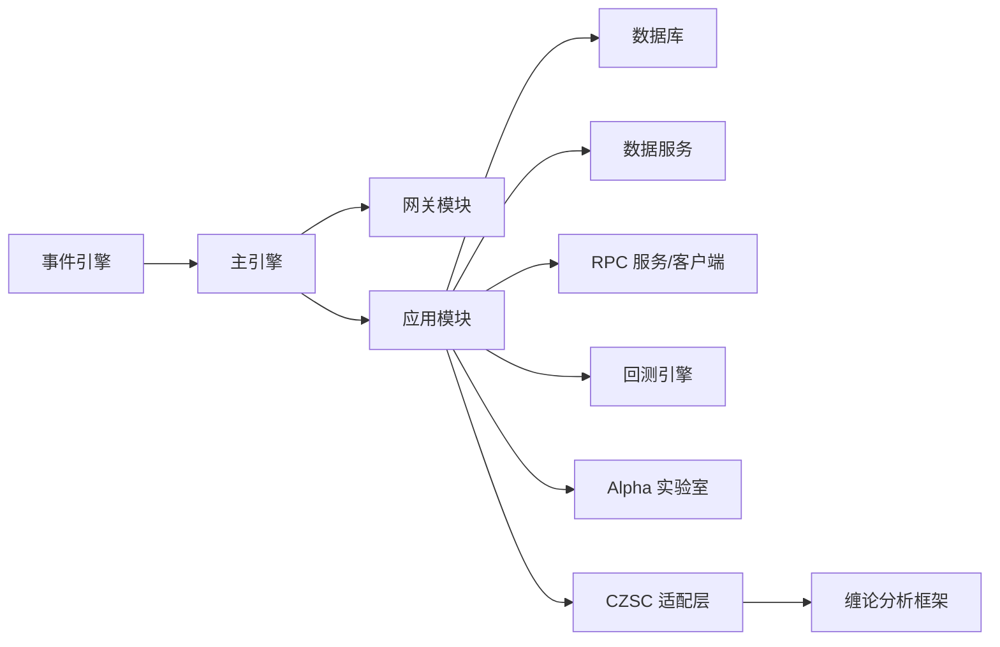

**图表来源**
- [examples/veighna_trader/run.py:44-73](file://examples/veighna_trader/run.py#L44-L73)
- [examples/client_server/run_server.py:17-22](file://examples/client_server/run_server.py#L17-L22)
- [examples/cta_backtesting/backtesting_demo.ipynb:22-34](file://examples/cta_backtesting/backtesting_demo.ipynb#L22-L34)
- [examples/alpha_research/download_data_rq.ipynb:79-81](file://examples/alpha_research/download_data_rq.ipynb#L79-L81)
- [examples/czsc_strategy/czsc_adapter.py:14-21](file://examples/czsc_strategy/czsc_adapter.py#L14-L21)

**章节来源**
- [examples/veighna_trader/run.py:1-87](file://examples/veighna_trader/run.py#L1-L87)
- [examples/client_server/run_server.py:1-74](file://examples/client_server/run_server.py#L1-L74)
- [examples/cta_backtesting/backtesting_demo.ipynb:1-800](file://examples/cta_backtesting/backtesting_demo.ipynb#L1-L800)
- [examples/alpha_research/download_data_rq.ipynb:1-195](file://examples/alpha_research/download_data_rq.ipynb#L1-L195)
- [examples/czsc_strategy/czsc_adapter.py:1-494](file://examples/czsc_strategy/czsc_adapter.py#L1-L494)

## 性能考虑
- 事件驱动与异步：通过事件引擎解耦模块，降低耦合度，提升可扩展性
- 回测性能：合理设置回测区间、数据加载进度提示、统计指标计算与图表渲染
- RPC 性能：服务端/客户端地址配置、消息发布频率、订阅范围控制
- Alpha 数据：批量下载与保存、合约设置统一化，减少重复 IO
- **CZSC性能优化**：多周期分析器缓存、K线合成器优化、背驰检测性能调优

## 故障排除指南
- GUI 启动失败：确认已安装依赖与 Python 环境，检查 run.py 中网关与应用模块启用状态
- 无界面脚本退出：检查交易时段判断逻辑与子进程状态，确保策略活跃状态控制
- 行情录制异常：检查 EVENT_CONTRACT 订阅回调、RecorderEngine 任务状态、日志事件处理
- RPC 连接失败：核对 rep/pub 地址、防火墙与网络配置，确认服务端已启动
- 回测无数据：检查数据加载时间范围、数据库连接、合约设置
- Alpha 数据下载失败：检查数据服务初始化、历史请求参数、保存路径权限
- **CZSC策略异常**：检查缠论分析器初始化、K线数据完整性、多周期同步问题
- **Baostock数据获取失败**：确认网络连接、API限制、数据缓存权限

**章节来源**
- [examples/veighna_trader/run.py:1-87](file://examples/veighna_trader/run.py#L1-L87)
- [examples/no_ui/run.py:96-121](file://examples/no_ui/run.py#L96-L121)
- [examples/data_recorder/data_recorder.py:114-129](file://examples/data_recorder/data_recorder.py#L114-L129)
- [examples/client_server/run_server.py:47-62](file://examples/client_server/run_server.py#L47-L62)
- [examples/cta_backtesting/backtesting_demo.ipynb:48-60](file://examples/cta_backtesting/backtesting_demo.ipynb#L48-L60)
- [examples/alpha_research/download_data_rq.ipynb:149-152](file://examples/alpha_research/download_data_rq.ipynb#L149-L152)
- [examples/czsc_strategy/README.md:180-186](file://examples/czsc_strategy/README.md#L180-L186)

## 结论
本教程围绕 VeighNa 的示例与教程，系统梳理了 GUI 应用、无界面脚本、行情录制、图表展示、RPC 分布式、回测与 Alpha 投研等关键主题。**新增的CZSC多时间框架交易策略示例进一步丰富了框架的应用场景，展示了如何将先进的技术分析框架与量化交易相结合，为开发者提供了多周期技术分析和实盘回测的完整解决方案。**通过代码解析与运行说明，帮助开发者快速理解并应用框架功能，构建稳定高效的量化交易系统。

## 附录
- 运行环境与安装：参考项目根目录 README 的安装与使用指南
- 示例运行顺序建议：先运行 GUI 示例，再运行无界面脚本与 RPC 示例，最后进行回测与 Alpha 数据准备
- **CZSC策略运行建议**：先安装czsc和baostock依赖，确保网络连接正常，首次运行会自动下载历史数据

**章节来源**
- [README.md:228-308](file://README.md#L228-L308)