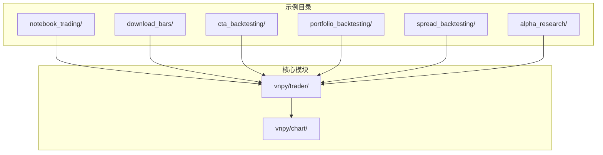
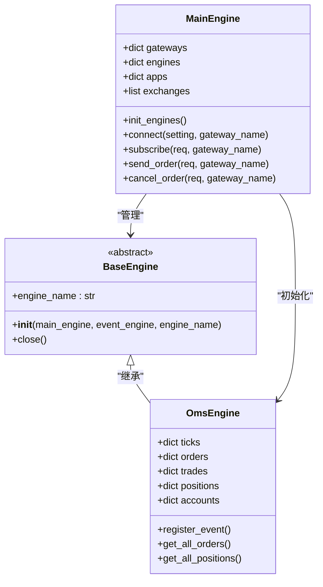
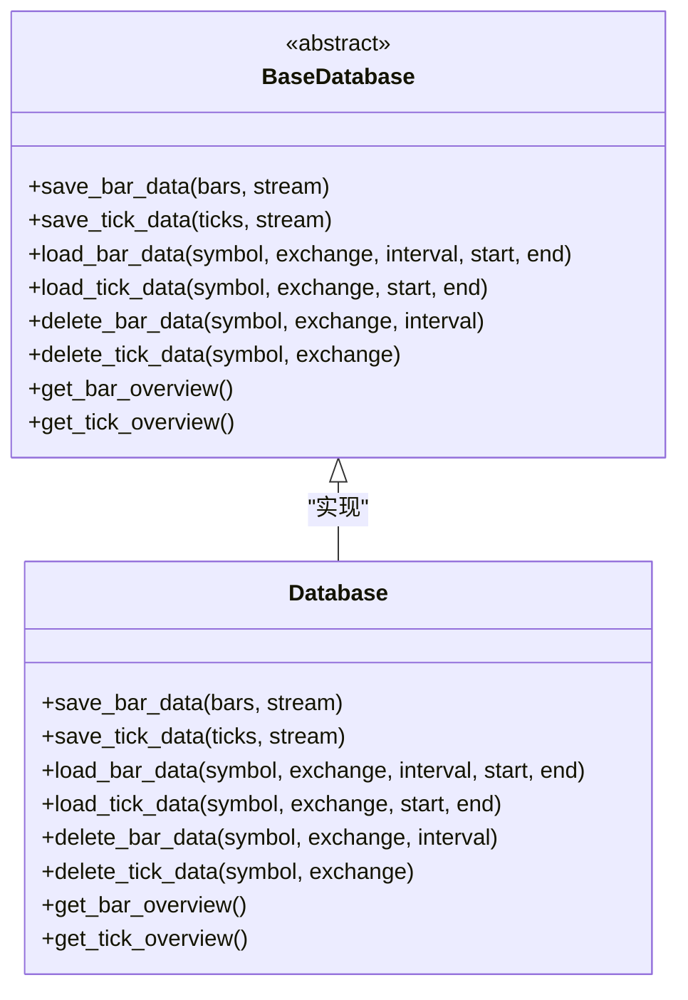
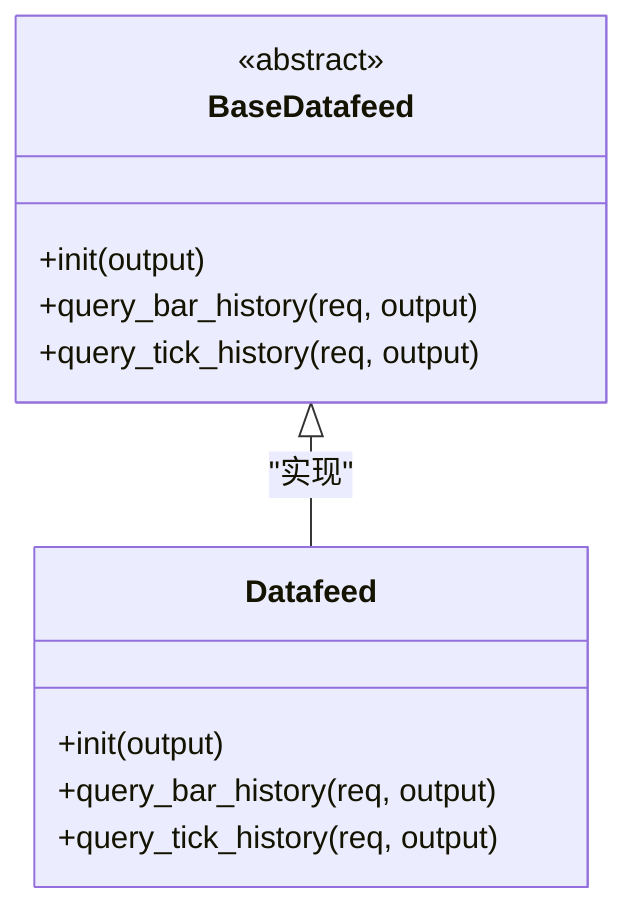
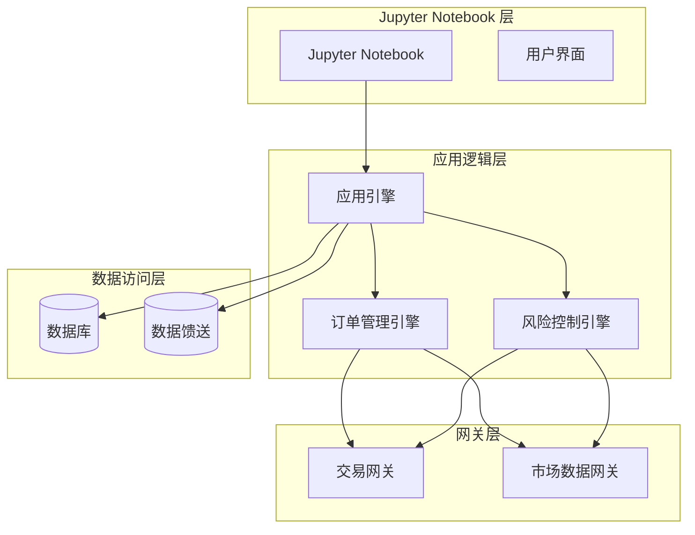
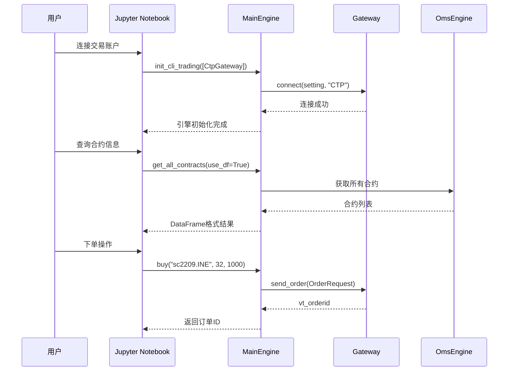
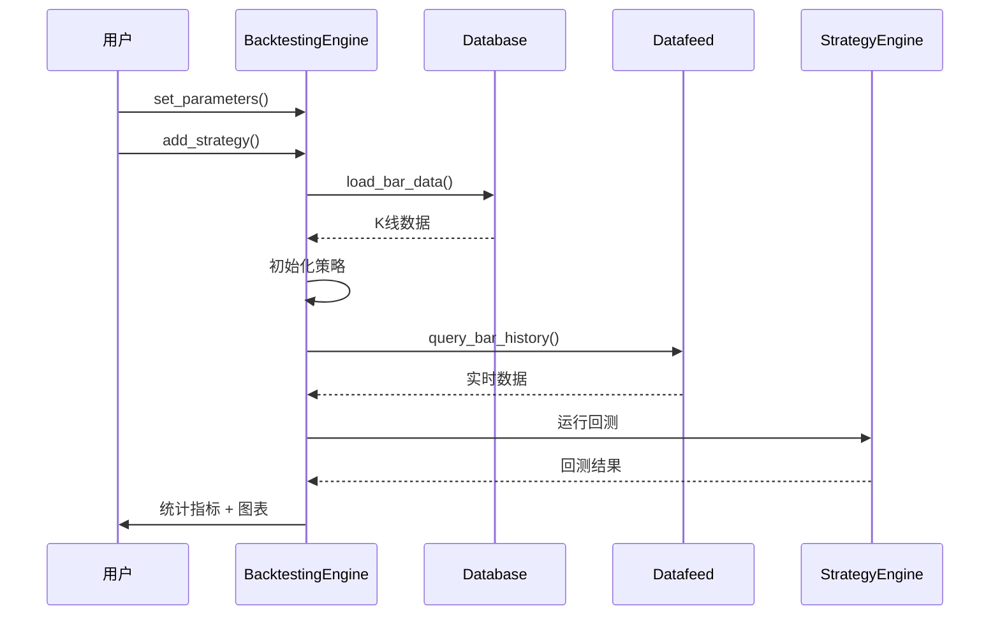
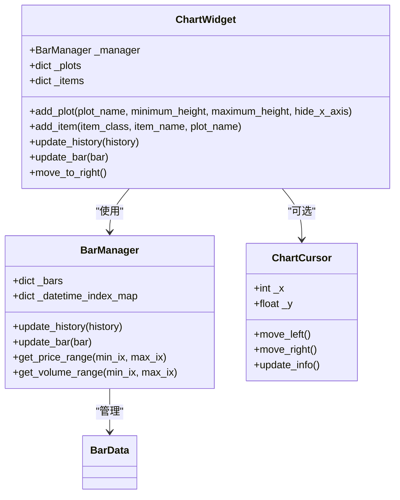
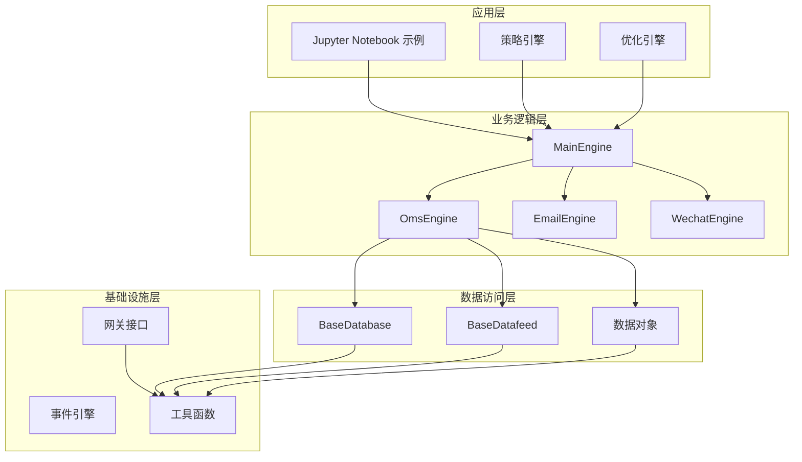
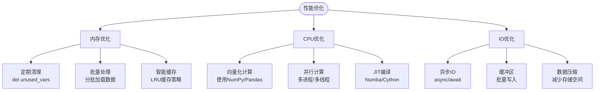

# 笔记本交易示例

<cite>
**本文档引用的文件**
- [demo_notebook.ipynb](file://examples/notebook_trading/demo_notebook.ipynb)
- [download_bars.ipynb](file://examples/download_bars/download_bars.ipynb)
- [backtesting_demo.ipynb](file://examples/cta_backtesting/backtesting_demo.ipynb)
- [portfolio_backtesting_demo.ipynb](file://examples/portfolio_backtesting/backtesting_demo.ipynb)
- [spread_backtesting.ipynb](file://examples/spread_backtesting/backtesting.ipynb)
- [download_data_rq.ipynb](file://examples/alpha_research/download_data_rq.ipynb)
- [download_data_xt.ipynb](file://examples/alpha_research/download_data_xt.ipynb)
- [engine.py](file://vnpy/trader/engine.py)
- [database.py](file://vnpy/trader/database.py)
- [datafeed.py](file://vnpy/trader/datafeed.py)
- [optimize.py](file://vnpy/trader/optimize.py)
- [manager.py](file://vnpy/chart/manager.py)
- [widget.py](file://vnpy/chart/widget.py)
- [object.py](file://vnpy/trader/object.py)
</cite>

## 目录
1. [简介](#简介)
2. [项目结构](#项目结构)
3. [核心组件](#核心组件)
4. [架构概览](#架构概览)
5. [详细组件分析](#详细组件分析)
6. [依赖关系分析](#依赖关系分析)
7. [性能考虑](#性能考虑)
8. [故障排除指南](#故障排除指南)
9. [结论](#结论)
10. [附录](#附录)

## 简介

VeighNa框架的Jupyter Notebook交易示例为量化研究人员和数据科学家提供了便捷的开发工具。这些示例展示了如何在Jupyter环境中进行量化交易开发和策略研究，包括环境配置、依赖安装和基本操作流程。

Jupyter Notebook交易示例具有以下优势：
- **快速原型开发**：支持快速测试和验证交易想法
- **数据分析**：结合Python生态系统的强大数据分析能力
- **策略验证**：提供完整的回测和优化功能
- **可视化展示**：内置图表和结果展示功能
- **交互式探索**：支持实时数据探索和参数调整

## 项目结构

VeighNa框架包含多个与Jupyter Notebook相关的示例文件，分布在不同的目录中：



**章节来源**
- [demo_notebook.ipynb](file://examples/notebook_trading/demo_notebook.ipynb#L1-L157)
- [download_bars.ipynb](file://examples/download_bars/download_bars.ipynb#L1-L181)

## 核心组件

### 主引擎系统

VeighNa的核心是MainEngine类，它作为交易平台的中央协调器：



**图表来源**
- [engine.py](file://vnpy/trader/engine.py#L81-L324)
- [engine.py](file://vnpy/trader/engine.py#L360-L588)

### 数据访问层

数据访问通过BaseDatabase抽象类实现，支持多种数据库后端：



**图表来源**
- [database.py](file://vnpy/trader/database.py#L52-L134)

### 数据馈送系统

BaseDatafeed类提供了统一的数据访问接口：



**图表来源**
- [datafeed.py](file://vnpy/trader/datafeed.py#L10-L35)

**章节来源**
- [engine.py](file://vnpy/trader/engine.py#L81-L324)
- [database.py](file://vnpy/trader/database.py#L52-L134)
- [datafeed.py](file://vnpy/trader/datafeed.py#L10-L35)

## 架构概览

VeighNa的Jupyter Notebook交易示例采用分层架构设计：



**图表来源**
- [engine.py](file://vnpy/trader/engine.py#L81-L324)
- [database.py](file://vnpy/trader/database.py#L139-L159)
- [datafeed.py](file://vnpy/trader/datafeed.py#L39-L68)

## 详细组件分析

### Notebook交易示例

demo_notebook.ipynb展示了如何在Jupyter环境中进行交易操作：



**图表来源**
- [demo_notebook.ipynb](file://examples/notebook_trading/demo_notebook.ipynb#L28-L105)
- [engine.py](file://vnpy/trader/engine.py#L234-L297)

### 数据下载示例

download_bars.ipynb演示了批量数据下载流程：

```mermaid
flowchart TD
Start([开始]) --> Config["配置数据服务<br/>SETTINGS[\"datafeed.name\"]"]
Config --> Init["初始化数据服务<br/>get_datafeed()"]
Init --> Symbols["准备合约列表"]
Symbols --> Loop{"遍历合约"}
Loop --> |是| Request["创建历史数据请求<br/>HistoryRequest"]
Request --> Query["查询数据<br/>query_bar_history"]
Query --> Save{"数据存在?"}
Save --> |是| Database["保存到数据库<br/>save_bar_data"]
Save --> |否| Error["记录错误"]
Database --> Next["下一个合约"]
Error --> Next
Next --> Loop
Loop --> |否| End([完成])
```

**图表来源**
- [download_bars.ipynb](file://examples/download_bars/download_bars.ipynb#L37-L149)
- [datafeed.py](file://vnpy/trader/datafeed.py#L21-L26)
- [database.py](file://vnpy/trader/database.py#L58-L62)

### 回测引擎示例

backtesting_demo.ipynb展示了完整的回测流程：



**图表来源**
- [backtesting_demo.ipynb](file://examples/cta_backtesting/backtesting_demo.ipynb#L17-L35)
- [optimize.py](file://vnpy/trader/optimize.py#L99-L129)

### 图表可视化组件

widget.py提供了丰富的图表可视化功能：



**图表来源**
- [widget.py](file://vnpy/chart/widget.py#L20-L322)
- [manager.py](file://vnpy/chart/manager.py#L9-L171)

**章节来源**
- [demo_notebook.ipynb](file://examples/notebook_trading/demo_notebook.ipynb#L1-L157)
- [download_bars.ipynb](file://examples/download_bars/download_bars.ipynb#L1-L181)
- [backtesting_demo.ipynb](file://examples/cta_backtesting/backtesting_demo.ipynb#L1-L800)
- [widget.py](file://vnpy/chart/widget.py#L20-L322)
- [manager.py](file://vnpy/chart/manager.py#L9-L171)

## 依赖关系分析

VeighNa框架的依赖关系体现了清晰的分层设计：



**图表来源**
- [engine.py](file://vnpy/trader/engine.py#L81-L324)
- [database.py](file://vnpy/trader/database.py#L139-L159)
- [datafeed.py](file://vnpy/trader/datafeed.py#L39-L68)

**章节来源**
- [engine.py](file://vnpy/trader/engine.py#L81-L324)
- [database.py](file://vnpy/trader/database.py#L139-L159)
- [datafeed.py](file://vnpy/trader/datafeed.py#L39-L68)

## 性能考虑

### 内存管理

在Jupyter Notebook环境中进行量化交易开发时，需要注意以下内存管理要点：

1. **数据清理**：定期清理不再使用的变量和数据对象
2. **批量处理**：避免一次性加载过多历史数据
3. **缓存策略**：合理使用缓存机制减少重复计算
4. **垃圾回收**：适时触发垃圾回收机制

### 性能优化



### 最佳实践

1. **代码组织**：将相关功能封装成函数和类
2. **错误处理**：添加适当的异常处理机制
3. **日志记录**：使用结构化日志记录关键信息
4. **配置管理**：使用配置文件管理参数设置

## 故障排除指南

### 常见问题及解决方案

| 问题类型 | 症状 | 解决方案 |
|---------|------|----------|
| 连接失败 | `找不到底层接口` | 检查网关配置和网络连接 |
| 数据缺失 | `查询K线数据失败` | 验证数据服务配置和许可证 |
| 内存不足 | `MemoryError` | 减少数据加载量或增加内存 |
| 回测异常 | `KeyError` | 检查参数设置和数据完整性 |
| 图表显示问题 | `显示异常` | 更新pyqtgraph版本 |

### 调试技巧

1. **逐步调试**：在Jupyter中分步骤执行代码
2. **日志输出**：使用logger记录关键信息
3. **断点调试**：在关键位置设置断点
4. **单元测试**：为重要功能编写测试用例

**章节来源**
- [engine.py](file://vnpy/trader/engine.py#L168-L188)
- [optimize.py](file://vnpy/trader/optimize.py#L106-L129)

## 结论

VeighNa框架的Jupyter Notebook交易示例为量化研究人员和数据科学家提供了强大的开发工具。通过这些示例，用户可以：

- 快速搭建交易环境并进行实盘交易
- 批量下载和管理金融数据
- 开发和测试交易策略
- 进行策略回测和优化
- 可视化交易结果和性能指标

建议用户根据具体需求选择合适的示例进行学习和实践，同时注意遵循最佳实践和性能优化原则。

## 附录

### 安装和配置指南

1. **基础环境**：确保Python 3.7+环境
2. **核心依赖**：安装vnpy框架和相关扩展
3. **数据服务**：配置RQData或XTQuant数据源
4. **数据库**：设置TDengine或其他数据库
5. **可视化**：安装pyqtgraph和相关图表库

### 学习路径建议

1. **入门阶段**：从demo_notebook.ipynb开始
2. **数据处理**：学习download_bars.ipynb示例
3. **策略开发**：参考backtesting_demo.ipynb
4. **高级应用**：探索alpha_research示例

### 扩展资源

- VeighNa官方文档和API参考
- 相关学术论文和研究资料
- 社区论坛和技术交流群组