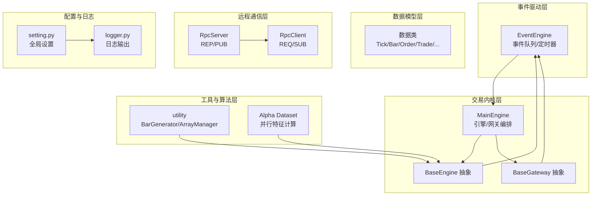
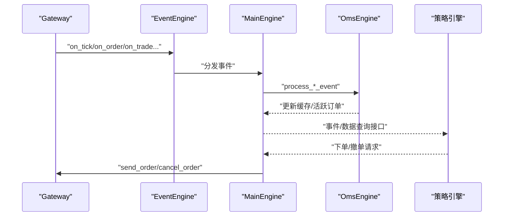
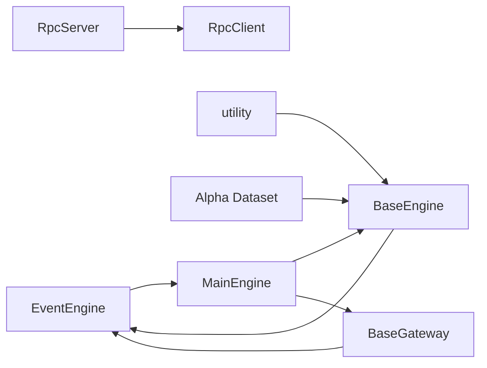

# 性能优化

<cite>
**本文引用的文件**
- [vnpy\event\engine.py](file://vnpy/event/engine.py)
- [vnpy\trader\engine.py](file://vnpy/trader/engine.py)
- [vnpy\trader\gateway.py](file://vnpy/trader/gateway.py)
- [vnpy\trader\object.py](file://vnpy/trader/object.py)
- [vnpy\trader\utility.py](file://vnpy/trader/utility.py)
- [vnpy\rpc\server.py](file://vnpy/rpc/server.py)
- [vnpy\rpc\client.py](file://vnpy/rpc/client.py)
- [vnpy\alpha\dataset\processor.py](file://vnpy/alpha/dataset/processor.py)
- [vnpy\alpha\dataset\template.py](file://vnpy/alpha/dataset/template.py)
- [vnpy\trader\setting.py](file://vnpy/trader/setting.py)
- [vnpy\trader\logger.py](file://vnpy/trader/logger.py)
- [examples\no_ui\run.py](file://examples/no_ui/run.py)
</cite>

## 目录
1. [引言](#引言)
2. [项目结构](#项目结构)
3. [核心组件](#核心组件)
4. [架构总览](#架构总览)
5. [详细组件分析](#详细组件分析)
6. [依赖关系分析](#依赖关系分析)
7. [性能考量](#性能考量)
8. [故障排查指南](#故障排查指南)
9. [结论](#结论)
10. [附录](#附录)

## 引言
本文件面向VeighNa量化交易框架的开发者与运维人员，围绕系统性能瓶颈识别与优化策略展开，重点覆盖事件引擎、内存管理、数据处理与计算密集型任务、并发与异步、性能监控与基准测试等方面，提供可操作的优化建议与最佳实践。

## 项目结构
VeighNa采用模块化分层设计：
- 事件驱动层：事件引擎负责事件分发与定时器，贯穿各模块
- 交易内核层：主引擎、引擎抽象、网关抽象等，承载业务编排
- 数据模型层：统一的数据对象定义，便于序列化与跨模块传递
- 工具与算法层：Bar/Array管理器、技术指标、Alpha数据集处理
- 远程通信层：基于ZeroMQ的RPC服务端/客户端
- 示例与配置：运行示例、日志与全局设置

图示来源
- [vnpy\event\engine.py](file://vnpy/event/engine.py#L33-L146)
- [vnpy\trader\engine.py](file://vnpy/trader/engine.py#L81-L324)
- [vnpy\trader\gateway.py](file://vnpy/trader/gateway.py#L33-L159)
- [vnpy\trader\object.py](file://vnpy/trader/object.py#L17-L428)
- [vnpy\trader\utility.py](file://vnpy/trader/utility.py#L166-L800)
- [vnpy\alpha\dataset\template.py](file://vnpy/alpha/dataset/template.py#L23-L306)
- [vnpy\rpc\server.py](file://vnpy/rpc/server.py#L11-L141)
- [vnpy\rpc\client.py](file://vnpy/rpc/client.py#L29-L170)
- [vnpy\trader\setting.py](file://vnpy/trader/setting.py#L11-L44)
- [vnpy\trader\logger.py](file://vnpy/trader/logger.py#L1-L56)

章节来源
- [vnpy\event\engine.py](file://vnpy/event/engine.py#L1-L146)
- [vnpy\trader\engine.py](file://vnpy/trader/engine.py#L1-L839)
- [vnpy\trader\gateway.py](file://vnpy/trader/gateway.py#L1-L273)
- [vnpy\trader\object.py](file://vnpy/trader/object.py#L1-L428)
- [vnpy\trader\utility.py](file://vnpy/trader/utility.py#L1-L1282)
- [vnpy\alpha\dataset\template.py](file://vnpy/alpha/dataset/template.py#L1-L306)
- [vnpy\rpc\server.py](file://vnpy/rpc/server.py#L1-L141)
- [vnpy\rpc\client.py](file://vnpy/rpc/client.py#L1-L170)
- [vnpy\trader\setting.py](file://vnpy/trader/setting.py#L1-L44)
- [vnpy\trader\logger.py](file://vnpy/trader/logger.py#L1-L56)

## 核心组件
- 事件引擎（EventEngine）：多线程事件队列、通用处理器、定时器事件
- 主引擎（MainEngine）：引擎/网关注册与生命周期管理、日志与通知
- 网关抽象（BaseGateway）：线程安全回调、事件推送
- 数据模型（object）：轻量数据类，支持序列化与跨模块传递
- 工具库（utility）：Bar/Array管理器、技术指标、时间序列容器
- Alpha数据集（alpha.dataset）：并行特征计算、跨时序归一化与清洗
- RPC（rpc）：零拷贝对象传输、心跳与断连检测
- 日志与配置（logger/setting）：统一日志格式与输出目标

章节来源
- [vnpy\event\engine.py](file://vnpy/event/engine.py#L33-L146)
- [vnpy\trader\engine.py](file://vnpy/trader/engine.py#L81-L324)
- [vnpy\trader\gateway.py](file://vnpy/trader/gateway.py#L33-L159)
- [vnpy\trader\object.py](file://vnpy/trader/object.py#L17-L428)
- [vnpy\trader\utility.py](file://vnpy/trader/utility.py#L166-L800)
- [vnpy\alpha\dataset\template.py](file://vnpy/alpha/dataset/template.py#L23-L306)
- [vnpy\rpc\server.py](file://vnpy/rpc/server.py#L11-L141)
- [vnpy\rpc\client.py](file://vnpy/rpc/client.py#L29-L170)
- [vnpy\trader\setting.py](file://vnpy/trader/setting.py#L11-L44)
- [vnpy\trader\logger.py](file://vnpy/trader/logger.py#L1-L56)

## 架构总览
事件驱动贯穿系统：网关通过事件引擎推送Tick/Order/Trade等事件；主引擎注册各类事件处理器，更新内部状态；策略引擎在回调中进行决策与下单；RPC服务端/客户端用于跨进程/跨机通信。

图示来源
- [vnpy\trader\gateway.py](file://vnpy/trader/gateway.py#L86-L159)
- [vnpy\event\engine.py](file://vnpy/event/engine.py#L55-L88)
- [vnpy\trader\engine.py](file://vnpy/trader/engine.py#L360-L588)

## 详细组件分析

### 事件引擎（EventEngine）性能调优
- 多线程模型
  - 事件处理线程与定时器线程分离，避免阻塞
  - 定时器周期通过构造参数控制，默认1秒
- 队列与分发
  - 使用阻塞队列，get超时1秒，降低CPU忙轮询
  - 按事件类型分发，再广播到通用处理器
- 注册去重
  - 同一处理器对同一事件类型仅注册一次，避免重复处理
- 停止流程
  - 先停止定时器线程，再等待事件线程结束，确保无新事件进入

优化建议
- 合理设置定时器间隔：高频场景可缩短间隔，但需权衡CPU占用
- 控制处理器数量与复杂度：避免在事件回调中执行耗时逻辑
- 批量事件合并：对高频Tick/Bar事件，考虑在上层聚合后再入队
- 调整队列容量：根据峰值吞吐调整队列大小，防止阻塞

章节来源
- [vnpy\event\engine.py](file://vnpy/event/engine.py#L42-L146)

### 主引擎与引擎体系（MainEngine/BaseEngine）
- 生命周期管理
  - 启动时启动事件引擎，关闭时先停事件引擎，再逐个关闭引擎与网关
- 引擎注册
  - 动态添加引擎与应用，暴露统一查询接口
- 日志与通知
  - 写日志事件，统一由LogEngine处理
  - 通知通道（邮件/微信）通过独立引擎异步处理

优化建议
- 将非关键路径（如通知）放入独立线程或队列，避免阻塞主事件流
- 对频繁查询的字典（如ticks/orders）建立索引字段，减少查找成本
- 在关闭流程中增加超时保护，避免长时间阻塞

章节来源
- [vnpy\trader\engine.py](file://vnpy/trader/engine.py#L81-L324)
- [vnpy\trader\engine.py](file://vnpy/trader/engine.py#L325-L588)

### 网关抽象（BaseGateway）与线程安全
- 回调规范
  - 所有回调必须线程安全，且传递的对象应视为不可变
  - 自动重连与查询账户/持仓/历史等
- 事件推送
  - 统一通过事件引擎推送，支持按vt_symbol细分事件

优化建议
- 避免在回调中直接进行IO或长耗时操作，必要时投递到队列/线程池
- 对共享状态使用锁保护，或采用无锁数据结构
- 对高频数据（如Tick）进行采样/聚合，降低事件风暴

章节来源
- [vnpy\trader\gateway.py](file://vnpy/trader/gateway.py#L33-L159)

### 数据模型（object）与内存管理
- 数据类采用dataclass，字段明确，序列化友好
- 关键字段如vt_symbol、vt_orderid等作为索引键，便于快速定位
- 建议避免在事件回调中复制大型对象，优先传递引用或浅拷贝

优化建议
- 使用弱引用或延迟加载策略，避免缓存无限增长
- 对历史数据定期清理，释放不再使用的对象
- 利用__slots__或更紧凑的数据结构（如命名元组）替代普通类，降低内存占用

章节来源
- [vnpy\trader\object.py](file://vnpy/trader/object.py#L17-L428)

### 工具库（utility）：Bar/Array管理器与指标计算
- BarGenerator
  - 支持分钟/小时/日K合成，窗口聚合逻辑清晰
  - 注意过滤无效Tick（last_price为0），避免异常值影响
- ArrayManager
  - 使用numpy数组实现滑动窗口，指标计算基于talib
  - 提供多种移动平均与动量指标，适合高性能计算

优化建议
- 合理设置ArrayManager窗口大小，避免过大导致内存压力
- 对高频数据先做聚合，再送入ArrayManager
- 指标计算尽量批量化，减少Python循环开销

章节来源
- [vnpy\trader\utility.py](file://vnpy/trader/utility.py#L166-L800)

### Alpha数据集（alpha.dataset）：并行特征计算
- 并行计算
  - 使用多进程上下文，按表达式并行计算特征
  - 进度条与日志提示，便于观察性能
- 数据处理
  - 支持缺失值填充、无穷值替换、跨时序/时序归一化、分位数归一化等
  - 可按时间段切片，生成训练/验证/测试集

优化建议
- 特征表达式尽量向量化，减少Python侧循环
- 归一化与清洗步骤可分阶段流水线化，避免重复扫描
- 合理设置进程数，避免CPU/内存资源争用

章节来源
- [vnpy\alpha\dataset\template.py](file://vnpy/alpha/dataset/template.py#L23-L306)
- [vnpy\alpha\dataset\processor.py](file://vnpy/alpha/dataset/processor.py#L1-L202)

### RPC服务端/客户端（ZeroMQ）
- 服务端
  - REP响应+PUB发布，支持心跳与锁保护
  - 轮询等待请求，避免阻塞
- 客户端
  - REQ请求+SUB订阅，支持心跳容忍与断连回调
  - LRU缓存动态方法代理，减少重复绑定

优化建议
- 请求超时合理设置，避免长时间阻塞
- 心跳间隔与容忍度平衡网络抖动与资源消耗
- 发布/订阅主题粒度适中，避免过多小消息

章节来源
- [vnpy\rpc\server.py](file://vnpy/rpc/server.py#L11-L141)
- [vnpy\rpc\client.py](file://vnpy/rpc/client.py#L29-L170)

### 示例与运行（no_ui）
- 子进程守护模式，按交易时段启停，降低空闲期资源占用
- 日志开关与级别可配置，便于生产环境降噪

优化建议
- 结合系统负载与市场时段，动态调整子进程数量
- 将日志级别与输出目标分离，避免磁盘IO成为瓶颈

章节来源
- [examples\no_ui\run.py](file://examples/no_ui/run.py#L1-L126)
- [vnpy\trader\setting.py](file://vnpy/trader/setting.py#L11-L44)
- [vnpy\trader\logger.py](file://vnpy/trader/logger.py#L1-L56)

## 依赖关系分析
事件引擎是系统中枢，主引擎与各引擎均依赖它；网关通过事件引擎与主引擎交互；工具库与Alpha模块为数据处理提供支撑；RPC模块提供跨进程通信能力。

图示来源
- [vnpy\event\engine.py](file://vnpy/event/engine.py#L33-L146)
- [vnpy\trader\engine.py](file://vnpy/trader/engine.py#L81-L324)
- [vnpy\trader\gateway.py](file://vnpy/trader/gateway.py#L33-L159)
- [vnpy\trader\utility.py](file://vnpy/trader/utility.py#L166-L800)
- [vnpy\alpha\dataset\template.py](file://vnpy/alpha/dataset/template.py#L23-L306)
- [vnpy\rpc\server.py](file://vnpy/rpc/server.py#L11-L141)
- [vnpy\rpc\client.py](file://vnpy/rpc/client.py#L29-L170)

## 性能考量
- CPU热点
  - 事件回调中的计算密集型逻辑应移至后台线程或进程
  - Bar/Array管理器与指标计算可批量化与向量化
- 内存占用
  - 缓存字典（ticks/orders）按符号与时间窗口清理
  - 数据类尽量轻量，避免深拷贝
- IO瓶颈
  - 日志写盘与网络RPC应异步化，避免阻塞事件线程
  - RPC超时与心跳参数需结合网络质量调优
- 并发与锁
  - 共享状态访问加锁，或采用无锁队列/原子变量
  - 多进程并行时注意GIL与进程间通信成本

## 故障排查指南
- 事件积压
  - 检查事件回调是否耗时过长，必要时拆分为异步任务
  - 观察定时器间隔与事件频率是否匹配
- 内存泄漏
  - 定期检查OmsEngine缓存（ticks/orders/positions等）是否清理
  - 关注大对象引用计数，避免循环引用
- RPC断连
  - 检查心跳容忍与网络状况，确认端口绑定/连接正确
  - 客户端断连回调中打印诊断信息
- 日志风暴
  - 调整日志级别与输出目标，避免磁盘IO成为瓶颈

章节来源
- [vnpy\event\engine.py](file://vnpy/event/engine.py#L55-L88)
- [vnpy\trader\engine.py](file://vnpy/trader/engine.py#L360-L588)
- [vnpy\rpc\client.py](file://vnpy/rpc/client.py#L132-L170)
- [vnpy\trader\logger.py](file://vnpy/trader/logger.py#L22-L56)

## 结论
通过事件驱动解耦、工具库高效计算、并行化数据处理与合理的并发/异步策略，VeighNa可在高并发与大数据量场景下保持稳定与高性能。建议在生产环境中结合实际业务负载，持续优化事件频率、缓存策略与RPC参数，并建立完善的性能监控与告警机制。

## 附录
- 性能监控指标建议
  - 事件队列长度、事件处理时延、定时器触发间隔偏差
  - 策略回调耗时分布、内存占用峰值、GC次数与暂停时间
  - RPC请求/响应时延、断连次数、心跳丢失率
- 基准测试方法
  - 生成大规模模拟Tick/Bar数据，测量从接收至回调完成的端到端时延
  - 对Bar/Array指标计算进行批量测试，评估不同窗口大小与指标组合的性能
  - 使用Alpha数据集模板对特征表达式进行并行计算基准测试