# 故障排除

<cite>
**本文引用的文件**
- [README.md](file://README.md)
- [vnpy/trader/engine.py](file://vnpy/trader/engine.py)
- [vnpy/event/engine.py](file://vnpy/event/engine.py)
- [vnpy/trader/gateway.py](file://vnpy/trader/gateway.py)
- [vnpy/trader/logger.py](file://vnpy/trader/logger.py)
- [vnpy/trader/setting.py](file://vnpy/trader/setting.py)
- [vnpy/trader/object.py](file://vnpy/trader/object.py)
- [vnpy/trader/database.py](file://vnpy/trader/database.py)
- [vnpy/rpc/common.py](file://vnpy/rpc/common.py)
- [vnpy/rpc/server.py](file://vnpy/rpc/server.py)
- [vnpy/rpc/client.py](file://vnpy/rpc/client.py)
- [examples/client_server/run_server.py](file://examples/client_server/run_server.py)
- [examples/client_server/run_client.py](file://examples/client_server/run_client.py)
</cite>

## 目录
1. [简介](#简介)
2. [项目结构](#项目结构)
3. [核心组件](#核心组件)
4. [架构总览](#架构总览)
5. [详细组件分析](#详细组件分析)
6. [依赖分析](#依赖分析)
7. [性能考虑](#性能考虑)
8. [故障排除指南](#故障排除指南)
9. [结论](#结论)
10. [附录](#附录)

## 简介
本文件面向VeighNa量化交易框架的技术支持与运维团队，提供系统化的故障排除手册。内容覆盖系统错误分类与处理策略、网络连接与心跳检测、数据同步与数据库一致性、交易执行链路、性能与资源耗尽诊断、以及应急响应与系统恢复操作。文档以代码为依据，配合图示与分层讲解，帮助读者快速定位问题并采取修复措施。

## 项目结构
VeighNa由事件驱动引擎、主引擎、网关、应用引擎、通知与日志、RPC通信、数据库适配等模块组成。典型运行路径是：GUI/CLI启动MainEngine，加载Gateway与App，事件引擎驱动数据流，RPC用于跨进程/跨节点通信，数据库负责历史与实时数据持久化。

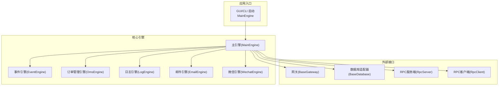

**图示来源**
- [vnpy/trader/engine.py](file://vnpy/trader/engine.py#L81-L324)
- [vnpy/event/engine.py](file://vnpy/event/engine.py#L33-L146)
- [vnpy/trader/gateway.py](file://vnpy/trader/gateway.py#L33-L273)
- [vnpy/trader/database.py](file://vnpy/trader/database.py#L52-L160)
- [vnpy/rpc/server.py](file://vnpy/rpc/server.py#L11-L141)
- [vnpy/rpc/client.py](file://vnpy/rpc/client.py#L29-L170)

**章节来源**
- [README.md](file://README.md#L1-L343)
- [vnpy/trader/engine.py](file://vnpy/trader/engine.py#L81-L324)
- [vnpy/event/engine.py](file://vnpy/event/engine.py#L33-L146)

## 核心组件
- 事件引擎：负责事件分发、定时器触发与线程安全处理。
- 主引擎：集中管理网关、应用、引擎实例，提供统一的业务入口。
- 订单管理引擎：维护Tick/Order/Trade/Position/Account/Contract/Quote等状态与活跃列表。
- 日志/通知：统一日志输出与邮件、微信推送。
- 网关：抽象交易接口，负责连接、订阅、下单、撤单、历史查询等。
- 数据库：抽象数据库适配器，支持多种后端驱动。
- RPC：基于ZeroMQ的请求-应答与发布-订阅模式，提供心跳与断连检测。

**章节来源**
- [vnpy/event/engine.py](file://vnpy/event/engine.py#L33-L146)
- [vnpy/trader/engine.py](file://vnpy/trader/engine.py#L81-L324)
- [vnpy/trader/gateway.py](file://vnpy/trader/gateway.py#L33-L273)
- [vnpy/trader/database.py](file://vnpy/trader/database.py#L52-L160)
- [vnpy/rpc/server.py](file://vnpy/rpc/server.py#L11-L141)
- [vnpy/rpc/client.py](file://vnpy/rpc/client.py#L29-L170)

## 架构总览
下图展示了从UI到网关、数据库与RPC的典型交互路径，以及事件驱动的数据流。

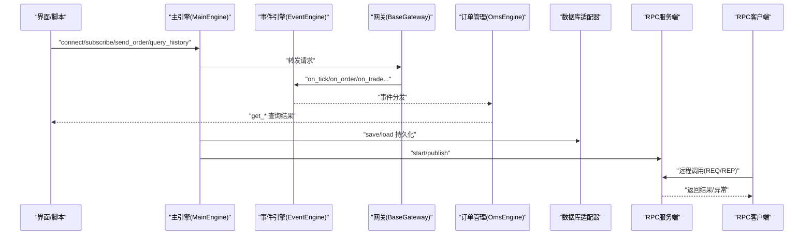

**图示来源**
- [vnpy/trader/engine.py](file://vnpy/trader/engine.py#L234-L308)
- [vnpy/event/engine.py](file://vnpy/event/engine.py#L55-L78)
- [vnpy/trader/gateway.py](file://vnpy/trader/gateway.py#L86-L158)
- [vnpy/trader/database.py](file://vnpy/trader/database.py#L57-L133)
- [vnpy/rpc/server.py](file://vnpy/rpc/server.py#L83-L111)
- [vnpy/rpc/client.py](file://vnpy/rpc/client.py#L128-L150)

## 详细组件分析

### 事件引擎与日志系统
- 事件引擎：内部队列+两个守护线程分别处理事件与定时器；停止时需等待线程join，避免资源泄漏。
- 日志系统：统一通过LogData与EVENT_LOG事件输出，支持控制台与文件双通道，级别可配置。

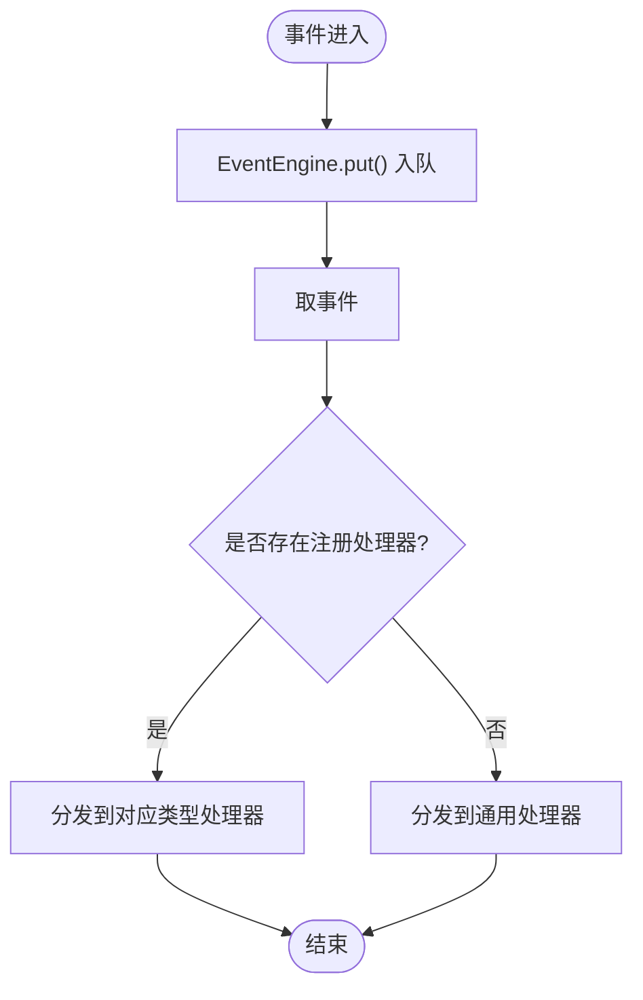

**图示来源**
- [vnpy/event/engine.py](file://vnpy/event/engine.py#L105-L110)
- [vnpy/event/engine.py](file://vnpy/event/engine.py#L66-L78)

**章节来源**
- [vnpy/event/engine.py](file://vnpy/event/engine.py#L33-L146)
- [vnpy/trader/logger.py](file://vnpy/trader/logger.py#L22-L56)
- [vnpy/trader/engine.py](file://vnpy/trader/engine.py#L325-L358)

### 主引擎与订单管理
- 主引擎负责初始化事件引擎、注册各引擎、转发业务请求（连接、订阅、下单、撤单、历史查询）。
- 订单管理引擎维护全量与活跃状态数据结构，处理事件并更新转换器，提供查询接口。

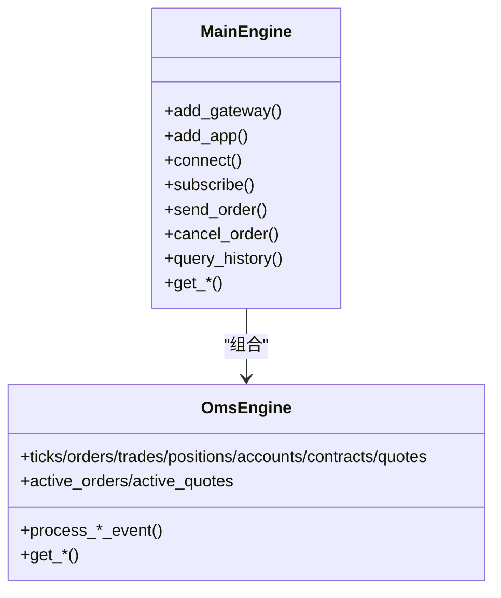

**图示来源**
- [vnpy/trader/engine.py](file://vnpy/trader/engine.py#L81-L324)
- [vnpy/trader/engine.py](file://vnpy/trader/engine.py#L360-L588)

**章节来源**
- [vnpy/trader/engine.py](file://vnpy/trader/engine.py#L81-L324)
- [vnpy/trader/engine.py](file://vnpy/trader/engine.py#L360-L588)

### 网关接口与数据对象
- 网关抽象定义了连接、订阅、下单、撤单、查询等必须实现的方法，并提供事件回调封装。
- 数据对象定义了Tick、Bar、Order、Trade、Position、Account、Contract、Quote、请求与历史查询等结构。

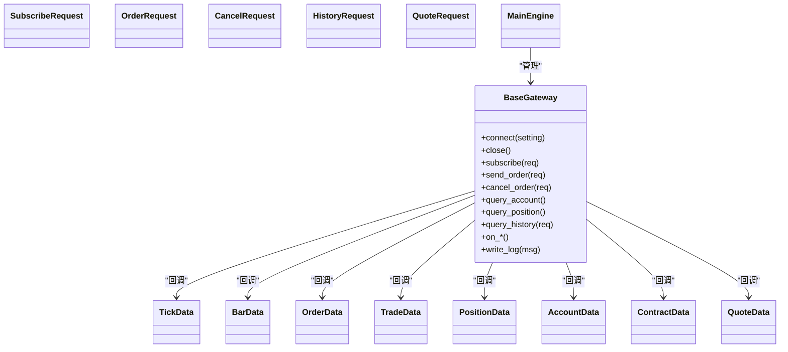

**图示来源**
- [vnpy/trader/gateway.py](file://vnpy/trader/gateway.py#L33-L273)
- [vnpy/trader/object.py](file://vnpy/trader/object.py#L17-L428)

**章节来源**
- [vnpy/trader/gateway.py](file://vnpy/trader/gateway.py#L33-L273)
- [vnpy/trader/object.py](file://vnpy/trader/object.py#L17-L428)

### RPC通信与心跳
- 服务端：绑定REQ/REP与PUB Socket，线程循环监听请求，执行注册函数并返回结果；周期性发布心跳。
- 客户端：连接REQ/SUB Socket，线程轮询订阅主题；超时抛出RemoteException；心跳丢失触发断连回调。

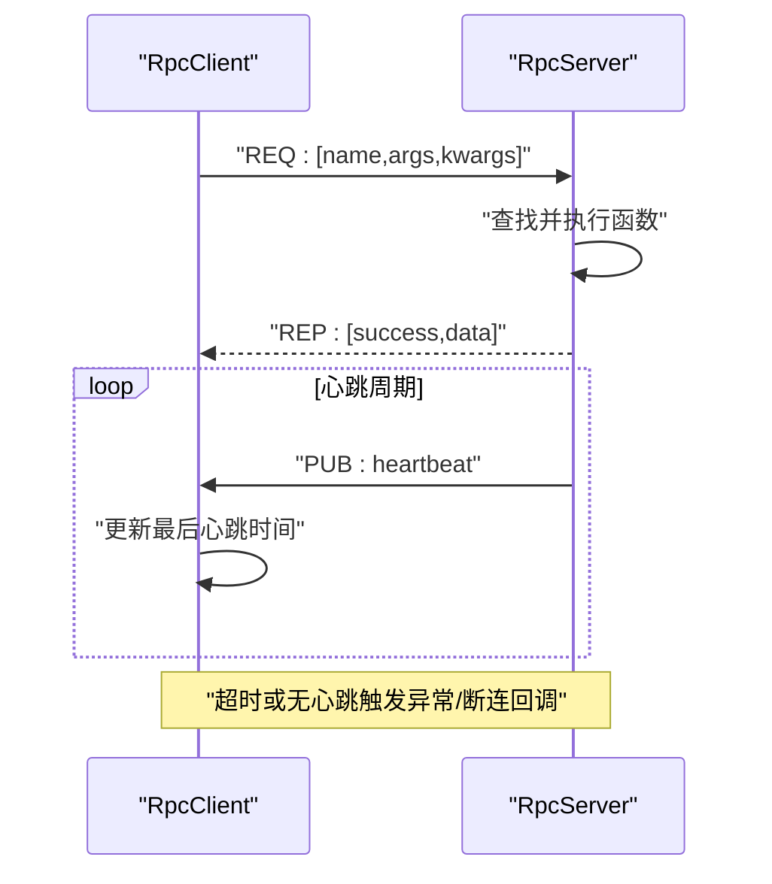

**图示来源**
- [vnpy/rpc/server.py](file://vnpy/rpc/server.py#L83-L111)
- [vnpy/rpc/client.py](file://vnpy/rpc/client.py#L128-L150)
- [vnpy/rpc/common.py](file://vnpy/rpc/common.py#L8-L11)

**章节来源**
- [vnpy/rpc/server.py](file://vnpy/rpc/server.py#L11-L141)
- [vnpy/rpc/client.py](file://vnpy/rpc/client.py#L29-L170)
- [vnpy/rpc/common.py](file://vnpy/rpc/common.py#L1-L11)

### 数据库适配与数据流
- 抽象数据库适配器定义保存/加载/删除/概览等接口；运行时动态加载驱动，默认SQLite。
- 数据对象包含vt_symbol/vt_orderid/vt_tradeid等唯一标识，便于事件与存储映射。

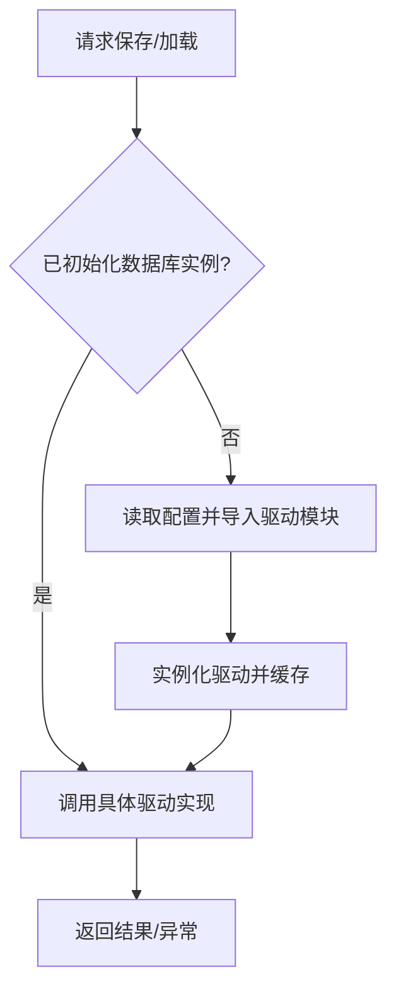

**图示来源**
- [vnpy/trader/database.py](file://vnpy/trader/database.py#L139-L160)
- [vnpy/trader/database.py](file://vnpy/trader/database.py#L52-L133)

**章节来源**
- [vnpy/trader/database.py](file://vnpy/trader/database.py#L52-L160)
- [vnpy/trader/object.py](file://vnpy/trader/object.py#L17-L428)

## 依赖分析
- 耦合关系：MainEngine聚合EventEngine与各引擎；OmsEngine依赖EventEngine处理事件；Gateway通过EventEngine发布事件；RPC服务端/客户端依赖ZeroMQ；数据库通过模块导入实现多驱动。
- 可能的环路：当前结构为单向依赖，未见明显循环依赖。
- 外部依赖：ZeroMQ、loguru、tzlocal等。

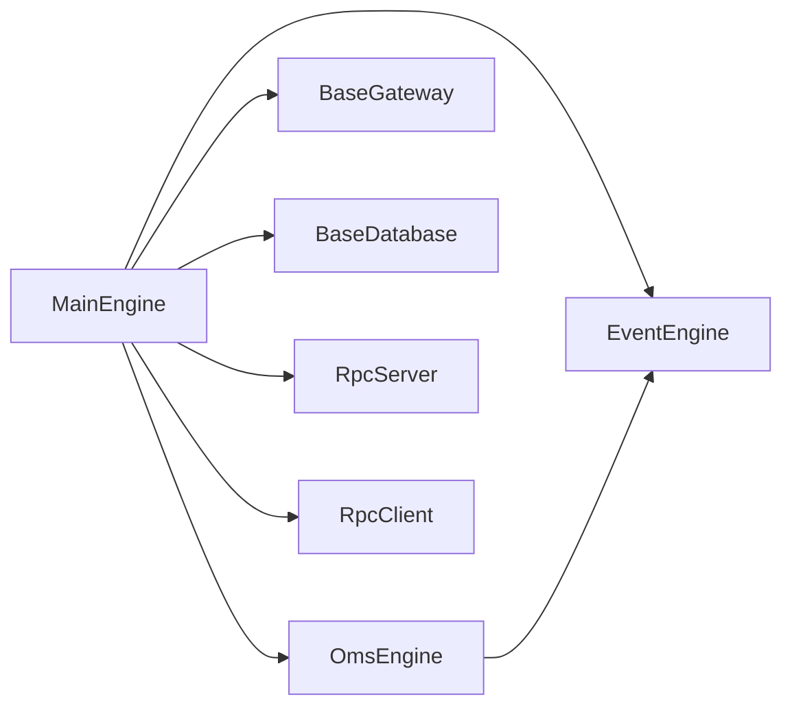

**图示来源**
- [vnpy/trader/engine.py](file://vnpy/trader/engine.py#L81-L324)
- [vnpy/event/engine.py](file://vnpy/event/engine.py#L33-L146)
- [vnpy/trader/gateway.py](file://vnpy/trader/gateway.py#L33-L273)
- [vnpy/trader/database.py](file://vnpy/trader/database.py#L52-L160)
- [vnpy/rpc/server.py](file://vnpy/rpc/server.py#L11-L141)
- [vnpy/rpc/client.py](file://vnpy/rpc/client.py#L29-L170)

**章节来源**
- [vnpy/trader/engine.py](file://vnpy/trader/engine.py#L81-L324)
- [vnpy/event/engine.py](file://vnpy/event/engine.py#L33-L146)

## 性能考虑
- 事件队列与线程模型：事件引擎采用阻塞队列与守护线程，避免忙轮询；停止时需等待线程退出，防止资源泄露。
- 日志级别与输出：控制台与文件双通道可按需开启，避免I/O成为瓶颈。
- RPC超时与心跳：客户端超时阈值可配置，心跳容忍时间用于判断断连，避免长时间阻塞。
- 数据库驱动：默认SQLite适合入门，生产建议使用高性能数据库驱动并合理设置连接池与索引。

[本节为通用指导，无需列出章节来源]

## 故障排除指南

### 一、系统错误分类与处理策略
- 运行期异常
  - 表现：主线程崩溃、事件引擎停止、RPC调用超时、数据库连接失败。
  - 处理：启用详细日志，捕获异常栈，检查配置文件与网络连通性。
- 逻辑错误
  - 表现：下单未成交、撤单无效、历史数据缺失、重复订单。
  - 处理：核对OrderRequest/CancelRequest构造、vt_symbol映射、状态机流转。
- 资源耗尽
  - 表现：内存增长、CPU占用高、文件句柄不足、数据库锁等待。
  - 处理：限制并发、释放缓存、优化查询、增加索引与分区。

**章节来源**
- [vnpy/trader/logger.py](file://vnpy/trader/logger.py#L22-L56)
- [vnpy/trader/setting.py](file://vnpy/trader/setting.py#L11-L44)

### 二、网络连接与心跳检测
- RPC断连
  - 症状：客户端抛出RemoteException，提示超时或无响应；服务端未收到请求。
  - 排查：确认地址与端口、防火墙放行、ZeroMQ版本兼容；检查服务端是否正常启动与线程存活。
  - 处理：重试连接、增大超时、检查服务端日志与心跳发布。
- 心跳丢失
  - 症状：客户端打印断连告警，订阅无数据。
  - 排查：确认服务端心跳周期与客户端容忍时间；检查网络抖动与丢包。
  - 处理：缩短容忍时间、增加重连机制、监控网络质量。

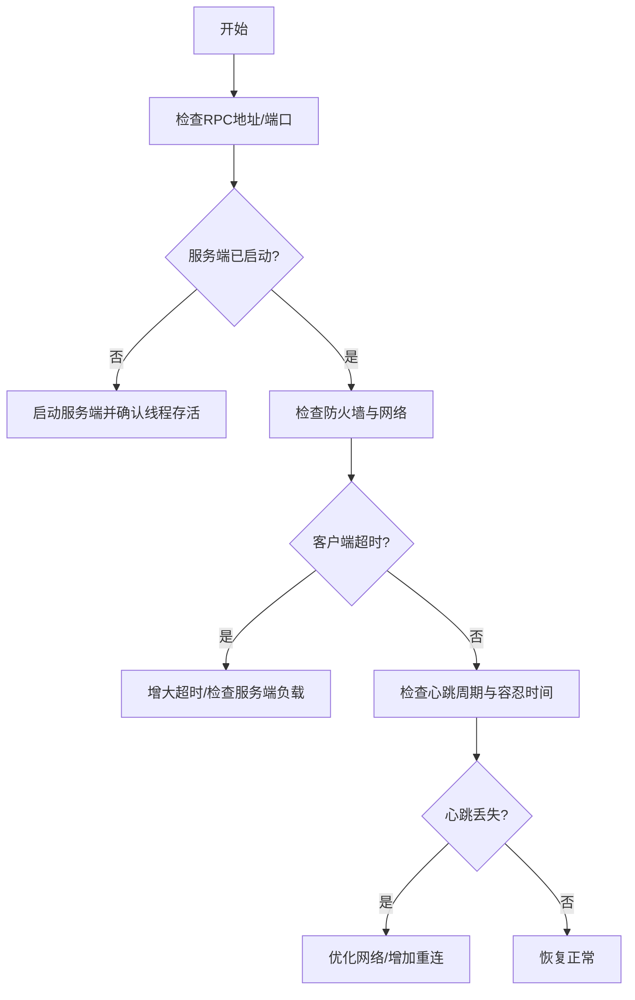

**图示来源**
- [vnpy/rpc/client.py](file://vnpy/rpc/client.py#L164-L170)
- [vnpy/rpc/common.py](file://vnpy/rpc/common.py#L8-L11)
- [vnpy/rpc/server.py](file://vnpy/rpc/server.py#L129-L141)

**章节来源**
- [vnpy/rpc/client.py](file://vnpy/rpc/client.py#L29-L170)
- [vnpy/rpc/server.py](file://vnpy/rpc/server.py#L11-L141)
- [vnpy/rpc/common.py](file://vnpy/rpc/common.py#L1-L11)

### 三、数据同步与数据库一致性
- 数据入库失败
  - 症状：save_* 返回失败或异常。
  - 排查：确认数据库驱动已安装、连接参数正确、表结构与字段匹配。
  - 处理：切换默认SQLite验证问题，逐步接入生产数据库。
- 历史数据缺失
  - 症状：query_history 返回空或范围不正确。
  - 排查：核对HistoryRequest参数、时区转换、数据库时区配置。
  - 处理：修正时区与时间范围，必要时重建索引。
- 实时数据不同步
  - 症状：OmsEngine查询不到最新数据。
  - 排查：确认事件已注册、事件类型一致、回调未被过滤。
  - 处理：检查OmsEngine.register_event与事件处理器注册。

**章节来源**
- [vnpy/trader/database.py](file://vnpy/trader/database.py#L52-L160)
- [vnpy/trader/engine.py](file://vnpy/trader/engine.py#L384-L461)
- [vnpy/trader/setting.py](file://vnpy/trader/setting.py#L31-L37)

### 四、交易执行链路故障
- 下单无响应
  - 症状：send_order返回空或状态未更新。
  - 排查：确认Gateway.send_order实现、vt_orderid生成、状态机流转。
  - 处理：检查网关日志、重试下单、必要时人工撤单。
- 撤单失败
  - 症状：cancel_order无效或报错。
  - 排查：确认CancelRequest构造、vt_orderid正确、网关支持撤单。
  - 处理：使用OrderData.create_cancel_request生成规范请求。
- 历史查询异常
  - 症状：query_history返回空或异常。
  - 排查：确认Gateway.query_history实现、HistoryRequest参数、网关支持历史数据。
  - 处理：降级到其他网关或使用数据服务。

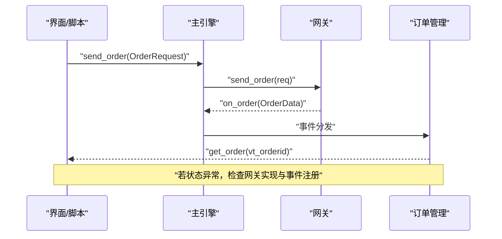

**图示来源**
- [vnpy/trader/engine.py](file://vnpy/trader/engine.py#L254-L264)
- [vnpy/trader/gateway.py](file://vnpy/trader/gateway.py#L196-L221)
- [vnpy/trader/engine.py](file://vnpy/trader/engine.py#L399-L410)

**章节来源**
- [vnpy/trader/engine.py](file://vnpy/trader/engine.py#L254-L308)
- [vnpy/trader/gateway.py](file://vnpy/trader/gateway.py#L196-L266)
- [vnpy/trader/object.py](file://vnpy/trader/object.py#L339-L355)

### 五、性能问题与资源耗尽
- CPU/内存飙升
  - 症状：事件积压、线程阻塞、日志刷屏。
  - 排查：检查事件处理器是否阻塞、是否重复注册、日志级别过高。
  - 处理：限流/去重、降低日志级别、拆分处理器。
- RPC延迟高
  - 症状：REQ/REP往返时间长、订阅端积压。
  - 排查：网络带宽、服务端线程数、消息大小。
  - 处理：压缩消息、批量处理、优化网络拓扑。
- 数据库压力大
  - 症状：写入慢、查询超时、锁等待。
  - 排查：索引缺失、事务过大、连接数过多。
  - 处理：分表分仓、批量写入、连接池优化。

**章节来源**
- [vnpy/event/engine.py](file://vnpy/event/engine.py#L55-L78)
- [vnpy/rpc/client.py](file://vnpy/rpc/client.py#L62-L84)
- [vnpy/trader/database.py](file://vnpy/trader/database.py#L57-L133)

### 六、应急响应与系统恢复
- 正常关闭流程
  - 步骤：先停止事件引擎，再依次关闭各引擎与网关，确保线程安全退出。
  - 注意：避免强制中断导致资源泄漏。
- RPC服务重启
  - 步骤：停止服务端线程、释放Socket、重新绑定地址、启动心跳。
  - 注意：客户端需具备重连与断言保护。
- 数据库切换
  - 步骤：确认新驱动可用、迁移脚本执行、校验数据完整性。
  - 注意：备份旧数据，灰度验证。

**章节来源**
- [vnpy/trader/engine.py](file://vnpy/trader/engine.py#L310-L324)
- [vnpy/rpc/server.py](file://vnpy/rpc/server.py#L67-L82)
- [vnpy/trader/database.py](file://vnpy/trader/database.py#L139-L160)

## 结论
VeighNa的故障排除应围绕“事件驱动、接口抽象、通信心跳、数据一致性”四大支柱展开。通过规范的日志与通知、严格的事件注册与状态机、稳健的RPC心跳与断连处理、以及可扩展的数据库适配，可以快速定位并解决问题。建议在生产环境中启用详尽日志、完善的监控与告警、以及自动化重连与恢复机制。

[本节为总结，无需列出章节来源]

## 附录

### A. 关键流程图：RPC客户端断连处理
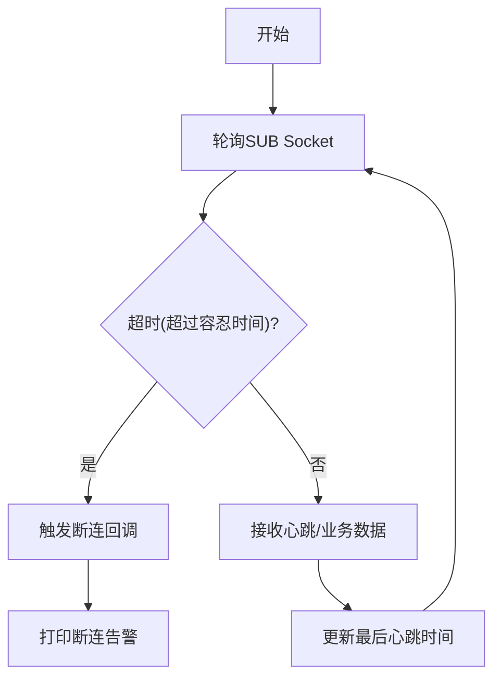

**图示来源**
- [vnpy/rpc/client.py](file://vnpy/rpc/client.py#L128-L150)
- [vnpy/rpc/common.py](file://vnpy/rpc/common.py#L8-L11)

### B. 示例：服务端与客户端运行
- 服务端示例：启动MainEngine，连接网关，启动RPC服务，发布心跳。
- 客户端示例：启动MainEngine，添加RpcGateway与策略应用，展示界面。

**章节来源**
- [examples/client_server/run_server.py](file://examples/client_server/run_server.py#L13-L74)
- [examples/client_server/run_client.py](file://examples/client_server/run_client.py#L9-L28)