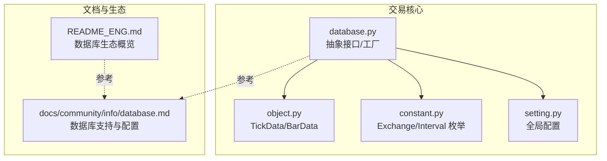
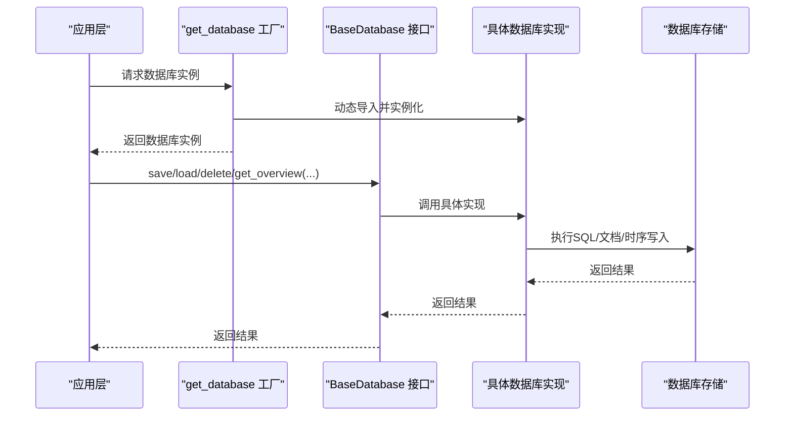
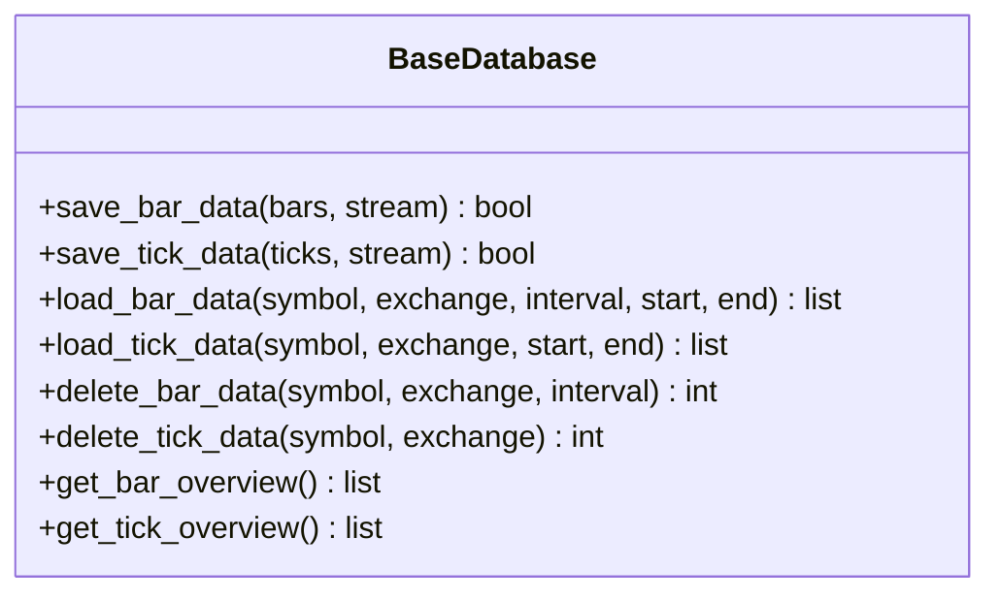
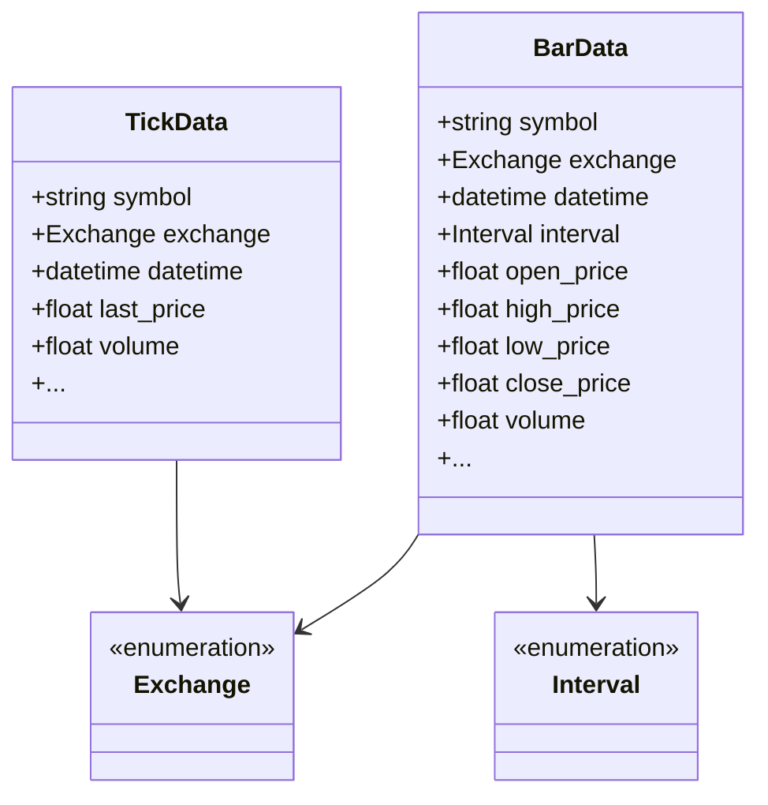
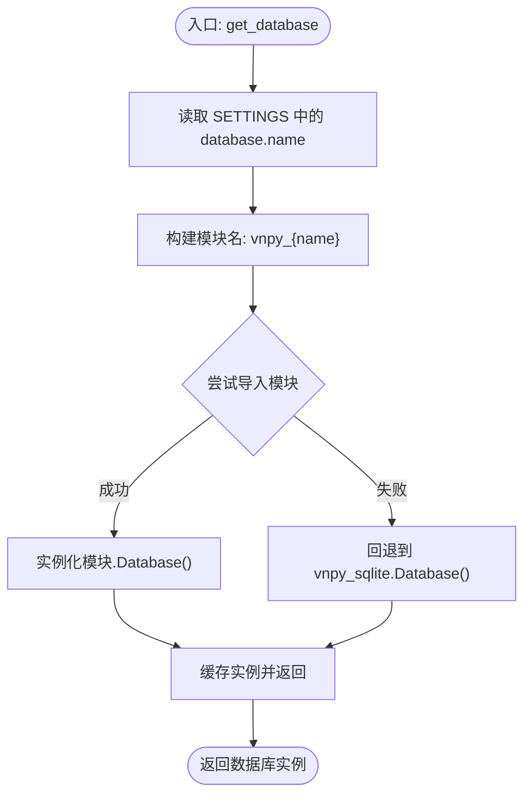
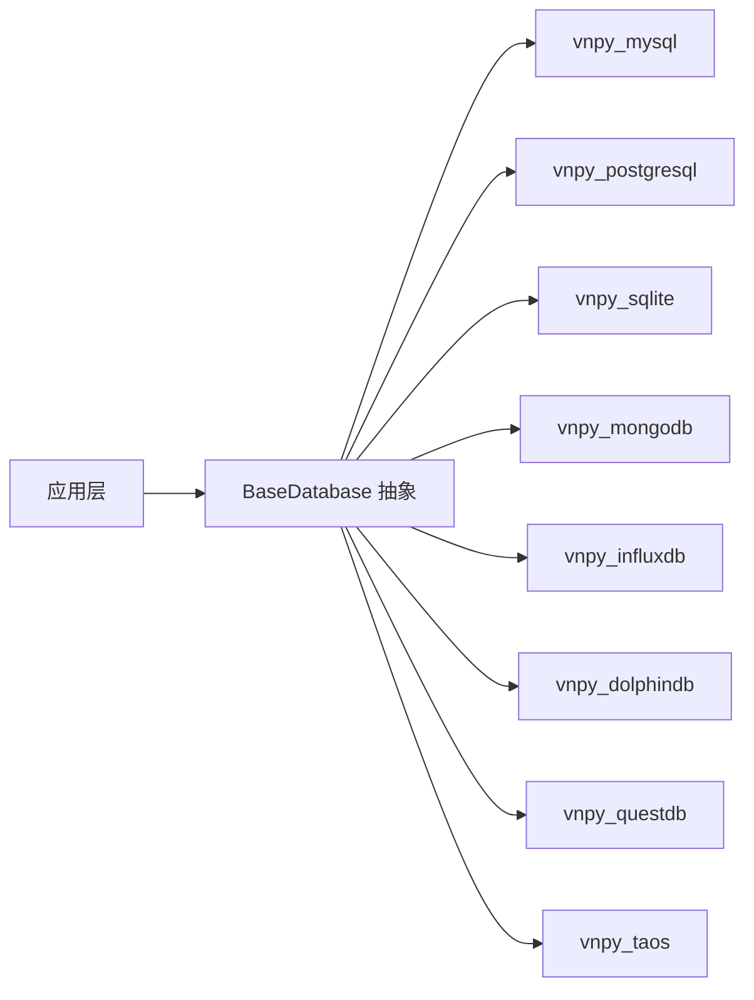

# 数据库集成

<cite>
**本文引用的文件**
- [vnpy/trader/database.py](file://vnpy/trader/database.py)
- [vnpy/trader/setting.py](file://vnpy/trader/setting.py)
- [vnpy/trader/object.py](file://vnpy/trader/object.py)
- [vnpy/trader/constant.py](file://vnpy/trader/constant.py)
- [docs/community/info/database.md](file://docs/community/info/database.md)
- [README_ENG.md](file://README_ENG.md)
</cite>

## 目录
1. [引言](#引言)
2. [项目结构](#项目结构)
3. [核心组件](#核心组件)
4. [架构总览](#架构总览)
5. [详细组件分析](#详细组件分析)
6. [依赖分析](#依赖分析)
7. [性能考虑](#性能考虑)
8. [故障排查指南](#故障排查指南)
9. [结论](#结论)
10. [附录](#附录)

## 引言
本文件面向数据库管理员与开发者，系统化梳理 VeighNa 量化交易框架的数据库集成方案。内容涵盖数据库连接配置、数据模型设计、表结构优化、数据同步与备份恢复、性能调优与连接池管理、数据迁移与版本升级等关键主题，并结合框架内置抽象层与官方文档，提供可落地的实施建议。

## 项目结构
与数据库相关的核心代码位于 vnpy/trader 模块，主要由以下文件构成：
- 抽象数据库接口与工厂：vnpy/trader/database.py
- 全局配置项：vnpy/trader/setting.py
- 数据对象与枚举：vnpy/trader/object.py、vnpy/trader/constant.py
- 官方数据库支持与配置说明：docs/community/info/database.md
- 平台能力概览（含数据库生态）：README_ENG.md

图表来源
- [vnpy/trader/database.py](file://vnpy/trader/database.py#L1-L160)
- [vnpy/trader/setting.py](file://vnpy/trader/setting.py#L1-L44)
- [vnpy/trader/object.py](file://vnpy/trader/object.py#L1-L200)
- [vnpy/trader/constant.py](file://vnpy/trader/constant.py#L1-L161)
- [docs/community/info/database.md](file://docs/community/info/database.md#L1-L410)
- [README_ENG.md](file://README_ENG.md#L150-L200)

章节来源
- [vnpy/trader/database.py](file://vnpy/trader/database.py#L1-L160)
- [vnpy/trader/setting.py](file://vnpy/trader/setting.py#L1-L44)
- [docs/community/info/database.md](file://docs/community/info/database.md#L1-L410)
- [README_ENG.md](file://README_ENG.md#L150-L200)

## 核心组件
- 抽象数据库接口 BaseDatabase：定义统一的 K 线与 Tick 数据的保存、加载、删除、概览查询等方法，屏蔽不同数据库实现差异。
- 数据对象与枚举：TickData、BarData、Exchange、Interval 等，作为数据库持久化与查询的契约数据结构。
- 数据库工厂 get_database：依据全局配置动态加载对应数据库驱动模块（如 vnpy_sqlite、vnpy_mysql 等），若未找到则回退至默认 SQLite。
- 全局配置 SETTINGS：集中管理数据库名称、主机、端口、账号、密码、时区等关键参数。

章节来源
- [vnpy/trader/database.py](file://vnpy/trader/database.py#L52-L160)
- [vnpy/trader/object.py](file://vnpy/trader/object.py#L29-L109)
- [vnpy/trader/constant.py](file://vnpy/trader/constant.py#L82-L161)
- [vnpy/trader/setting.py](file://vnpy/trader/setting.py#L11-L44)

## 架构总览
数据库抽象层通过工厂按配置动态选择具体实现，应用层仅依赖抽象接口，从而实现“一次编写，多库适配”。典型流程：
- 应用层获取数据库实例
- 传入标准数据对象（TickData/BarData）与查询条件（symbol/exchange/interval/start/end）
- 抽象接口委派给具体数据库实现（如 MySQL/PostgreSQL/MongoDB/InfluxDB 等）

图表来源
- [vnpy/trader/database.py](file://vnpy/trader/database.py#L139-L160)
- [docs/community/info/database.md](file://docs/community/info/database.md#L1-L410)

## 详细组件分析

### 抽象数据库接口 BaseDatabase
- 职责：定义统一的数据存取与管理接口，包括：
  - 保存 K 线与 Tick 数据
  - 加载 K 线与 Tick 数据（按合约、交易所、周期、时间范围）
  - 删除指定合约/周期的 K 线或指定合约的 Tick 数据
  - 查询数据库中可用的 K 线与 Tick 概览
- 设计要点：
  - 方法签名标准化，便于多数据库实现一致性
  - 支持流式写入标记（stream 参数），为批量入库优化预留
  - 返回值类型明确（列表/整数/概览对象），便于上层处理

图表来源
- [vnpy/trader/database.py](file://vnpy/trader/database.py#L52-L134)

章节来源
- [vnpy/trader/database.py](file://vnpy/trader/database.py#L52-L134)

### 数据对象与枚举
- TickData：包含最新价、成交量、买卖盘口、时间戳等字段，用于逐笔行情存储与查询。
- BarData：包含开盘、最高、最低、收盘、成交量等字段，用于 K 线存储与查询。
- Exchange/Interval：标准化交易所与时间粒度枚举，保证跨数据库的一致性与可移植性。

图表来源
- [vnpy/trader/object.py](file://vnpy/trader/object.py#L29-L109)
- [vnpy/trader/constant.py](file://vnpy/trader/constant.py#L82-L161)

章节来源
- [vnpy/trader/object.py](file://vnpy/trader/object.py#L29-L109)
- [vnpy/trader/constant.py](file://vnpy/trader/constant.py#L82-L161)

### 数据库工厂与配置
- 工厂函数 get_database：
  - 读取全局配置中的 database.name
  - 动态导入模块 vnpy_{name}
  - 若模块不存在，回退到默认 SQLite 实现
  - 缓存实例，避免重复初始化
- 全局配置 SETTINGS：
  - 包含 database.timezone、database.name、database.database、database.host、database.port、database.user、database.password 等键
  - 支持从 JSON 文件覆盖默认值

图表来源
- [vnpy/trader/database.py](file://vnpy/trader/database.py#L139-L160)
- [vnpy/trader/setting.py](file://vnpy/trader/setting.py#L11-L44)

章节来源
- [vnpy/trader/database.py](file://vnpy/trader/database.py#L139-L160)
- [vnpy/trader/setting.py](file://vnpy/trader/setting.py#L11-L44)

### 数据模型设计与表结构优化
- 统一数据模型：TickData/BarData 作为持久化契约，确保不同数据库的表结构设计遵循一致的字段语义。
- 时间字段与时区：
  - 抽象层提供时区转换工具 convert_tz，将输入时间统一转换为数据库时区，避免跨时区写入导致的排序与查询异常。
  - 配置项 database.timezone 来源于系统本地时区，可在部署时显式调整。
- 表结构设计建议（基于抽象接口的通用约束）：
  - 主键与索引：以 (symbol, exchange, datetime) 或 (symbol, exchange, interval, datetime) 作为主键或唯一索引，确保去重与快速定位。
  - 分区策略：对于时间序列数据，建议按日期或周期进行分区，提升扫描与归档效率。
  - 列式存储：对高频写入场景优先考虑列式数据库（如 InfluxDB、QuestDB、TDengine），以获得更高吞吐。
  - 文档型数据库：MongoDB 可利用灵活的 BSON 结构存储 Tick/Bar，适合快速迭代与多维查询。
- 字段冗余与物化视图：对常用聚合字段（如 OHLCV、成交量）可考虑物化，减少在线计算成本。

章节来源
- [vnpy/trader/database.py](file://vnpy/trader/database.py#L17-L23)
- [vnpy/trader/setting.py](file://vnpy/trader/setting.py#L31-L37)
- [docs/community/info/database.md](file://docs/community/info/database.md#L1-L410)

### 数据同步与备份恢复
- 同步策略：
  - 实时写入：数据记录器将 Tick/Bar 持久化到数据库，建议开启事务批处理，降低写放大。
  - 增量同步：以时间窗口增量拉取，避免一次性全量扫描。
  - 多副本：关系型数据库可采用主从复制；时序数据库可启用集群节点；文档型数据库可配置副本集。
- 备份与恢复：
  - 关系型数据库：定期逻辑备份（mysqldump/pg_dump）与物理备份（LVM/快照），验证恢复流程。
  - 时序数据库：导出/导入工具（如 InfluxDB CLI、QuestDB/TAOS 工具链）进行离线备份。
  - 文档型数据库：导出集合或使用副本集/分片集群的快照机制。
- 故障演练：定期进行 RTO/RPO 测试，确保在故障发生后能按 SLA 恢复。

章节来源
- [docs/community/info/database.md](file://docs/community/info/database.md#L1-L410)

### 性能调优与连接池管理
- 连接池：
  - 关系型数据库：合理设置最大连接数、空闲超时、重试策略，避免连接泄漏。
  - 时序数据库：控制并发写入批次大小与刷新间隔，避免阻塞。
  - 文档型数据库：限制单次批量写入条数，结合异步回调监控延迟。
- 写入优化：
  - 批量写入：将多个 Tick/Bar 合并为单次插入，减少往返次数。
  - 去重策略：基于主键/唯一索引进行幂等写入，避免重复数据。
  - 压缩与编码：启用数据库压缩与合适的字符集/排序规则，降低 IO。
- 读取优化：
  - 索引命中：确保查询条件覆盖索引前缀，避免全表扫描。
  - 分页与投影：仅读取必要字段，分页处理大数据集。
  - 缓存：对热点数据引入应用层缓存（如 Redis），减轻数据库压力。

章节来源
- [docs/community/info/database.md](file://docs/community/info/database.md#L1-L410)

### 数据迁移与版本升级
- 版本管理：
  - 对关系型数据库，维护 DDL 版本号与迁移脚本，按顺序执行。
  - 对时序/文档型数据库，记录 schema 版本并在启动时校验与自动修复。
- 迁移步骤：
  - 停止写入，导出旧库数据。
  - 生成新 schema 的 DDL/索引，创建新库。
  - 导入数据并校验完整性（数量、时间范围、关键字段）。
  - 切换流量，观察指标与告警，保留回滚窗口。
- 自动化与可观测性：
  - 使用 CI/CD 执行迁移脚本，记录日志与回滚点。
  - 监控迁移期间的延迟、错误率与资源占用。

章节来源
- [docs/community/info/database.md](file://docs/community/info/database.md#L1-L410)

## 依赖分析
- 组件耦合：
  - 应用层仅依赖 BaseDatabase 抽象，耦合度低，便于替换实现。
  - 数据对象与枚举被广泛使用，变更需谨慎评估影响面。
- 外部依赖：
  - 通过模块名约定（vnpy_{name}）与动态导入解耦具体数据库驱动。
  - 时区处理依赖系统本地时区配置，确保跨环境一致性。

图表来源
- [vnpy/trader/database.py](file://vnpy/trader/database.py#L139-L160)
- [README_ENG.md](file://README_ENG.md#L179-L193)

章节来源
- [vnpy/trader/database.py](file://vnpy/trader/database.py#L139-L160)
- [README_ENG.md](file://README_ENG.md#L179-L193)

## 性能考虑
- 写入路径：
  - 批量提交、去重写入、索引预估与分区规划。
- 读取路径：
  - 索引优化、投影裁剪、分页与缓存。
- 连接与资源：
  - 连接池参数调优、超时与重试策略、资源回收。
- 存储介质：
  - SSD/NVMe、RAID/云盘类型、压缩与冷热分层。

## 故障排查指南
- 无法连接数据库：
  - 检查 host/port/user/password/database 配置是否正确。
  - 确认防火墙与网络连通性。
- 时区异常：
  - 核对 database.timezone 设置，确保与业务期望一致。
- 写入失败：
  - 查看连接池状态与事务日志，确认唯一约束冲突与索引问题。
- 读取慢：
  - 检查查询条件是否命中索引，是否存在全表扫描。
- 备份恢复：
  - 校验备份文件完整性与可恢复性，制定回滚预案。

章节来源
- [vnpy/trader/setting.py](file://vnpy/trader/setting.py#L31-L37)
- [docs/community/info/database.md](file://docs/community/info/database.md#L1-L410)

## 结论
通过抽象数据库接口与工厂模式，VeighNa 实现了对多种数据库的统一接入。配合标准数据模型、时区处理与官方文档提供的配置指引，开发者可以按需选择最适合的数据库类型，并在性能、可靠性与运维成本之间取得平衡。建议在生产环境中完善监控、备份与自动化迁移流程，确保数据安全与业务连续性。

## 附录
- 官方数据库支持与配置示例参见文档：docs/community/info/database.md
- 平台数据库生态概览参见：README_ENG.md