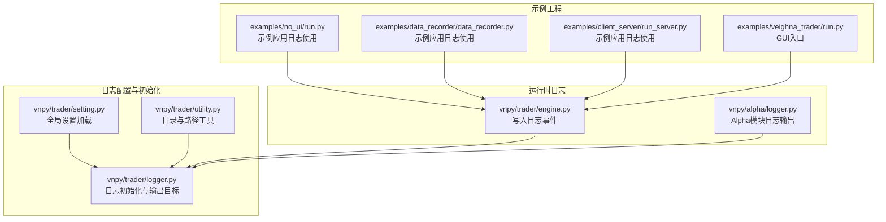
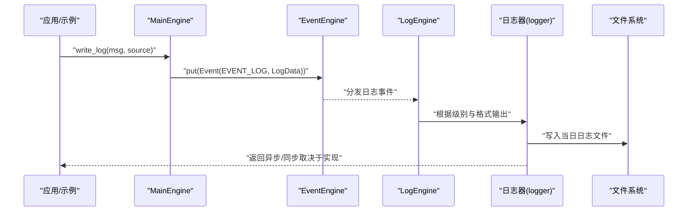
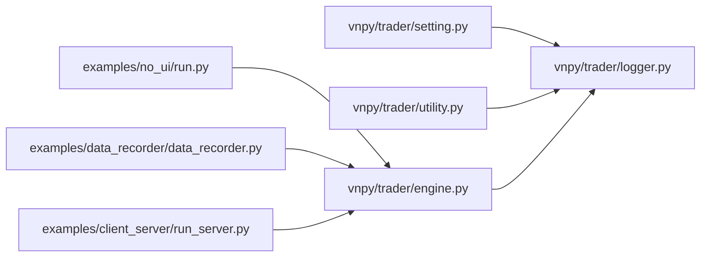

# 日志监控

<cite>
**本文引用的文件**
- [vnpy/trader/logger.py](file://vnpy/trader/logger.py)
- [vnpy/alpha/logger.py](file://vnpy/alpha/logger.py)
- [vnpy/trader/setting.py](file://vnpy/trader/setting.py)
- [vnpy/trader/engine.py](file://vnpy/trader/engine.py)
- [vnpy/trader/utility.py](file://vnpy/trader/utility.py)
- [examples/no_ui/run.py](file://examples/no_ui/run.py)
- [examples/data_recorder/data_recorder.py](file://examples/data_recorder/data_recorder.py)
- [examples/client_server/run_server.py](file://examples/client_server/run_server.py)
- [examples/veighna_trader/run.py](file://examples/veighna_trader/run.py)
</cite>

## 目录
1. [简介](#简介)
2. [项目结构](#项目结构)
3. [核心组件](#核心组件)
4. [架构总览](#架构总览)
5. [详细组件分析](#详细组件分析)
6. [依赖关系分析](#依赖关系分析)
7. [性能与可维护性](#性能与可维护性)
8. [故障排查指南](#故障排查指南)
9. [结论](#结论)
10. [附录](#附录)

## 简介
本文件面向VeighNa量化交易框架的运维与开发团队，系统化梳理日志监控体系的设计与落地实践。内容涵盖日志系统架构、配置方法、日志格式与级别、输出目标、轮转与归档策略、监控告警与异常检测最佳实践，以及日志分析与故障诊断方法。通过结合源码路径与流程图示，帮助读者快速建立稳定、可观测的日志管理与监控体系。

## 项目结构
VeighNa的日志体系由以下关键部分组成：
- 全局日志配置与初始化：在交易引擎启动时加载全局设置，并基于设置初始化日志输出（控制台与文件）。
- 日志格式与级别：统一使用结构化格式，支持按级别过滤输出。
- 输出目标：控制台与本地文件；文件按日期命名，便于归档与轮转。
- 额外上下文：通过扩展字段注入网关名称等上下文信息，提升定位效率。
- 示例工程中的日志使用：展示如何在应用层记录运行状态与关键事件。

图表来源
- [vnpy/trader/setting.py](file://vnpy/trader/setting.py#L11-L38)
- [vnpy/trader/logger.py](file://vnpy/trader/logger.py#L22-L56)
- [vnpy/trader/utility.py](file://vnpy/trader/utility.py#L72-L79)
- [vnpy/trader/engine.py](file://vnpy/trader/engine.py#L168-L174)
- [vnpy/alpha/logger.py](file://vnpy/alpha/logger.py#L1-L13)
- [examples/no_ui/run.py](file://examples/no_ui/run.py#L15-L84)
- [examples/data_recorder/data_recorder.py](file://examples/data_recorder/data_recorder.py#L26-L28)
- [examples/client_server/run_server.py](file://examples/client_server/run_server.py#L32-L32)
- [examples/veighna_trader/run.py](file://examples/veighna_trader/run.py#L38-L82)

章节来源
- [vnpy/trader/setting.py](file://vnpy/trader/setting.py#L11-L38)
- [vnpy/trader/logger.py](file://vnpy/trader/logger.py#L22-L56)
- [vnpy/trader/utility.py](file://vnpy/trader/utility.py#L72-L79)
- [vnpy/trader/engine.py](file://vnpy/trader/engine.py#L168-L174)
- [vnpy/alpha/logger.py](file://vnpy/alpha/logger.py#L1-L13)
- [examples/no_ui/run.py](file://examples/no_ui/run.py#L15-L84)
- [examples/data_recorder/data_recorder.py](file://examples/data_recorder/data_recorder.py#L26-L28)
- [examples/client_server/run_server.py](file://examples/client_server/run_server.py#L32-L32)
- [examples/veighna_trader/run.py](file://examples/veighna_trader/run.py#L38-L82)

## 核心组件
- 全局设置（日志相关）
  - 关键项：日志开关、日志级别、是否输出到控制台、是否输出到文件。
  - 来源：全局设置字典，支持从JSON文件覆盖默认值。
- 日志初始化
  - 统一格式：时间戳、级别、上下文（如网关名）、消息。
  - 默认移除标准输出，按配置添加控制台与文件输出。
  - 文件输出按当前日期命名，输出至“log”目录。
- 运行时日志写入
  - 通过事件机制推送日志事件，由日志引擎消费并落盘或转发。
- Alpha模块日志
  - 独立的终端输出配置，便于独立运行场景。

章节来源
- [vnpy/trader/setting.py](file://vnpy/trader/setting.py#L15-L18)
- [vnpy/trader/logger.py](file://vnpy/trader/logger.py#L22-L56)
- [vnpy/trader/engine.py](file://vnpy/trader/engine.py#L168-L174)
- [vnpy/alpha/logger.py](file://vnpy/alpha/logger.py#L6-L13)

## 架构总览
下图展示了从应用层到日志系统的调用链路与数据流。

图表来源
- [vnpy/trader/engine.py](file://vnpy/trader/engine.py#L168-L174)
- [vnpy/trader/logger.py](file://vnpy/trader/logger.py#L35-L56)

章节来源
- [vnpy/trader/engine.py](file://vnpy/trader/engine.py#L168-L174)
- [vnpy/trader/logger.py](file://vnpy/trader/logger.py#L35-L56)

## 详细组件分析

### 日志格式与级别
- 格式字段
  - 时间戳：精确到毫秒。
  - 级别：彩色显示，便于快速识别严重程度。
  - 上下文：例如网关名称，用于区分不同模块或接口来源。
  - 消息：实际日志内容。
- 级别来源
  - 从全局设置中读取默认级别，支持在运行时调整。
- 输出目标
  - 控制台：当配置允许时，输出到标准输出。
  - 文件：当配置允许时，按日期生成文件名并写入“log”目录。

章节来源
- [vnpy/trader/logger.py](file://vnpy/trader/logger.py#L22-L28)
- [vnpy/trader/logger.py](file://vnpy/trader/logger.py#L35-L56)
- [vnpy/trader/setting.py](file://vnpy/trader/setting.py#L15-L18)

### 日志初始化与输出目标
- 初始化步骤
  - 导入日志库与全局设置。
  - 配置默认扩展字段（如网关名）。
  - 移除默认stderr输出，避免重复输出。
  - 按配置决定是否启用控制台与文件输出。
  - 文件输出路径来自通用目录工具函数，确保“log”目录存在。
- 路径与目录
  - 使用统一的目录工具函数获取“log”目录，不存在则自动创建。

章节来源
- [vnpy/trader/logger.py](file://vnpy/trader/logger.py#L31-L56)
- [vnpy/trader/utility.py](file://vnpy/trader/utility.py#L72-L79)

### 运行时日志写入与事件机制
- 写入接口
  - 主引擎提供统一写日志接口，封装为日志事件并投递到事件引擎。
- 事件类型
  - 使用专用日志事件类型，便于日志引擎订阅与处理。
- 引擎职责
  - 日志引擎负责消费事件并执行具体输出动作（控制台/文件/其他通道）。

章节来源
- [vnpy/trader/engine.py](file://vnpy/trader/engine.py#L168-L174)

### Alpha模块日志
- 独立配置
  - 移除默认输出后，仅向终端输出，适合独立运行场景。
- 格式简洁
  - 保留时间与消息，便于快速查看。

章节来源
- [vnpy/alpha/logger.py](file://vnpy/alpha/logger.py#L6-L13)

### 示例工程中的日志使用
- 无UI示例
  - 显式开启日志功能、设置级别、启用控制台与文件输出，并在关键节点记录日志。
- 数据录制示例
  - 启用日志功能与控制台输出，演示如何在业务逻辑中记录事件。
- 客户端-服务器示例
  - 将日志事件转换为字符串进行传输，体现日志在分布式场景下的序列化需求。

章节来源
- [examples/no_ui/run.py](file://examples/no_ui/run.py#L15-L84)
- [examples/data_recorder/data_recorder.py](file://examples/data_recorder/data_recorder.py#L26-L28)
- [examples/client_server/run_server.py](file://examples/client_server/run_server.py#L32-L32)

## 依赖关系分析
- 配置依赖
  - 日志初始化依赖全局设置字典，确保在模块导入阶段即可生效。
- 路径依赖
  - 文件输出依赖通用目录工具函数，保证跨平台路径一致性。
- 运行时依赖
  - 应用层通过主引擎写日志，事件引擎分发给日志引擎，形成解耦的发布-订阅模式。

图表来源
- [vnpy/trader/setting.py](file://vnpy/trader/setting.py#L11-L38)
- [vnpy/trader/logger.py](file://vnpy/trader/logger.py#L35-L56)
- [vnpy/trader/utility.py](file://vnpy/trader/utility.py#L72-L79)
- [vnpy/trader/engine.py](file://vnpy/trader/engine.py#L168-L174)
- [examples/no_ui/run.py](file://examples/no_ui/run.py#L15-L84)
- [examples/data_recorder/data_recorder.py](file://examples/data_recorder/data_recorder.py#L26-L28)
- [examples/client_server/run_server.py](file://examples/client_server/run_server.py#L32-L32)

章节来源
- [vnpy/trader/setting.py](file://vnpy/trader/setting.py#L11-L38)
- [vnpy/trader/logger.py](file://vnpy/trader/logger.py#L35-L56)
- [vnpy/trader/utility.py](file://vnpy/trader/utility.py#L72-L79)
- [vnpy/trader/engine.py](file://vnpy/trader/engine.py#L168-L174)
- [examples/no_ui/run.py](file://examples/no_ui/run.py#L15-L84)
- [examples/data_recorder/data_recorder.py](file://examples/data_recorder/data_recorder.py#L26-L28)
- [examples/client_server/run_server.py](file://examples/client_server/run_server.py#L32-L32)

## 性能与可维护性
- 性能特性
  - 使用结构化日志与统一格式，减少解析成本。
  - 控制台输出建议在生产环境谨慎开启，避免I/O瓶颈。
  - 文件输出按天切分，降低单文件体积，有利于后续分析与轮转。
- 可维护性
  - 通过全局设置集中管理日志行为，便于统一策略与快速切换。
  - 扩展字段（如网关名）提升日志可读性与定位效率。
  - 事件驱动的日志写入模式降低模块间耦合。

[本节为通用建议，不直接分析具体文件]

## 故障排查指南
- 常见问题
  - 日志未输出：检查全局设置中的日志开关与输出目标配置。
  - 文件未生成：确认“log”目录是否存在且具备写权限。
  - 级别过滤：确认当前日志级别是否高于消息级别。
  - 分布式日志：确保日志事件在传输过程中保持可读格式。
- 排查步骤
  - 在应用启动早期打印关键配置项，验证日志初始化是否按预期执行。
  - 在关键业务节点增加日志点，观察日志是否到达目标输出。
  - 对比控制台与文件输出，确认是否存在重复或缺失。
- 建议
  - 在生产环境优先启用文件输出，必要时结合外部日志收集系统统一采集。

章节来源
- [vnpy/trader/setting.py](file://vnpy/trader/setting.py#L15-L18)
- [vnpy/trader/logger.py](file://vnpy/trader/logger.py#L35-L56)
- [vnpy/trader/utility.py](file://vnpy/trader/utility.py#L72-L79)
- [examples/no_ui/run.py](file://examples/no_ui/run.py#L15-L84)

## 结论
VeighNa的日志系统以统一的初始化流程、清晰的格式规范与灵活的输出目标为核心，配合事件驱动的日志写入机制，形成了可扩展、易维护的日志监控基础。通过合理的配置与最佳实践，可在开发调试与生产运维中高效地进行问题定位与风险预警。

[本节为总结，不直接分析具体文件]

## 附录

### 日志配置清单
- 开关与级别
  - 是否启用日志：影响日志初始化与事件处理。
  - 日志级别：决定哪些消息会被输出。
- 输出目标
  - 控制台输出：适用于开发与调试。
  - 文件输出：适用于生产与归档。
- 路径与命名
  - 日志目录：统一在“log”目录下。
  - 文件命名：按当前日期生成文件名，便于按日归档。

章节来源
- [vnpy/trader/setting.py](file://vnpy/trader/setting.py#L15-L18)
- [vnpy/trader/logger.py](file://vnpy/trader/logger.py#L48-L56)
- [vnpy/trader/utility.py](file://vnpy/trader/utility.py#L72-L79)

### 日志轮转与归档策略
- 策略建议
  - 按日轮转：现有实现已按日期命名文件，可结合外部轮转工具（如logrotate）进行压缩与清理。
  - 保留周期：根据合规与容量限制设定保留天数。
  - 归档格式：建议采用压缩格式（如gzip），并保留原始日志以便审计。
- 实施要点
  - 外部轮转：在不中断服务的前提下进行滚动替换与清理。
  - 监控空间：定期检查磁盘占用，防止日志膨胀影响系统稳定性。

[本节为通用建议，不直接分析具体文件]

### 监控告警与异常检测最佳实践
- 告警维度
  - 错误与致命级别：触发即时告警。
  - 关键业务节点：在启动、连接、策略初始化等节点记录关键日志。
  - 性能阈值：对慢查询、超时等异常行为进行日志标记。
- 告警渠道
  - 邮件与微信：结合主引擎的通知能力，实现多通道告警。
- 异常检测
  - 规则引擎：基于日志关键词与模式匹配，自动识别异常。
  - 机器学习：对历史日志进行聚类与异常检测，辅助发现未知问题。

[本节为通用建议，不直接分析具体文件]

### 日志分析与故障诊断方法
- 分析方法
  - 时间线追踪：围绕关键事件构建时间线，串联各模块日志。
  - 上下文关联：利用扩展字段（如网关名）快速定位来源。
  - 关键词检索：对错误码、异常堆栈、关键变量进行检索。
- 诊断流程
  - 现象描述 → 关键日志 → 根因定位 → 修复验证 → 回归测试。

[本节为通用建议，不直接分析具体文件]