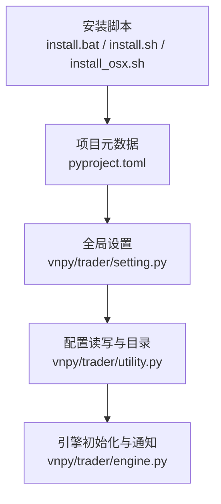
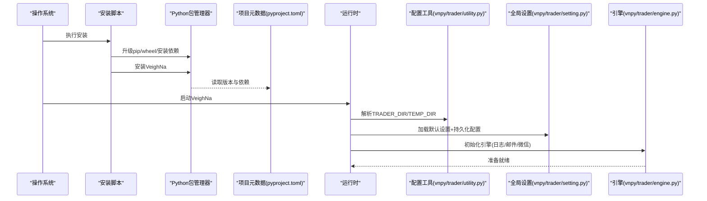
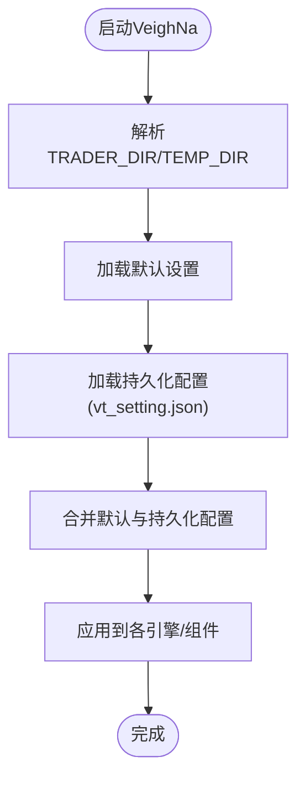
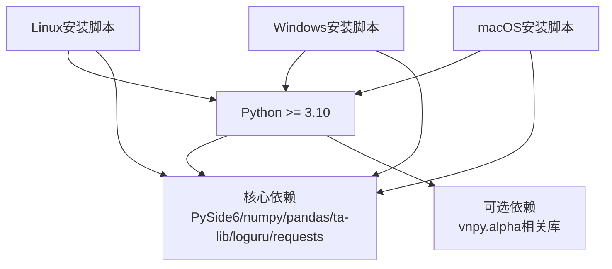

# 环境配置

<cite>
**本文引用的文件**
- [README.md](file://README.md)
- [install.bat](file://install.bat)
- [install.sh](file://install.sh)
- [install_osx.sh](file://install_osx.sh)
- [pyproject.toml](file://pyproject.toml)
- [vnpy/trader/setting.py](file://vnpy/trader/setting.py)
- [vnpy/trader/utility.py](file://vnpy/trader/utility.py)
- [vnpy/trader/engine.py](file://vnpy/trader/engine.py)
</cite>

## 目录
1. [简介](#简介)
2. [项目结构](#项目结构)
3. [核心组件](#核心组件)
4. [架构总览](#架构总览)
5. [详细组件分析](#详细组件分析)
6. [依赖分析](#依赖分析)
7. [性能考虑](#性能考虑)
8. [故障排查指南](#故障排查指南)
9. [结论](#结论)
10. [附录](#附录)

## 简介
本文件面向系统管理员与开发者，提供VeighNa量化交易框架的环境配置与部署指导。内容覆盖系统要求、安装流程、配置文件结构与参数含义、不同环境（开发、测试、生产）的配置差异与最佳实践、配置验证与调试方法，以及常见问题排查。

## 项目结构
VeighNa仓库包含安装脚本、项目元数据与核心交易框架模块。与环境配置直接相关的关键位置如下：
- 安装脚本：Windows、Linux、macOS三套安装脚本，负责升级pip/wheel、安装ta-lib依赖、以及安装VeighNa包。
- 项目元数据：pyproject.toml声明了Python版本要求、核心依赖与可选依赖（如vnpy.alpha相关库）。
- 核心配置：vnpy/trader/setting.py定义全局默认设置；vnpy/trader/utility.py提供配置文件读写与运行目录管理；vnpy/trader/engine.py负责引擎初始化与通知通道。

**图示来源**
- [install.bat](file://install.bat#L1-L16)
- [install.sh](file://install.sh#L1-L41)
- [install_osx.sh](file://install_osx.sh#L1-L30)
- [pyproject.toml](file://pyproject.toml#L1-L124)
- [vnpy/trader/setting.py](file://vnpy/trader/setting.py#L1-L44)
- [vnpy/trader/utility.py](file://vnpy/trader/utility.py#L38-L80)
- [vnpy/trader/engine.py](file://vnpy/trader/engine.py#L81-L101)

**章节来源**
- [README.md](file://README.md#L228-L270)
- [install.bat](file://install.bat#L1-L16)
- [install.sh](file://install.sh#L1-L41)
- [install_osx.sh](file://install_osx.sh#L1-L30)
- [pyproject.toml](file://pyproject.toml#L1-L124)

## 核心组件
- 全局设置与默认值：vnpy/trader/setting.py定义字体、日志、邮件、数据服务、数据库等默认项，并尝试从当前运行目录加载vt_setting.json覆盖默认值。
- 配置读写与运行目录：vnpy/trader/utility.py提供TRADER_DIR、TEMP_DIR路径解析，以及load_json/save_json工具，确保配置文件位于用户家目录下的隐藏目录中。
- 引擎初始化与通知：vnpy/trader/engine.py在初始化时切换工作目录至TRADER_DIR，并按需初始化日志、邮件、微信等引擎；MainEngine还提供send_notification方法，统一推送通知。

**章节来源**
- [vnpy/trader/setting.py](file://vnpy/trader/setting.py#L11-L44)
- [vnpy/trader/utility.py](file://vnpy/trader/utility.py#L38-L118)
- [vnpy/trader/engine.py](file://vnpy/trader/engine.py#L81-L200)

## 架构总览
下图展示了VeighNa环境配置在系统中的关键交互：安装脚本负责系统依赖与Python包安装；项目元数据约束运行环境；运行时通过utility确定配置目录，setting加载默认与持久化配置，engine在初始化阶段完成引擎装配与通知通道准备。

**图示来源**
- [install.bat](file://install.bat#L9-L16)
- [install.sh](file://install.sh#L11-L40)
- [install_osx.sh](file://install_osx.sh#L10-L29)
- [pyproject.toml](file://pyproject.toml#L24-L41)
- [vnpy/trader/utility.py](file://vnpy/trader/utility.py#L38-L80)
- [vnpy/trader/setting.py](file://vnpy/trader/setting.py#L41-L44)
- [vnpy/trader/engine.py](file://vnpy/trader/engine.py#L86-L101)

## 详细组件分析

### 安装与系统要求
- 系统与Python版本：推荐使用VeighNa Studio集成发行版；支持Windows 11+/Windows Server 2022+、Ubuntu 22.04+；Python 3.10及以上，推荐3.13。
- 安装脚本差异：
  - Windows：install.bat支持传入python与pypi镜像索引，默认使用vnpy官方镜像。
  - Linux：install.sh自动检测/安装ta-lib，升级pip/wheel后安装VeighNa。
  - macOS：install_osx.sh通过brew安装ta-lib，再安装VeighNa。
- 依赖约束：pyproject.toml明确requires-python与核心依赖版本范围，确保运行环境一致性。

**章节来源**
- [README.md](file://README.md#L228-L254)
- [install.bat](file://install.bat#L1-L16)
- [install.sh](file://install.sh#L1-L41)
- [install_osx.sh](file://install_osx.sh#L1-L30)
- [pyproject.toml](file://pyproject.toml#L24-L41)

### 配置文件结构与参数含义
- 默认设置键空间：
  - 字体：font.family、font.size
  - 日志：log.active、log.level、log.console、log.file
  - 邮件：email.server、email.port、email.username、email.password、email.sender、email.receiver
  - 数据服务：datafeed.name、datafeed.username、datafeed.password
  - 数据库：database.timezone、database.name、database.database、database.host、database.port、database.user、database.password
- 持久化位置：运行时从TRADER_DIR加载vt_setting.json，若不存在则创建空文件。
- 目录解析：utility.py解析TRADER_DIR与TEMP_DIR，确保配置文件位于用户家目录下的隐藏目录中。

**图示来源**
- [vnpy/trader/utility.py](file://vnpy/trader/utility.py#L38-L80)
- [vnpy/trader/setting.py](file://vnpy/trader/setting.py#L11-L44)

**章节来源**
- [vnpy/trader/setting.py](file://vnpy/trader/setting.py#L11-L44)
- [vnpy/trader/utility.py](file://vnpy/trader/utility.py#L38-L118)

### 不同环境的配置差异与部署策略
- 开发环境
  - 用途：本地开发、单元测试、快速迭代。
  - 部署要点：使用最小化依赖安装，启用console日志输出，使用SQLite作为默认数据库，便于快速启动与调试。
  - 配置建议：关闭邮件与微信通知通道，避免误发；将日志级别设为DEBUG以便排查。
- 测试环境
  - 用途：集成测试、压力测试、回归测试。
  - 部署要点：与生产相近的依赖版本，但使用独立数据库实例与测试账户；开启必要的通知通道以验证告警链路。
  - 配置建议：启用文件日志与控制台日志双通道；设置合理的日志级别；隔离数据服务凭据。
- 生产环境
  - 用途：真实交易、策略实盘运行。
  - 部署要点：使用稳定版本的Python与系统库；使用企业级数据库（如MySQL/PostgreSQL/QuestDB等）；启用邮件与微信通知通道；配置高可用与备份策略。
  - 配置建议：仅保留必要日志级别（INFO/WARNING），避免过度日志影响性能；为数据库与数据服务配置强口令与访问控制；监控通知通道健康状态。

[本节为通用实践说明，不直接分析具体文件，故无“章节来源”]

### 配置验证与调试方法
- 验证安装与依赖
  - Windows：执行install.bat，确认pip/wheel升级与ta-lib安装成功。
  - Linux/macOS：执行对应install脚本，确认ta-lib与VeighNa安装成功。
  - 依赖一致性：核对pyproject.toml中的requires-python与依赖版本范围。
- 验证配置加载
  - 启动VeighNa后，检查TRADER_DIR下是否存在vt_setting.json；若不存在，运行时会创建空文件。
  - 在日志中确认是否加载了持久化配置，以及各项设置是否生效。
- 调试通知通道
  - 邮件：在setting中填写SMTP服务器、端口、用户名、密码、发件人与收件人，调用MainEngine.send_notification进行验证。
  - 微信：在setting中配置微信相关凭据，调用send_notification验证微信推送。

**章节来源**
- [install.bat](file://install.bat#L9-L16)
- [install.sh](file://install.sh#L11-L40)
- [install_osx.sh](file://install_osx.sh#L10-L29)
- [pyproject.toml](file://pyproject.toml#L24-L41)
- [vnpy/trader/setting.py](file://vnpy/trader/setting.py#L11-L44)
- [vnpy/trader/utility.py](file://vnpy/trader/utility.py#L91-L118)
- [vnpy/trader/engine.py](file://vnpy/trader/engine.py#L168-L188)

## 依赖分析
- Python版本与依赖
  - requires-python：>=3.10
  - 核心依赖：PySide6、numpy、pandas、ta-lib、loguru、requests等
  - 可选依赖：vnpy.alpha相关库（polars、scipy、scikit-learn、lightgbm、torch等）
- 安装脚本与系统依赖
  - Windows：使用pip安装VeighNa与ta-lib轮子
  - Linux：编译安装ta-lib，再安装VeighNa
  - macOS：通过brew安装ta-lib，再安装VeighNa

**图示来源**
- [pyproject.toml](file://pyproject.toml#L24-L53)
- [install.bat](file://install.bat#L9-L16)
- [install.sh](file://install.sh#L11-L40)
- [install_osx.sh](file://install_osx.sh#L10-L29)

**章节来源**
- [pyproject.toml](file://pyproject.toml#L24-L53)
- [install.bat](file://install.bat#L9-L16)
- [install.sh](file://install.sh#L11-L40)
- [install_osx.sh](file://install_osx.sh#L10-L29)

## 性能考虑
- 日志级别：生产环境建议使用INFO或更高，避免过多DEBUG日志带来的I/O开销。
- 数据库选择：生产环境优先选用高性能时序数据库或关系型数据库，并配置合适的索引与连接池。
- 通知通道：邮件与微信推送应限流与降噪，避免在高频交易场景中成为瓶颈。
- 依赖版本：遵循pyproject.toml中的版本范围，确保依赖兼容与性能最优。

[本节为通用性能建议，不直接分析具体文件，故无“章节来源”]

## 故障排查指南
- 安装失败
  - Windows：确认pip/wheel已升级，镜像索引可达；若ta-lib安装失败，检查系统架构与权限。
  - Linux：确认系统已安装构建工具与依赖库；若ta-lib编译失败，检查GCC与make版本。
  - macOS：确认Homebrew可用，brew安装ta-lib成功。
- 配置未生效
  - 检查TRADER_DIR路径与vt_setting.json是否存在；确认JSON格式正确。
  - 重启VeighNa以确保配置重新加载。
- 通知通道异常
  - 邮件：核对SMTP服务器、端口、用户名、密码；测试网络连通性。
  - 微信：核对凭据配置与网络环境；检查微信服务可用性。

**章节来源**
- [install.bat](file://install.bat#L9-L16)
- [install.sh](file://install.sh#L13-L39)
- [install_osx.sh](file://install_osx.sh#L13-L26)
- [vnpy/trader/utility.py](file://vnpy/trader/utility.py#L91-L118)
- [vnpy/trader/engine.py](file://vnpy/trader/engine.py#L168-L188)

## 结论
通过规范的环境准备、严格的依赖管理与清晰的配置结构，VeighNa可在开发、测试与生产环境中稳定运行。建议在生产环境采用企业级数据库与通知通道，并建立完善的监控与备份机制，确保系统高可用与可维护性。

[本节为总结性内容，不直接分析具体文件，故无“章节来源”]

## 附录
- 快速参考
  - 系统与Python版本要求见README
  - 安装脚本与参数见各平台安装脚本
  - 依赖版本范围见pyproject.toml
  - 全局设置键空间见vnpy/trader/setting.py
  - 配置读写与目录解析见vnpy/trader/utility.py
  - 引擎初始化与通知见vnpy/trader/engine.py

**章节来源**
- [README.md](file://README.md#L228-L270)
- [install.bat](file://install.bat#L1-L16)
- [install.sh](file://install.sh#L1-L41)
- [install_osx.sh](file://install_osx.sh#L1-L30)
- [pyproject.toml](file://pyproject.toml#L24-L53)
- [vnpy/trader/setting.py](file://vnpy/trader/setting.py#L11-L44)
- [vnpy/trader/utility.py](file://vnpy/trader/utility.py#L38-L118)
- [vnpy/trader/engine.py](file://vnpy/trader/engine.py#L86-L101)