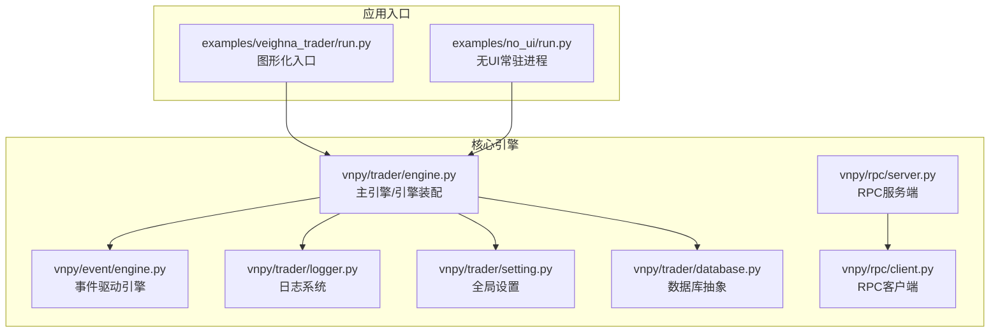
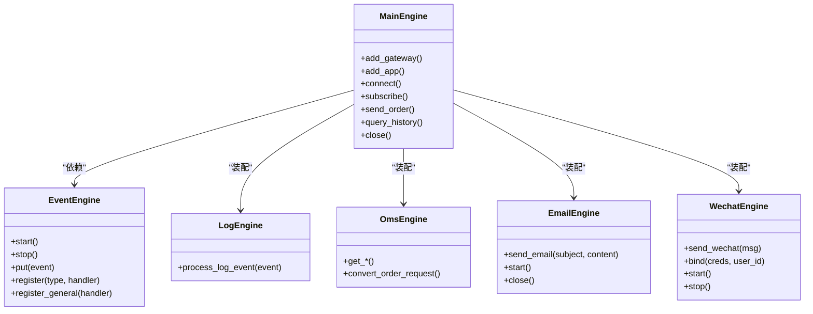
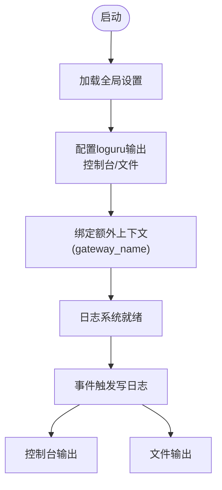
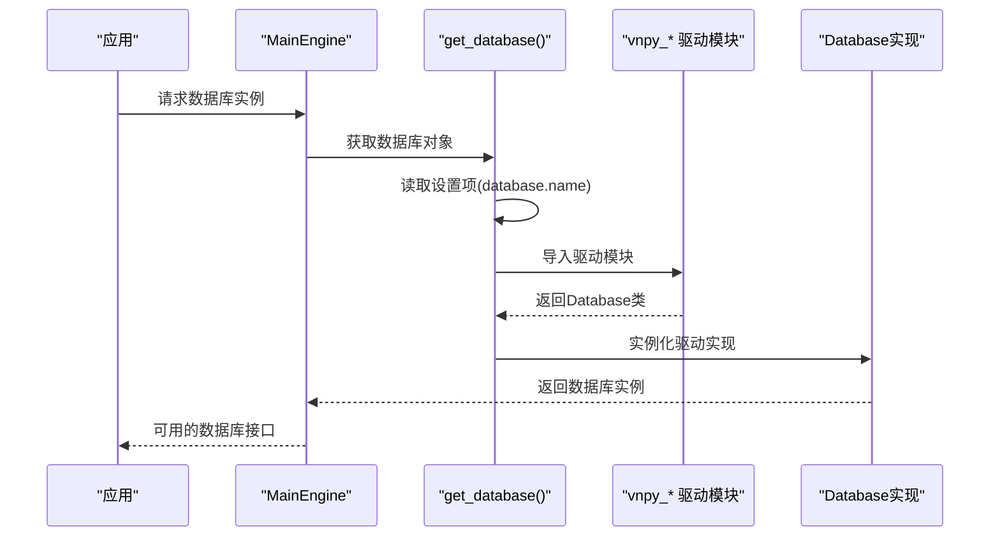
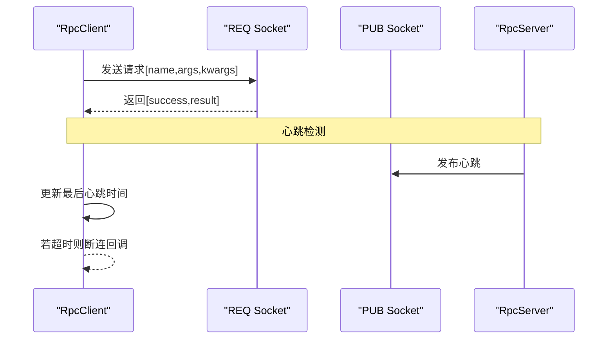
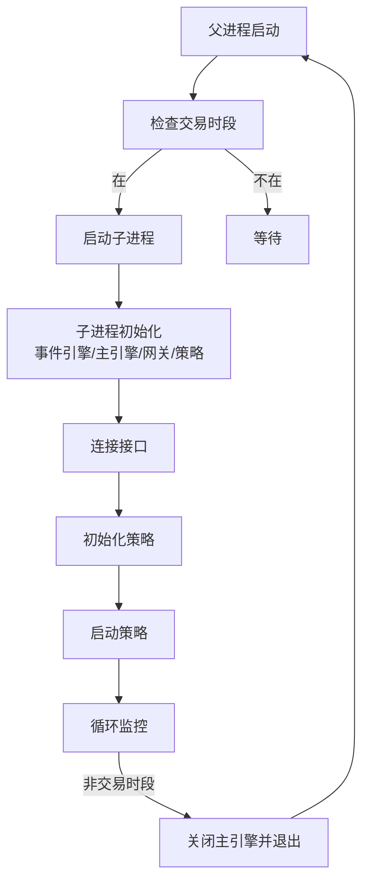
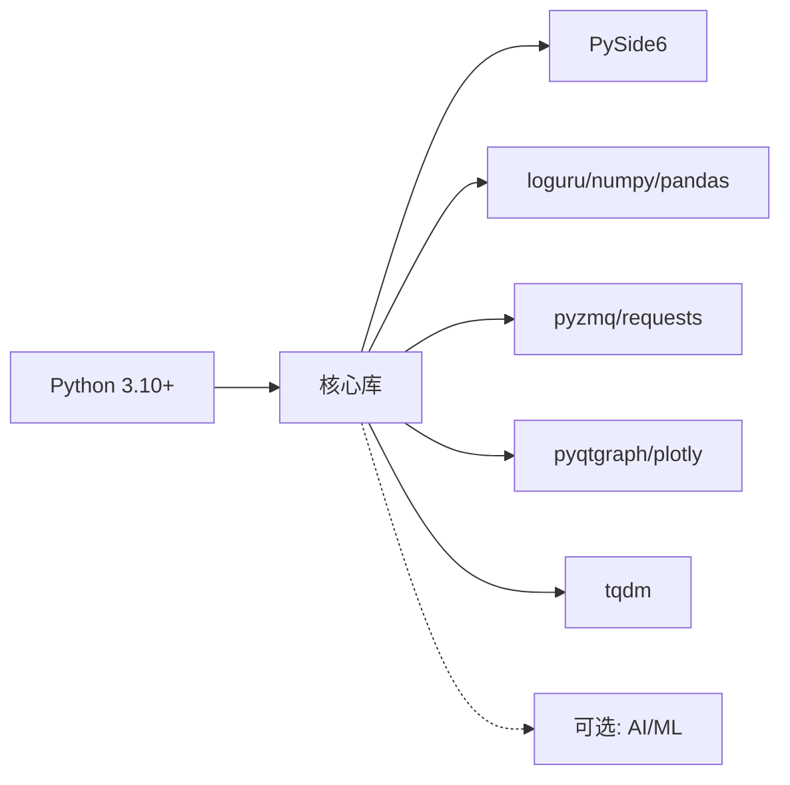

# 部署和运维

<cite>
**本文引用的文件**   
- [README.md](file://README.md)
- [pyproject.toml](file://pyproject.toml)
- [vnpy/__init__.py](file://vnpy/__init__.py)
- [vnpy/trader/engine.py](file://vnpy/trader/engine.py)
- [vnpy/event/engine.py](file://vnpy/event/engine.py)
- [vnpy/trader/setting.py](file://vnpy/trader/setting.py)
- [vnpy/trader/database.py](file://vnpy/trader/database.py)
- [vnpy/trader/logger.py](file://vnpy/trader/logger.py)
- [vnpy/rpc/server.py](file://vnpy/rpc/server.py)
- [vnpy/rpc/client.py](file://vnpy/rpc/client.py)
- [vnpy/trader/utility.py](file://vnpy/trader/utility.py)
- [examples/no_ui/run.py](file://examples/no_ui/run.py)
- [examples/veighna_trader/run.py](file://examples/veighna_trader/run.py)
</cite>

## 目录
1. [简介](#简介)
2. [项目结构](#项目结构)
3. [核心组件](#核心组件)
4. [架构总览](#架构总览)
5. [详细组件分析](#详细组件分析)
6. [依赖分析](#依赖分析)
7. [性能考虑](#性能考虑)
8. [故障排除指南](#故障排除指南)
9. [结论](#结论)
10. [附录](#附录)

## 简介
本文件面向运维与系统管理员，围绕VeighNa量化交易框架提供生产级部署与运维指导。内容覆盖：
- 生产环境部署策略与配置管理
- 性能优化与资源管理
- 日志系统设计与监控方案
- 故障排除与常见问题
- 数据库配置与数据服务集成最佳实践
- 分布式RPC通信与心跳机制
- 无UI常驻进程与进程生命周期管理

## 项目结构
VeighNa采用模块化架构，核心由事件驱动引擎、主引擎、引擎与应用装配、网关与数据适配、RPC通信、日志与设置、数据库抽象层等组成。典型运行形态包括：
- 图形化桌面应用（Qt界面）
- 无UI常驻进程（后台策略运行）
- 分布式RPC服务（跨进程/跨节点）

**图示来源**
- [examples/veighna_trader/run.py](file://examples/veighna_trader/run.py#L38-L87)
- [examples/no_ui/run.py](file://examples/no_ui/run.py#L56-L126)
- [vnpy/event/engine.py](file://vnpy/event/engine.py#L33-L146)
- [vnpy/trader/engine.py](file://vnpy/trader/engine.py#L81-L324)
- [vnpy/trader/logger.py](file://vnpy/trader/logger.py#L22-L56)
- [vnpy/trader/setting.py](file://vnpy/trader/setting.py#L11-L44)
- [vnpy/trader/database.py](file://vnpy/trader/database.py#L52-L160)
- [vnpy/rpc/server.py](file://vnpy/rpc/server.py#L11-L141)
- [vnpy/rpc/client.py](file://vnpy/rpc/client.py#L29-L170)

**章节来源**
- [README.md](file://README.md#L228-L270)
- [examples/veighna_trader/run.py](file://examples/veighna_trader/run.py#L38-L87)
- [examples/no_ui/run.py](file://examples/no_ui/run.py#L56-L126)

## 核心组件
- 事件驱动引擎：负责事件分发、定时器与线程安全处理。
- 主引擎：装配网关、应用与功能引擎，统一对外接口。
- 日志系统：基于loguru，支持控制台与文件输出，可绑定额外上下文。
- 设置与配置：集中管理日志级别、数据库、邮件、数据服务等全局参数。
- 数据库抽象：动态加载数据库驱动，支持SQLite/MySQL/PostgreSQL/QuestDB等。
- RPC通信：基于ZeroMQ，提供请求-应答与发布-订阅，内置心跳检测。

**章节来源**
- [vnpy/event/engine.py](file://vnpy/event/engine.py#L33-L146)
- [vnpy/trader/engine.py](file://vnpy/trader/engine.py#L81-L324)
- [vnpy/trader/logger.py](file://vnpy/trader/logger.py#L22-L56)
- [vnpy/trader/setting.py](file://vnpy/trader/setting.py#L11-L44)
- [vnpy/trader/database.py](file://vnpy/trader/database.py#L52-L160)
- [vnpy/rpc/server.py](file://vnpy/rpc/server.py#L11-L141)
- [vnpy/rpc/client.py](file://vnpy/rpc/client.py#L29-L170)

## 架构总览
VeighNa采用“事件驱动 + 引擎装配 + 抽象适配”的架构。主引擎负责：
- 初始化事件引擎并启动
- 注册日志、Oms、邮件、微信等引擎
- 挂载网关与应用引擎
- 提供统一的下单、订阅、历史数据查询等接口

**图示来源**
- [vnpy/event/engine.py](file://vnpy/event/engine.py#L33-L146)
- [vnpy/trader/engine.py](file://vnpy/trader/engine.py#L81-L324)

**章节来源**
- [vnpy/trader/engine.py](file://vnpy/trader/engine.py#L81-L324)

## 详细组件分析

### 日志系统与配置管理
- 日志格式包含时间戳、级别、网关名与消息体；默认移除标准错误输出，按配置启用控制台与文件输出。
- 配置项集中于全局设置字典，支持日志开关、级别、控制台/文件输出开关、邮件与数据服务凭据、数据库类型与连接参数等。
- 日志引擎通过事件驱动接收日志事件并输出，便于统一管理。

**图示来源**
- [vnpy/trader/logger.py](file://vnpy/trader/logger.py#L22-L56)
- [vnpy/trader/setting.py](file://vnpy/trader/setting.py#L11-L44)
- [vnpy/trader/engine.py](file://vnpy/trader/engine.py#L325-L358)

**章节来源**
- [vnpy/trader/logger.py](file://vnpy/trader/logger.py#L22-L56)
- [vnpy/trader/setting.py](file://vnpy/trader/setting.py#L11-L44)
- [vnpy/trader/engine.py](file://vnpy/trader/engine.py#L325-L358)

### 数据库配置与数据服务集成
- 数据库抽象层通过设置项动态选择驱动模块，默认尝试指定名称的驱动，未找到则回退至SQLite驱动。
- 支持多种数据库适配器（SQLite、MySQL、PostgreSQL、QuestDB、DolphinDB、TDengine、MongoDB），满足不同吞吐与延迟需求。
- 时区转换在数据库层统一处理，确保入库/出库一致性。

**图示来源**
- [vnpy/trader/database.py](file://vnpy/trader/database.py#L139-L160)
- [vnpy/trader/setting.py](file://vnpy/trader/setting.py#L31-L38)

**章节来源**
- [vnpy/trader/database.py](file://vnpy/trader/database.py#L52-L160)
- [vnpy/trader/setting.py](file://vnpy/trader/setting.py#L11-L44)

### RPC通信与心跳机制
- 服务端使用REQ/REP与PUB/SUB模式，提供函数注册、远程调用与数据推送。
- 客户端通过LRU缓存包装远程调用，支持超时与异常封装；订阅主题并处理心跳。
- 心跳周期与容忍度在公共常量中定义，客户端在超时未收到心跳时触发断连回调。

**图示来源**
- [vnpy/rpc/server.py](file://vnpy/rpc/server.py#L83-L141)
- [vnpy/rpc/client.py](file://vnpy/rpc/client.py#L128-L170)

**章节来源**
- [vnpy/rpc/server.py](file://vnpy/rpc/server.py#L11-L141)
- [vnpy/rpc/client.py](file://vnpy/rpc/client.py#L29-L170)

### 无UI常驻进程与进程生命周期
- 父进程按交易时段调度子进程启停，子进程内初始化事件引擎、主引擎、网关与策略引擎，注册日志事件监听，连接接口并启动策略。
- 非交易时段优雅关闭，避免资源占用。

**图示来源**
- [examples/no_ui/run.py](file://examples/no_ui/run.py#L56-L126)

**章节来源**
- [examples/no_ui/run.py](file://examples/no_ui/run.py#L56-L126)

## 依赖分析
- Python版本与平台：支持Python 3.10+，推荐3.13；支持Windows/Linux/macOS。
- 关键依赖：PySide6、loguru、numpy/pandas、pyzmq、plotly、tqdm、requests等。
- 可选依赖：AI/机器学习相关（polars、scipy、scikit-learn、lightgbm、torch、pyarrow）。
- 构建与质量工具：ruff、mypy、hatchling等。

**图示来源**
- [pyproject.toml](file://pyproject.toml#L24-L41)
- [pyproject.toml](file://pyproject.toml#L44-L53)
- [pyproject.toml](file://pyproject.toml#L89-L124)

**章节来源**
- [pyproject.toml](file://pyproject.toml#L1-L124)

## 性能考虑
- 事件驱动与线程模型：事件引擎与定时器分离，避免阻塞；日志与通知引擎采用队列与线程，降低I/O阻塞影响。
- 日志级别与输出：生产环境建议仅开启文件输出或控制台输出其一，避免频繁磁盘写入；合理设置日志级别。
- 数据库选择：高频写入建议使用SQLite或QuestDB；对延迟敏感场景可考虑DolphinDB/TDengine；需高可用与扩展性时选用MySQL/PostgreSQL。
- RPC超时与心跳：客户端超时与心跳容忍度可按网络状况调整，避免长连接空闲导致资源占用。
- 进程生命周期：无UI常驻进程按交易时段启停，减少非交易时段CPU与内存占用。

**章节来源**
- [vnpy/event/engine.py](file://vnpy/event/engine.py#L33-L146)
- [vnpy/trader/logger.py](file://vnpy/trader/logger.py#L22-L56)
- [vnpy/trader/database.py](file://vnpy/trader/database.py#L52-L160)
- [vnpy/rpc/client.py](file://vnpy/rpc/client.py#L61-L86)
- [examples/no_ui/run.py](file://examples/no_ui/run.py#L56-L126)

## 故障排除指南
- 无法连接交易接口
  - 检查网关配置是否正确，确认连接参数与账号信息。
  - 查看日志中连接与登录相关记录，定位错误来源。
- 邮件通知失败
  - 核对SMTP服务器、端口、用户名与密码；确保SSL/TLS配置正确。
  - 查看邮件引擎日志输出的异常堆栈。
- 微信通知异常
  - 检查凭证与用户ID配置文件是否存在且有效。
  - 确认网络可达性与发送间隔设置。
- RPC断连
  - 检查服务端与客户端地址绑定/连接状态。
  - 观察心跳是否正常，超时阈值是否过短。
- 数据库驱动缺失
  - 确认设置项中database.name与对应驱动模块是否匹配。
  - 未找到驱动时回退至SQLite，建议显式安装所需驱动。
- 日志文件未生成
  - 确认日志文件输出开关与路径权限。
  - 检查当前工作目录与用户目录下的临时路径。

**章节来源**
- [vnpy/trader/engine.py](file://vnpy/trader/engine.py#L590-L655)
- [vnpy/trader/engine.py](file://vnpy/trader/engine.py#L657-L800)
- [vnpy/trader/database.py](file://vnpy/trader/database.py#L139-L160)
- [vnpy/rpc/client.py](file://vnpy/rpc/client.py#L164-L170)
- [vnpy/trader/logger.py](file://vnpy/trader/logger.py#L48-L56)

## 结论
VeighNa通过事件驱动与模块化引擎设计，提供了灵活的生产部署与运维能力。结合合理的日志与数据库配置、RPC通信与心跳机制、以及按交易时段的进程生命周期管理，可在生产环境中实现稳定、可观测、可扩展的量化交易系统。

## 附录
- 安装与运行
  - 使用发行版安装脚本或手动安装后，可通过图形化入口或无UI脚本启动。
  - 图形化入口示例展示了如何添加网关与应用引擎并启动主窗口。
  - 无UI示例展示了按交易时段启停策略进程的守护逻辑。

**章节来源**
- [README.md](file://README.md#L234-L270)
- [examples/veighna_trader/run.py](file://examples/veighna_trader/run.py#L38-L87)
- [examples/no_ui/run.py](file://examples/no_ui/run.py#L56-L126)