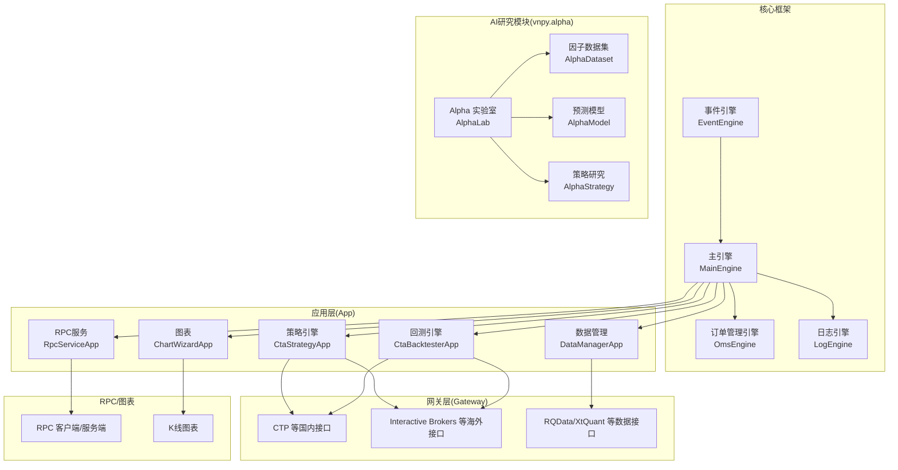
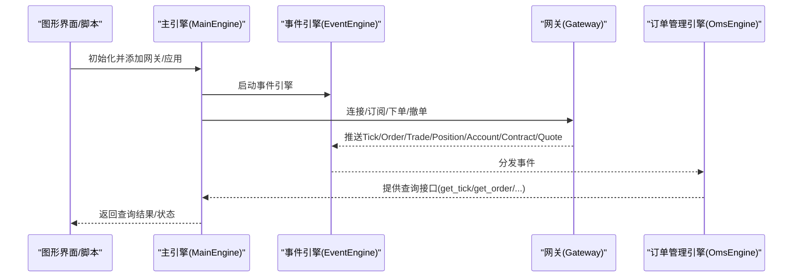
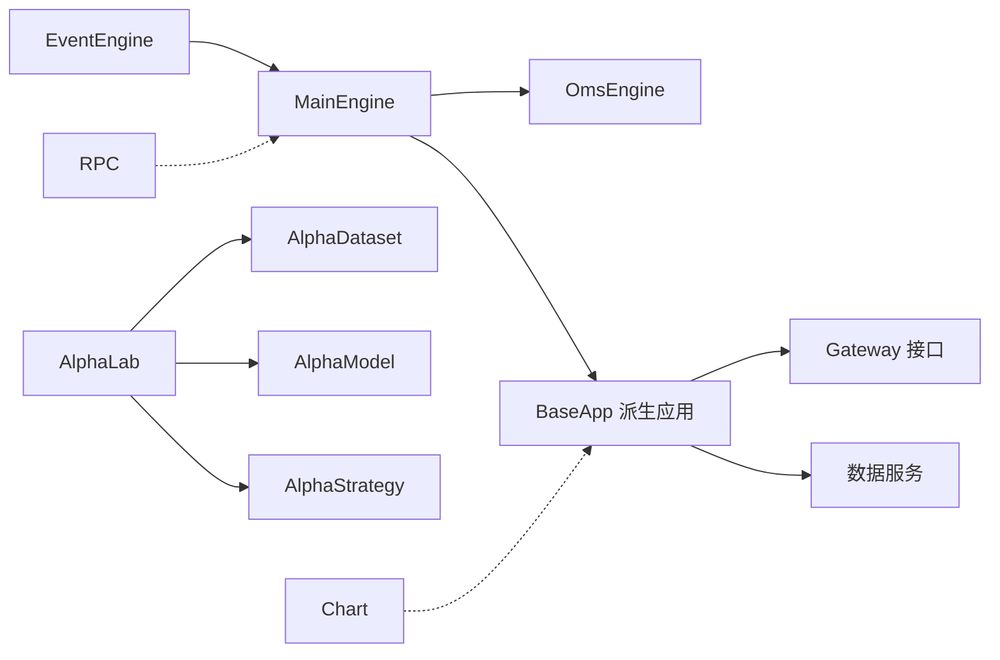

# 项目概述

<cite>
**本文引用的文件列表**
- [README.md](file://README.md)
- [README_ENG.md](file://README_ENG.md)
- [CHANGELOG.md](file://CHANGELOG.md)
- [vnpy/__init__.py](file://vnpy/__init__.py)
- [vnpy/trader/engine.py](file://vnpy/trader/engine.py)
- [vnpy/event/engine.py](file://vnpy/event/engine.py)
- [vnpy/rpc/__init__.py](file://vnpy/rpc/__init__.py)
- [vnpy/chart/__init__.py](file://vnpy/chart/__init__.py)
- [vnpy/alpha/__init__.py](file://vnpy/alpha/__init__.py)
- [vnpy/alpha/lab.py](file://vnpy/alpha/lab.py)
- [vnpy/trader/app.py](file://vnpy/trader/app.py)
- [examples/veighna_trader/run.py](file://examples/veighna_trader/run.py)
- [examples/no_ui/run.py](file://examples/no_ui/run.py)
</cite>

## 目录
1. [引言](#引言)
2. [项目结构](#项目结构)
3. [核心组件](#核心组件)
4. [架构总览](#架构总览)
5. [详细组件分析](#详细组件分析)
6. [依赖关系分析](#依赖关系分析)
7. [性能考量](#性能考量)
8. [故障排查指南](#故障排查指南)
9. [结论](#结论)
10. [附录](#附录)

## 引言
VeighNa 是一套基于 Python 的开源量化交易系统开发框架，自发布以来持续演进，现已发展为功能完备的量化交易平台。项目强调“由交易者编写、服务于交易者”的理念，围绕事件驱动、模块化扩展与跨市场接入能力构建，支持多市场、多品种、多策略的实盘与研究场景。2024 年发布的 4.4.0 版本在保持兼容性的前提下，引入了 AI 驱动的量化研究模块（vnpy.alpha），提供一站式多因子机器学习策略开发、投研与实盘交易解决方案，显著提升了框架在量化研究与 AI 应用方面的综合能力。

## 项目结构
VeighNa 采用模块化组织方式，核心子系统包括：
- 事件驱动引擎：统一事件分发与定时器机制
- 主引擎与引擎体系：集中管理网关、应用引擎与通用功能
- 交易应用（App）：策略引擎、回测、组合管理、图表、数据管理等
- 网关（Gateway）：对接国内外多家交易所与数据服务商
- Alpha 模块：面向机器学习的因子工程、模型训练与策略研究
- RPC 组件：跨进程通信与分布式部署
- 图表组件：高性能 K 线图表

**图表来源**
- [vnpy/event/engine.py](file://vnpy/event/engine.py#L33-L146)
- [vnpy/trader/engine.py](file://vnpy/trader/engine.py#L81-L324)
- [vnpy/alpha/lab.py](file://vnpy/alpha/lab.py#L20-L50)

**章节来源**
- [README.md](file://README.md#L74-L226)
- [README_ENG.md](file://README_ENG.md#L72-L224)

## 核心组件
- 事件驱动引擎（EventEngine）：负责事件队列、事件分发与定时器触发，是整个系统异步与解耦的基础。
- 主引擎（MainEngine）：集中管理网关、应用引擎、通用功能（邮件、微信通知），提供统一的交易接口与查询能力。
- 订单管理引擎（OmsEngine）：维护市场数据、委托、成交、持仓、账户、合约、报价等状态，提供统一查询与转换能力。
- Alpha 模块（vnpy.alpha）：提供因子工程、模型训练、策略研究与实验流程管理，支持 Lasso、LightGBM、MLP 等主流算法。
- RPC 组件：提供跨进程通信能力，支撑分布式部署与多客户端连接。
- 图表组件：支持大数据量 K 线显示与实时更新。

**章节来源**
- [vnpy/event/engine.py](file://vnpy/event/engine.py#L33-L146)
- [vnpy/trader/engine.py](file://vnpy/trader/engine.py#L81-L324)
- [vnpy/alpha/__init__.py](file://vnpy/alpha/__init__.py#L1-L19)
- [vnpy/rpc/__init__.py](file://vnpy/rpc/__init__.py#L1-L9)
- [vnpy/chart/__init__.py](file://vnpy/chart/__init__.py#L1-L10)

## 架构总览
VeighNa 的整体架构以事件驱动为核心，通过主引擎统一调度各应用引擎与网关，形成“网关—引擎—应用—UI/CLI”的层次化结构。AI 研究模块（vnpy.alpha）作为独立子系统，与主引擎协同，提供从数据到模型再到策略的完整研究闭环。

**图表来源**
- [vnpy/trader/engine.py](file://vnpy/trader/engine.py#L81-L324)
- [vnpy/event/engine.py](file://vnpy/event/engine.py#L55-L104)

## 详细组件分析

### 事件驱动引擎（EventEngine）
- 职责：事件队列、事件分发、定时器触发（默认 1 秒周期）
- 关键点：支持按类型注册处理器与通用处理器；线程安全地处理事件；可停止以避免新事件产生
- 性能：基于队列与线程模型，适合高并发事件处理

**章节来源**
- [vnpy/event/engine.py](file://vnpy/event/engine.py#L33-L146)

### 主引擎（MainEngine）
- 职责：统一管理网关、应用引擎与通用功能；提供交易接口（连接、订阅、下单、撤单、查询历史等）；统一日志与通知
- 关键点：初始化时自动注册日志引擎与订单管理引擎；支持通过 send_notification 统一推送邮件与微信通知
- 扩展性：通过 add_gateway/add_app 动态加载模块

**章节来源**
- [vnpy/trader/engine.py](file://vnpy/trader/engine.py#L81-L324)

### 订单管理引擎（OmsEngine）
- 职责：维护市场数据、委托、成交、持仓、账户、合约、报价等状态；提供活跃委托/报价查询；支持开平转换器
- 关键点：注册事件监听；按 vt_symbol/vt_orderid/vt_tradeid/vt_positionid/vt_accountid/vt_quoteid 等键管理状态；提供转换器以适配不同市场的开平规则

**章节来源**
- [vnpy/trader/engine.py](file://vnpy/trader/engine.py#L360-L588)

### Alpha 实验室（AlphaLab）
- 职责：提供数据管理、模型训练、信号生成与策略回测的完整工作流；支持 Parquet 存储与 Polars DataFrame 处理
- 关键点：支持日线/分钟线数据的保存与加载；支持指数成分过滤与合约参数配置；提供数据集、模型、信号的持久化与检索
- 与主引擎协作：通过 vnpy.alpha 模块与主引擎交互，实现从数据到策略的闭环

**章节来源**
- [vnpy/alpha/lab.py](file://vnpy/alpha/lab.py#L20-L481)
- [vnpy/alpha/__init__.py](file://vnpy/alpha/__init__.py#L1-L19)

### 应用基类（BaseApp）
- 职责：定义应用的唯一名称、模块字符串、路径、显示名称、引擎类、UI 控件类与图标文件名
- 作用：规范应用的生命周期与 UI 组织方式，便于主引擎统一加载与管理

**章节来源**
- [vnpy/trader/app.py](file://vnpy/trader/app.py#L10-L22)

### 示例运行方式
- 图形化启动：通过 VeighNa Station 或在示例目录运行图形界面脚本，添加网关与应用后启动主窗口
- 无 UI 启动：通过脚本直接创建事件引擎与主引擎，连接网关并初始化策略引擎，实现自动化运行

**章节来源**
- [examples/veighna_trader/run.py](file://examples/veighna_trader/run.py#L38-L87)
- [examples/no_ui/run.py](file://examples/no_ui/run.py#L56-L122)

## 依赖关系分析
- 模块内聚与耦合：事件引擎与主引擎高度内聚，应用层通过主引擎与网关解耦；Alpha 模块与主引擎松耦合，通过统一接口交互
- 外部依赖：RPC 组件依赖 ZeroMQ；图表组件依赖 Qt；Alpha 模块依赖 Polars；通知模块依赖邮件与微信 SDK
- 版本与兼容：4.4.0 版本引入 loguru 替代 logging，统一静态类型与代码质量工具链

**图表来源**
- [vnpy/trader/engine.py](file://vnpy/trader/engine.py#L81-L324)
- [vnpy/alpha/lab.py](file://vnpy/alpha/lab.py#L20-L50)
- [vnpy/rpc/__init__.py](file://vnpy/rpc/__init__.py#L1-L9)
- [vnpy/chart/__init__.py](file://vnpy/chart/__init__.py#L1-L10)

**章节来源**
- [vnpy/trader/engine.py](file://vnpy/trader/engine.py#L81-L324)
- [vnpy/alpha/lab.py](file://vnpy/alpha/lab.py#L20-L50)

## 性能考量
- 异步与事件驱动：事件引擎与应用层解耦，降低阻塞与串行瓶颈
- 数据存储与处理：Alpha 模块采用 Polars 与 Parquet，支持高效批处理与去重排序
- 网络与通信：RPC 组件提供跨进程通信，支持多客户端连接与统一路由
- 日志与通知：统一日志与通知通道，减少重复 I/O 与资源竞争

[本节为通用指导，无需列出具体文件来源]

## 故障排查指南
- 日志与通知：通过主引擎的 send_notification 可同时推送邮件与微信；日志引擎统一处理日志事件
- 网关连接：确认网关配置项正确，检查连接状态与订阅请求；必要时查看日志输出
- 数据一致性：Alpha 实验室在保存数据时进行去重与排序，加载时按时间范围过滤；如遇数据异常，检查文件是否存在与时间范围设置
- 进程与守护：无 UI 场景可通过父子进程守护策略在交易时段自动启动与关闭子进程

**章节来源**
- [vnpy/trader/engine.py](file://vnpy/trader/engine.py#L168-L188)
- [vnpy/trader/engine.py](file://vnpy/trader/engine.py#L325-L358)
- [vnpy/alpha/lab.py](file://vnpy/alpha/lab.py#L51-L95)
- [examples/no_ui/run.py](file://examples/no_ui/run.py#L97-L122)

## 结论
VeighNa 以事件驱动为核心，结合模块化应用与网关体系，形成了覆盖多市场、多策略、多场景的量化交易框架。4.4.0 版本引入的 vnpy.alpha 模块，进一步强化了 AI 驱动的量化研究能力，使框架在因子工程、模型训练与策略研究方面具备更强的竞争力。通过统一的主引擎与通知机制，VeighNa 既适合初学者快速上手，也为有经验的开发者提供了深入定制与扩展的空间。

[本节为总结性内容，无需列出具体文件来源]

## 附录

### 版本历史概览（节选）
- 4.4.0：新增微信通知、QuestDB 适配、Alpha 自定义表达式注册、数据处理函数增强等
- 4.3.0：Alpha 101 数据集、DataProxy 运算符优化、风控模块重构
- 4.2.0：风控模块插件化、Polygon 数据服务、Alpha 数据集优化
- 4.1.0：扩展模块适配、ibapi 升级、Alpha Dataset 增强
- 4.0.0：引入 vnpy.alpha、loguru 替代 logging、统一静态类型与代码质量工具
- 更早版本：逐步剥离与重构 RPC、图表、数据管理、数据库适配器等子模块

**章节来源**
- [CHANGELOG.md](file://CHANGELOG.md#L1-L800)
- [vnpy/__init__.py](file://vnpy/__init__.py#L24-L25)

### 未来发展规划（基于现有信息的合理预期）
- AI 策略生态：持续完善 vnpy.alpha 的因子工程、模型训练与策略回测能力，扩展更多主流算法与数据集
- 跨市场与多资产：进一步扩展网关覆盖范围，支持更多交易所与数据服务商
- 分布式与云原生：借助 RPC 组件与事件驱动，探索容器化与云原生部署方案
- 工具链与质量：持续优化代码质量工具链与静态类型声明，提升可维护性与可扩展性

[本节为概念性内容，无需列出具体文件来源]