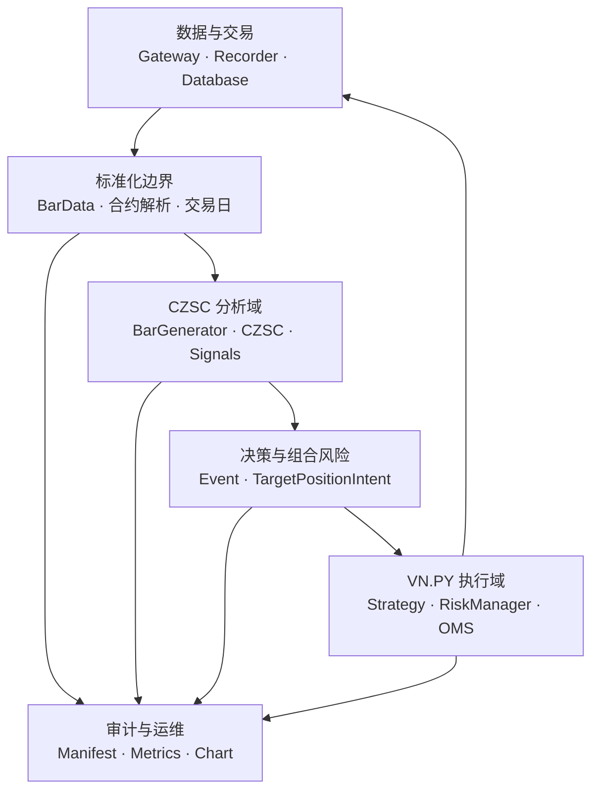
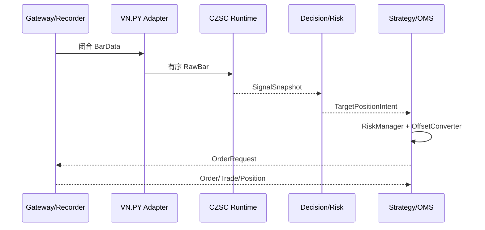

# CZSC × VN.PY 缠论期货策略集成架构与优化方案

> 建议项目内权威路径：`examples/czsc_strategy/docs/architecture/CZSC_VNPY_INTEGRATION_ARCHITECTURE.md`  
> 文档版本：2.0-draft  
> 审计日期：2026-07-29  
> 状态：架构设计，不改变信号、参数、委托或现有回测基线  
> 适用项目：`D:\repo\vnpy\examples\czsc_strategy`

## 0. 执行结论

目标架构不是把 CZSC 和 VN.PY 再包装成第三套量化框架，而是明确分工：

- **CZSC 是结构分析与信号引擎**：负责 K 线合成、分型、笔、`ZS` 值对象、内置信号注册表、`Signal/Event` 条件组合、多周期信号计算和快速权重研究。
- **VN.PY 是数据、事件、账户、订单和实盘运行平台**：负责 `BarData/TickData`、数据库、策略生命周期、OMS、开平转换、委托回报、CTP、事前风控、录制、图形界面和标准回测。
- **项目自研代码只保留期货领域差异**：交易日口径、连续合约与实际合约映射、主力切换、保证金与手续费溯源、涨跌停/换月/缺失行情策略、组合资金分配、稳定信号投影、审计与晋升门禁。

因此，推荐的最终落点是：

1. 用 VN.PY 官方对象和插件替代项目中的通用数据、订单、成交、持仓、事件循环、数据库抽象、GUI 和基础风控轮子。
2. 用 CZSC `1.0.0rc8` 的 Rust/PyO3 公共能力替代可等价的自研信号条件代数、多笔形态和技术指标缓存。
3. 暂时保留当前自研回测器作为**回归裁判**，以 VN.PY CTA/组合回测器建立影子路径；只有关键语义逐项对齐后才退役旧引擎。
4. CZSC `Position/CzscTrader/WeightBacktest` 不接管真实订单与账户；VN.PY 的 CTA/Portfolio/OMS 不重新实现缠论结构。
5. 默认配置和现有回测结果必须保持不变；优化按开关、双读、影子运行、逐层切换推进。

## 1. 审计基线与证据优先级

### 1.1 固定基线

| 对象 | 固定版本/提交 | 用途 |
|---|---|---|
| 目标工程 | `maxtwoon/vnpy dev@27ca154f4301a0c3ced0058375bc22825f0f5e69`，`czsc_strategy VERSION=0.2.63` | 当前实现审计基线 |
| VN.PY 核心 | `vnpy/vnpy master@1b78494979deb4c4996f6b864f234d9839f2f239`，4.4.0 | 平台公共接口基线 |
| CZSC | `waditu/czsc v1.0.0-rc.8@4b1b503ba293d60781492f87139fd2b07ebcf201` | 与子项目 `requirements.txt` 一致 |
| CTA 策略 | `vnpy_ctastrategy` 1.4.1 | 单合约策略生命周期、回测、优化 |
| 组合策略 | `vnpy_portfoliostrategy` 1.3.0 | 多合约同步、目标仓位、组合回测 |
| 事前风控 | `vnpy_riskmanager` 2.0.0 | 下单前最终拦截 |
| 数据库 | `vnpy_sqlite` 1.1.3 | 标准 `BaseDatabase` 实现 |
| 仿真账户 | `vnpy_paperaccount` 1.1.0 | 接线冒烟，不替代 SimNow |
| GUI/运维 | `vnpy_ctabacktester` 1.3.0、`vnpy_datamanager` 1.2.0、`vnpy_datarecorder` 1.1.1、`vnpy_chartwizard` 1.1.0、`vnpy_portfoliomanager` 1.1.0 | 复用标准应用能力 |

### 1.2 证据优先级

1. 固定提交上的源码、`.pyi`、测试和运行时只读探针。
2. 同版本官方 README/文档。
3. DeepWiki 等二级索引，仅用于导航。

DeepWiki 页面在 2026-03-07 索引的是 CZSC `0.10.11@ff56d9`，而目标工程锁定 `1.0.0rc8`。两者模块布局、信号数量、Rust 迁移范围和导入路径不同，不能把 DeepWiki 中的 `czsc.signals`、Redis/ClickHouse 或旧 `CzscTrader` 说明直接当成 rc8 接口合同。

## 2. 当前工程诊断

### 2.1 当前实际耦合

`chan_strategy` 约 9,805 行，主要模块为：

| 模块 | 行数 | 当前职责 | 问题 |
|---|---:|---|---|
| `positions.py` | 2,203 | 自研 `Signal/Factor/Event/Position`、仓位和风控状态 | 同时承担条件代数、决策、持仓、风控，职责过载 |
| `backtest_engine.py` | 1,430 | 数据驱动、撮合、资金、报告 | 与 VN.PY 回测基础设施重复；但含关键期货语义 |
| `validation.py` | 1,372 | CZSC 初始化、参数与数据验证 | 可拆成边界验证和研究门禁 |
| `signals.py` | 1,152 | 买点、背驰、结构信号 | 与 rc8 注册信号有较大重叠 |
| `portfolio_engine.py` | 1,094 | 多品种协调、资金分配、组合风险 | 组合风控有价值；事件和订单部分与 VN.PY 重复 |
| `html_report.py` | 623 | 自研报告 | 通用 K 线/绩效展示与 CZSC/VN.PY 重复 |
| `data_adapter.py` | 495 | 直连 SQLite、转换、重采样 | 绕过 VN.PY `BaseDatabase`，同时混合数据访问和周期语义 |
| `sell_signals.py` | 322 | 卖点和退出信号 | 与 rc8 `cxt/tas/pos` 部分重叠 |
| `portfolio_ledger.py` | 243 | 组合账本 | 不能与 OMS 并列成为实盘持仓真相 |
| `zhongshu.py` | 122 | 由已确认笔构造项目中枢 | rc8 `CZSC` 无公共 `zs_list`，该能力存在保留理由 |

生产路径几乎没有使用 VN.PY；只有 SimNow 诊断脚本使用了 `EventEngine/MainEngine/CTP`。也就是说，项目当前是“放在 VN.PY 仓库里的独立回测框架”，还不是 VN.PY 策略应用。

### 2.2 P0 依赖冲突

根 `pyproject.toml` 固定：

```text
czsc==0.9.51
```

子项目 `examples/czsc_strategy/requirements.txt` 固定：

```text
czsc==1.0.0rc8
```

这是同一解释器环境内不可接受的双版本合同。根 VN.PY 核心本不需要 CZSC，正确做法是：

- 从根 VN.PY 核心依赖中移除 CZSC。
- 在 `examples/czsc_strategy` 独立虚拟环境/锁文件中固定 `czsc==1.0.0rc8`。
- 运行时记录 `importlib.metadata.version("czsc")`、`czsc.__file__`、`czsc._native.__file__`、信号注册表摘要和依赖锁摘要；不匹配则 fail closed。

### 2.3 P0 信号能力纠错

现有 `diagnostics/czsc_rc8_theory_probe.py` 和 `CHANGELOG 0.2.60` 因为只寻找旧 Python 路径 `czsc.signals`，得出了“rc8 无内置信号”的结论。源码表明 rc8 已把信号迁入 Rust/PyO3：

- 注册表只读入口：`czsc._native.list_all_signals(...)`
- 分发入口：`czsc._native.signals`
- 批量计算：`czsc.generate_czsc_signals`
- 配置推导：`derive_signals_config`、`derive_signals_freqs`
- 状态对象：`CzscSignals`、`CzscTrader`

rc8 源码注册了包括以下类别的信号：

- 一买/一卖：`cxt_first_buy_V221126`、`cxt_first_sell_V221126`
- 二买/二卖：`cxt_second_bs_V230320`、`cxt_second_bs_V240524`
- 三买/三卖：`cxt_third_bs_V230318`、`cxt_third_buy_V230228`
- 双中枢：`cxt_double_zs_V230311`
- 三/五/七/九/十一笔形态：`cxt_*_bi_V2306xx`
- MACD 背驰和买卖点辅助：`tas_macd_bc_*`、`tas_macd_first_bs_*`、`tas_macd_second_bs_*`
- 仓位状态、止盈止损：`pos_*`

这不意味着立即删除项目信号。必须先做同输入、同确认口径、同参数的信号映射和差分测试；语义等价的复用官方信号，语义不等价的保留为带项目命名空间的扩展。

### 2.4 必须保留的项目语义

以下能力不能因为迁入 VN.PY 或 CZSC 而丢失：

- 仅使用闭合 K 线和已确认结构；未完成笔不得污染决策。
- 信号在当前闭合 bar 形成，订单最早在下一可交易 bar 撮合。
- 期货交易日、夜盘归属、节假日和合约交易时段。
- 复权连续序列只用于分析，实际合约用于价格、乘数、保证金、持仓和下单。
- 主力切换、移仓换月、涨跌停、缺失行情、停牌/无流动性处理。
- 手续费、合约乘数、最小变动价位、保证金率和来源时间。
- 组合风险、日内损失、集中度、资金容量、失败关闭和完整审计。

## 3. VN.PY 能力与接口清单

### 3.1 核心能力

| VN.PY 接口 | 已有能力 | 本项目用法 | 不再自研 |
|---|---|---|---|
| `EventEngine/Event` | 单分发线程、定时事件、类型订阅、通用订阅 | 接收行情/订单/成交/风控/健康事件；耗时分析移出分发线程 | 自定义总线和轮询循环 |
| `MainEngine/BaseGateway` | 网关、应用、引擎装配；订阅、下单、撤单、查询 | 实盘统一入口 | 直接调用 CTP API |
| `OmsEngine` | 缓存 tick、order、trade、position、account、contract | 实盘订单和持仓单一真相 | 平行实盘账本 |
| `OffsetConverter` | 上期所/能源中心今昨仓、锁仓、净仓转换和冻结量 | 所有真实开平转换 | 自研今昨仓拆单 |
| `TickData/BarData` | 标准行情对象 | VN.PY 边界标准模型 | 自建通用 Bar/Tick |
| `OrderRequest/CancelRequest` | 标准委托请求 | 仅执行适配层创建 | 自建通用 Order |
| `OrderData/TradeData/PositionData/AccountData` | 标准回报与状态 | 账本投影和审计输入 | 自建实盘状态对象 |
| `ContractData` | `size/pricetick/min_volume/max_volume` 等 | 合约规格和数量/价格归一 | 重复合约元数据；保证金率仍由项目维护 |
| `BaseDatabase/get_database` | 标准 bar/tick 保存、加载、概览、删除 | 新数据仓储端口 | 新数据库抽象 |
| `BaseDatafeed` | 标准历史数据查询抽象 | 可选数据源 | 自建通用 datafeed |
| `BarGenerator` | tick→1m、固定分钟/小时/日线 | 只优先复用 tick→1m | 交易所会话敏感的高周期不能盲用 |
| `ArrayManager` | 滚动数组和 TA 指标 | 非缠论策略可用 | 缠论路径优先 CZSC 原生缓存 |
| `vnpy.chart` | `ChartWidget/BarManager/ChartItem` | 桌面实时 K 线和缠论覆盖层 | 新桌面 K 线框架 |

### 3.2 官方插件能力

| 插件 | 采用方式 | 边界/注意事项 |
|---|---|---|
| `vnpy_ctastrategy` | 单实际合约策略、生命周期、委托回报、标准回测和参数优化 | bar 回测先撮合旧订单再调用 `on_bar`，天然支持下一 bar；需补项目的保证金、涨跌停、换月语义 |
| `vnpy_portfoliostrategy` | 多品种 `on_bars`、目标仓位、组合回测 | 默认会用旧收盘价生成缺失 bar；本项目必须改为 `NO_BAR_NO_TRADE`，禁止在合成 bar 上成交 |
| `vnpy_riskmanager` | 下单前最终规则链 | 复用内置活动委托、日限额、重复委托、单笔数量、合法性规则；增加项目期货规则 |
| `vnpy_ctp` | SimNow/实盘 CTP 行情交易 | tick 含涨跌停价；不提供通用历史 K 线查询，需 Recorder/Database |
| `vnpy_sqlite` | 标准数据库实现 | 现有 `{symbol}_1M_raw` 先双读迁移，不直接切库 |
| `vnpy_datarecorder` | 实时 tick/1m 录制 | 用于生产数据入口 |
| `vnpy_datamanager` | CSV 导入导出、数据概览、下载 | 替代自研通用数据管理界面 |
| `vnpy_ctabacktester` | 订单、成交、日绩效、图表、优化 GUI | 作为标准回测操作台 |
| `vnpy_paperaccount` | 本地行情驱动的接线冒烟 | 不能作为收益或实盘晋升证据 |
| `vnpy_portfoliomanager` | 组合订单引用、成交、持仓和每日盈亏展示 | 运维展示，不是保证金/组合风险权威 |
| `vnpy_chartwizard` | 实时/历史图表应用 | 复用桌面图表 |
| `vnpy_rpcservice` | Windows 客户端与 Ubuntu 服务端分离 | 仅可信网络、VPN 或 SSH 隧道；不直接暴露公网 |

### 3.3 暂不采用

- `vnpy.alpha`：适合机器学习、横截面和目标持仓研究，不是当前缠论择时主链路。可在后续作为独立特征/状态研究，不能混入 P0-P2。
- 重写 `EventEngine`、OMS、CTA 引擎或 CTP 网关：无必要。

## 4. CZSC rc8 能力与接口清单

| CZSC 接口 | 能力 | 本项目定位 | 限制 |
|---|---|---|---|
| `RawBar/NewBar/FX/BI/ZS/CZSC` | 缠论核心结构和增量分析 | 结构分析唯一实现 | `ZS` 是值对象；`CZSC` 无公共自动 `zs_list` |
| `BarGenerator(..., market=Market.Futures)` | 多周期合成和增量更新 | 1m→5/15/30/60m 等分析周期 | 日线交易日边界仍需项目适配与差分验证 |
| `CzscSignals` | 多周期信号状态 | 在线分析运行时 | 不能阻塞 VN.PY 事件线程 |
| `generate_czsc_signals` | 批量信号矩阵 | 离线信号研究和官方信号差分 | 不是订单回测 |
| `Signal/Event` | 标准信号匹配与 AND/ANY/NOT 组合 | 替换等价的自研条件代数 | 项目 `Factor` 的 OR 语义应编译成多个 Event |
| `Position/CzscTrader` | 信号到仓位的研究状态机 | 影子决策和信号验证 | 不作为真实账户、订单、今昨仓真相 |
| `WeightBacktest` | 权重序列快速绩效 | 信号质量、组合权重快速筛选 | 不模拟真实订单、保证金、换月和涨跌停 |
| `daily_performance/top_drawdowns` | 官方绩效统计 | 通用绩效复用 | 期货领域指标另行补充 |
| `resample_bars` | 批量周期转换 | 离线分析 | 必须做期货交易日/夜盘口径测试 |
| `_native.list_all_signals` | 注册信号元数据 | 生成能力清单、manifest 和官方映射 | 不按文档猜接口；运行时枚举 |
| `_native.signals.call_signal` | 单信号分发 | 映射验证和调试 | trader-state 信号必须由 `CzscTrader` 路径执行 |
| lightweight plotting | 离线 K 线和信号展示 | 报告复用 | 桌面实时图用 VN.PY Chart |

`CZSC` 的 `max_bi_num` 默认值为 50。当前项目未显式固定该值，必须把它写入运行 manifest；任何改为 100/200 的尝试先做前缀稳定性、内存和信号差分，不作为“性能优化”直接上线。

## 5. 权威边界

| 事实 | 唯一权威 | 说明 |
|---|---|---|
| tick、实际合约 bar | VN.PY Gateway/Recorder/Database | 带 `symbol/exchange/datetime/gateway` |
| 分型、笔、未完成笔、CZSC 信号缓存 | CZSC runtime | 只在闭合 bar 顺序更新 |
| 项目笔中枢/走势分类 | 项目扩展，输入仅为 CZSC 已确认笔 | 名称必须带 `Project` 或版本，不能声称等同官方自动中枢 |
| 策略规则匹配 | CZSC `Signal/Event` + 项目扩展规则 | 不涉及真实下单 |
| 目标风险敞口和手数 | 项目 `PortfolioRiskService` | 使用实际合约规格和保证金来源 |
| 委托、成交、持仓、账户 | VN.PY OMS/策略引擎 | 项目账本仅为只读投影 |
| 今昨仓和冻结量 | VN.PY `OffsetConverter` | 不重复实现 |
| 最终下单许可 | VN.PY RiskManager | 项目规则注册到官方规则链 |
| 快速权重研究 | CZSC `WeightBacktest` | 研究层 |
| 可成交性回测 | VN.PY CTA/Portfolio 回测扩展 | 晋升层 |

## 6. 目标架构



### 6.1 分层职责

#### 数据与交易层

- 实盘：`vnpy_ctp + MainEngine + DataRecorder`。
- 历史：`BaseDatabase + vnpy_sqlite`。
- 现有自定义 SQLite：通过 `LegacySqliteBarRepository` 暂时适配，只读双跑；不再向新代码泄漏表名。

#### 标准化边界层

- 外部统一使用 VN.PY `BarData`、`TickData`、`ContractData`。
- `VnpyCzscBarAdapter` 是纯函数适配器，不保存策略状态。
- `TradingCalendarPolicy` 只负责交易日/会话判定。
- `ContractResolver` 明确 `analysis_symbol` 和 `execution_vt_symbol`，并保存 point-in-time 映射。

#### CZSC 分析域

- 每个 `analysis_symbol` 一个串行 `ChanRuntime`。
- 内含 CZSC `BarGenerator`、各周期 `CZSC/CzscSignals` 和显式 `signals_config`。
- 只消费闭合、去重、单调递增的 bar。
- 输出不可变 `SignalSnapshot`，不直接发送订单。

#### 决策与组合风险层

- 官方 `Signal/Event` 处理规则匹配。
- `SignalProjection` 把官方/项目信号映射成稳定项目键。
- `DecisionService` 产生目标方向/权重，不处理订单状态。
- `PortfolioRiskService` 根据资金、保证金、集中度、品种和组合约束产生目标手数。

#### VN.PY 执行层

- 单实际合约：`CtaTemplate`。
- 多品种同步和目标仓位：优先 `vnpy_portfoliostrategy.StrategyTemplate`。
- `set_target/rebalance_portfolio` 或 CTA `buy/sell/short/cover` 由薄策略适配器调用。
- 委托经 `RiskManager`、`OffsetConverter`、Gateway；回报回到 OMS 和策略回调。

#### 审计与运维层

- 每次运行写 manifest、bar 水位、决策、风险拒绝、订单关联和健康指标。
- VN.PY Chart 负责实时桌面；CZSC plotting 负责离线研究。
- `PortfolioManager` 展示实时组合，项目报表补充期货专属风险字段。

## 7. 接口合同

### 7.1 `BarData → RawBar`

适配器建议签名：

```python
def to_czsc_raw_bar(
    bar: BarData,
    *,
    bar_id: int,
    freq: Freq,
    analysis_symbol: str,
) -> RawBar:
    ...
```

硬约束：

- `bar.datetime` 必须有明确时区；禁止 naive datetime 静默推断。
- `symbol + exchange` 映射为唯一 `vt_symbol`；`analysis_symbol` 单独保存。
- OHLC 必须有限且 `low <= open/close <= high`。
- `volume/turnover/open_interest` 映射规则固定并测试。
- 同一分析序列的 `bar_id` 严格递增且可重放。
- 闭合标记由上游事件确定；适配器不得猜测 bar 是否完成。
- 适配前后写入 `source_bar_key`，用于幂等和追踪。

### 7.2 信号 manifest

每次运行至少记录：

| 字段 | 含义 |
|---|---|
| `czsc_version` | 安装包版本 |
| `czsc_python_path` / `czsc_native_path` | Python 与原生扩展实际加载路径 |
| `signal_registry_sha256` | `_native.list_all_signals` 排序序列摘要 |
| `signals_config_sha256` | 当前策略信号配置摘要 |
| `max_bi_num` | CZSC 笔缓存上限 |
| `base_freq/freqs/market` | 周期配置和 `Market.Futures` |
| `strategy_version/config_sha256` | 项目版本与有效配置 |
| `data_snapshot_id` | 数据快照 |
| `contract_map_id` | 连续到实际合约映射版本 |
| `calendar_version` | 交易日历版本 |

任何不匹配都应阻止**新开仓**；平仓、撤单和风险处置仍允许。

### 7.3 `SignalSnapshot`

稳定投影至少包含：

```text
analysis_symbol
trade_freq
bar_end
available_at
source_bar_key
confirmed_only
native_signals
project_signals
signal_manifest_hash
runtime_sequence
```

要求：

- `native_signals` 保留 CZSC 原始 key/value，便于升级差分。
- `project_signals` 使用项目稳定键，策略不得直接依赖不受控的内部字段。
- `available_at >= bar_end`，且决策撮合不得回到当前 bar。
- 同一 `source_bar_key + manifest` 重放必须字节一致。

### 7.4 `TargetPositionIntent`

决策层只输出目标，不输出“已成交”：

```text
decision_id
strategy_id
analysis_symbol
execution_vt_symbol
target_lots
valid_from
valid_until
reason_codes
signal_snapshot_id
risk_snapshot_id
rollover_state
```

`decision_id` 建议由以下稳定字段哈希生成：

```text
strategy_version | analysis_symbol | execution_vt_symbol |
trade_freq | bar_end | signal_manifest_hash | config_hash
```

VN.PY `OrderRequest.reference` 放入可读策略前缀和缩短的 `decision_id`；完整关联保存在审计表。

### 7.5 执行回报

项目账本只从以下 VN.PY 回调投影：

- `on_order(OrderData)`
- `on_trade(TradeData)`
- `PositionData`
- `AccountData`

禁止项目代码先修改“预计持仓”再把它当成真实持仓。目标、活动委托、成交持仓、结算持仓必须分字段表达。

### 7.6 合约映射

连续序列和实际合约必须拆开：

```text
analysis_symbol = RB888（或严格 PIT 连续序列）
execution_vt_symbol = rb2610.SHFE
effective_from / effective_to
mapping_observed_at
adjustment_method
roll_reason
```

原则：

- 信号输入不得用事后完整主力表。
- 下单价格、涨跌停、乘数、保证金和持仓只取实际合约。
- 换月是显式状态机：`NORMAL → ROLL_PENDING → CLOSE_OLD → OPEN_NEW → NORMAL`。
- 未找到可交易实际合约时禁止新开仓。

### 7.7 事件线程与背压

VN.PY `EventEngine` 是单分发线程，CZSC 计算和报表不能在事件处理器中长时间执行：

1. VN.PY handler 只校验、去重并投递闭合 bar 到有界队列。
2. 每个分析标的由单 worker 顺序更新 CZSC，禁止同一标的并发乱序。
3. worker 完成后投递项目事件：
   - `eCzscSignal`
   - `eCzscIntent`
   - `eCzscRiskReject`
   - `eCzscHealth`
4. 队列延迟、最后 bar 年龄或序列缺口越界时，停止新开仓并报警；退出和撤单继续。

不要为此新写消息中间件；进程内先使用有界 `queue.Queue` 和 VN.PY EventEngine。只有实测吞吐不足才引入进程隔离。

### 7.8 在线时序



## 8. 研究、回测与实盘的一致架构

### 8.1 四级验证

| 层级 | 引擎 | 回答的问题 | 不能证明 |
|---|---|---|---|
| L1 信号研究 | `generate_czsc_signals + WeightBacktest` | 信号是否有信息、权重组合是否值得继续 | 可成交性和真实成本 |
| L2 事件回测 | VN.PY CTA/Portfolio Backtesting + 项目期货策略 | 下一 bar、订单、手续费、滑点、保证金、涨跌停、换月是否可信 | 实盘连接与回报异常 |
| L3 接线仿真 | PaperAccount | 事件、OMS、风控和回调是否接通 | 交易所/柜台行为 |
| L4 前向仿真 | SimNow | 真实 CTP 连接、交易时段和回报 | 真实资金稳定盈利 |

实盘晋升还需在 L4 之后按项目既有多日观察和风险门禁执行。

### 8.2 VN.PY 回测扩展边界

不重写 VN.PY 回测器，只扩展其缺失的项目语义：

- `FuturesExecutionPolicy`：保证金占用、费用、涨跌停、无成交、换月、最小量和容量。
- `NoSyntheticFillPolicy`：组合回测缺失 bar 时不允许使用旧收盘合成 bar 撮合。
- `NextTradableBarPolicy`：信号 bar 不成交；下一个**可交易** bar 才可成交。
- `ContractRollPolicy`：连续分析、实际执行和换月成本。

推荐先包装/子类化最小钩子并保留 VN.PY 原撮合代码；若上游没有稳定钩子，只复制最小函数且附上游提交、差异说明和上游同步测试，禁止复制整个引擎。

### 8.3 旧回测器退役条件

`chan_strategy.backtest_engine.BacktestEngine` 在迁移期作为 regression oracle，满足以下全部条件后才退役：

- 默认配置逐 bar 决策、目标仓位、订单和成交差异已解释。
- 下一 bar、涨跌停、缺失 bar、换月、手续费、保证金测试通过。
- 组合每日权益、最大回撤、资金占用和成交清单在容差内。
- 至少一个完整研究窗口双跑通过。
- 新引擎的失败关闭、恢复和幂等测试通过。

## 9. 当前模块的复用/拆分/退役矩阵

| 当前模块 | 决策 | 目标落点 |
|---|---|---|
| `data_adapter.py` | 拆分 | `LegacySqliteBarRepository`、`VnpyBarRepository`、`VnpyCzscBarAdapter`、`TradingCalendarPolicy` |
| `signals.py` | 映射后瘦身 | 官方等价信号转 `signals_config`；项目差异保留到 `project_signals.py` |
| `sell_signals.py` | 映射后瘦身 | 同上；退出风险与结构信号分离 |
| `zhongshu.py` | 保留并正名 | `ProjectBiZsBuilder`；输入只允许已确认笔；加官方差异说明 |
| `positions.py` 的 Signal/Factor/Event | 替换 | CZSC `Signal/Event`；Factor OR 编译为多个 Event |
| `positions.py` 的研究 Position | 影子保留 | CZSC `Position/CzscTrader` 做差分，不接真实账户 |
| `positions.py` 的实盘持仓 | 移除权威性 | VN.PY OMS/StrategyTemplate |
| `portfolio_engine.py` | 保留纯风险数学，移除通用执行 | `PortfolioRiskService` + VN.PY PortfolioStrategy |
| `portfolio_ledger.py` | 改为只读投影 | 从 Order/Trade/Position/Account 事件构建审计视图 |
| `backtest_engine.py` | 迁移期保留，最终退役 | VN.PY backtester + 最小期货 execution policy |
| `html_report.py` | 瘦身 | CZSC/VN.PY 通用图表绩效 + 项目保证金/换月/风险面板 |
| `validation.py` | 拆分 | 输入合同、manifest 验证、研究晋升门禁 |
| SimNow diagnostics | 保留只读边界 | 连接健康与前向证据，不发委托、不含凭证 |

## 10. 官方信号复用工作流

每个自研信号按以下流程处理，禁止凭名称判断等价：

1. 运行时导出 rc8 注册表，保存名称、模板、类别和摘要。
2. 建立 `signal_mapping.yaml`：

```text
project_signal_key
native_signal_name
native_params
mapping_status = exact | compatible | different | missing
semantic_notes
fixture_ids
```

3. 对历史前缀逐 bar 同时计算自研和官方信号。
4. 比较首次可用时间、确认笔口径、值域、方向、参数、未来函数和缺失值。
5. `exact` 才可替换；`compatible` 只能影子观察；`different/missing` 保留项目实现。
6. 被替换实现至少保留一个版本的回归夹具和映射记录。

首批映射优先级：

1. 三/五/七/九/十一笔形态。
2. 一买/一卖、二买/二卖、三买/三卖。
3. MACD 状态、背驰和买卖点辅助。
4. 通用止盈止损/持仓状态。
5. 项目独有的交易日、换月、组合风险不参与官方信号替换。

## 11. 数据迁移

### 11.1 双仓储

先实现同一端口的两个适配器：

- `LegacySqliteBarRepository`：只读现有 `{symbol}_1M_raw`。
- `VnpyBarRepository`：调用 `get_database().load_bar_data(...)`。

导入 VN.PY 标准库时逐批校验：

- 行数和起止时间。
- 时区和交易日。
- `symbol/exchange/interval`。
- OHLCV、成交额、持仓量。
- 重复、缺口、乱序。
- 分段和全量哈希。

只有双读一致后，DataManager/Recorder 才成为新主入口。旧库保持只读回滚窗口，不直接删除。

### 11.2 周期合成

- tick→1m：VN.PY `BarGenerator`。
- 1m→分析分钟周期：CZSC `BarGenerator(..., market=Market.Futures)`。
- 日线/交易日：继续使用项目交易日策略，直到与 CZSC/VN.PY 的回放差分为零。
- 禁止使用无会话意识的简单 resample 直接生成夜盘期货日线。

## 12. 风控集成

### 12.1 两级风控

第一层是项目组合风险，决定目标手数：

- 资金预算、保证金预算。
- 品种/板块集中度。
- 单品种最大风险。
- 组合回撤、日内损失。
- 换月和流动性状态。

第二层是 VN.PY RiskManager，决定订单是否允许发出：

- 复用 `ActiveOrderRule`、`DailyLimitRule`、`DuplicateOrderRule`、`OrderSizeRule`、`OrderValidityRule`。
- 新增：
  - `MarginUsageRule`
  - `DailyLossRule`
  - `RolloverRule`
  - `StaleSignalRule`
  - `LimitStateRule`

所有拒绝都输出稳定 reason code。风险模块不得修改原始信号，只能缩减目标或拒绝订单。

### 12.2 失败策略

| 故障 | 新开仓 | 平仓/撤单 | 处置 |
|---|---|---|---|
| CZSC 版本/注册表不符 | 禁止 | 允许 | 启动失败或只减仓 |
| bar 缺口/乱序 | 禁止 | 允许 | 重同步后人工/自动恢复 |
| 分析队列过期 | 禁止 | 允许 | `eCzscHealth` 告警 |
| 合约映射缺失 | 禁止 | 允许旧合约风险处置 | 进入 `ROLL_PENDING` |
| 保证金来源过期 | 禁止 | 允许 | 刷新配置 |
| OMS/账户不同步 | 禁止 | 仅允许明确风险处置 | 对账 |

## 13. 推荐目录

```text
examples/czsc_strategy/
├── chan_strategy/
│   ├── domain/
│   │   ├── contracts.py
│   │   ├── decision.py
│   │   ├── portfolio_risk.py
│   │   ├── contract_roll.py
│   │   └── trading_calendar.py
│   ├── adapters/
│   │   ├── czsc_runtime.py
│   │   ├── vnpy_bar.py
│   │   ├── vnpy_database.py
│   │   └── legacy_database.py
│   ├── vnpy_app/
│   │   ├── portfolio_strategy.py
│   │   ├── risk_rules.py
│   │   ├── events.py
│   │   └── chart_items.py
│   ├── research/
│   │   ├── signal_mapping.py
│   │   ├── signal_matrix.py
│   │   └── shadow_backtest.py
│   └── legacy/
│       └── backtest_engine.py
├── docs/
│   └── architecture/
│       └── CZSC_VNPY_INTEGRATION_ARCHITECTURE.md
├── tests/
│   ├── contracts/
│   ├── parity/
│   ├── integration/
│   └── unit/
├── constraints.txt
└── run_manifest.schema.json
```

该目录是目标态，不建议一次性搬迁。先新增适配器和影子路径，再在每个阶段移动已稳定模块。

## 14. 分阶段优化路线

### P0：基线和真相修复（2–3 天）

交付：

- 移除根项目 `czsc==0.9.51` 依赖，子项目独立锁定 rc8。
- 新增运行 manifest 和启动版本/路径检查。
- 修正“rc8 无内置信号”的文档结论，新增正确注册表只读探针。
- 本文进入项目权威架构路径，README 链接本文。
- 冻结当前默认回测基线、数据快照和配置摘要。

门禁：

- 默认策略结果字节不变。
- 原 113 个测试文件覆盖的套件不回退。
- 不改策略参数、信号消费或下单。

### P1：边界适配（约 1 周）

交付：

- `VnpyCzscBarAdapter`。
- `LegacySqliteBarRepository/VnpyBarRepository` 双读。
- `ChanRuntime`、`SignalSnapshot`、manifest。
- bar、时区、交易日、闭合和幂等合同测试。

门禁：

- 数据全字段和哈希一致。
- 同一输入重放输出一致。
- 未完成 bar/笔不进入决策。

### P2：官方信号映射和研究层复用（1–2 周）

交付：

- rc8 注册表快照和 `signal_mapping.yaml`。
- 首批多笔形态、买卖点、MACD 信号差分。
- `generate_czsc_signals + WeightBacktest` 快速研究路径。
- 自研信号仅在证实等价后退役。

门禁：

- 前缀稳定性和无未来函数测试。
- 每个替换项有逐 bar 差分证据。
- WeightBacktest 结果不作为可成交性结论。

### P3：VN.PY 回测影子路径（1–2 周）

交付：

- 薄 `CzscCtaStrategy` 或 `CzscPortfolioStrategy`。
- VN.PY 标准回测 + `FuturesExecutionPolicy`。
- `NO_BAR_NO_TRADE`。
- 连续分析/实际合约和换月回测。
- 旧/新引擎并行对账报告。

门禁：

- 信号 bar 不成交。
- 缺失合约 bar 不产生合成成交。
- 涨跌停、手续费、保证金、换月有可判定测试。
- 差异全部分类，不能用“收益接近”替代订单级解释。

### P4：OMS、风险和 SimNow 影子接线（1–2 周）

交付：

- `MainEngine + CTP + StrategyApp + RiskManager + DataRecorder`。
- 项目五类风险规则。
- OMS 只读账本投影。
- PaperAccount 接线冒烟和 SimNow 只读/影子决策。

门禁：

- 影子模式不发委托。
- 信号/目标/风险/订单关联完整。
- 重连、重复事件、乱序、过期信号和恢复测试通过。

### P5：受控切换和运维（2–4 周）

交付：

- 小规模、单品种、严格限额实盘。
- VN.PY Chart/PortfolioManager 运维界面。
- Ubuntu headless 运行；Windows GUI 可选。
- 如需远程使用，RPC 仅走可信网络/VPN/SSH。
- 旧回测器满足退役条件后移入 legacy，最终删除。

门禁：

- 按既有多日 SimNow 观察规则完成晋升。
- 风险拒绝、恢复、对账、告警和回滚演练通过。
- 不以诊断或短期回测作为盈利证明。

## 15. 验收清单

### 数据与时间

- [ ] 所有 datetime 有明确时区。
- [ ] 夜盘交易日归属有交易所/项目夹具。
- [ ] 连续序列映射是 point-in-time，无事后主力泄漏。
- [ ] 旧库与 VN.PY 标准库双读一致。
- [ ] 缺失、重复、乱序和未闭合 bar fail closed。

### CZSC

- [ ] rc8 版本、Python 路径、native 路径和注册表摘要固定。
- [ ] `Market.Futures`、周期、`max_bi_num` 写入 manifest。
- [ ] 只消费已确认结构。
- [ ] 官方/项目信号有逐 bar 映射证据。
- [ ] `CZSC` 无 `zs_list` 的事实已反映在项目中枢命名。

### 回测与执行

- [ ] 决策 bar 绝不成交。
- [ ] 下一个不可交易 bar 不成交。
- [ ] Portfolio 回测的合成缺失 bar 不成交。
- [ ] 实际合约的涨跌停、乘数、价位、保证金和手续费生效。
- [ ] 换月状态机、成本和失败路径有测试。
- [ ] OMS 和 OffsetConverter 是实盘状态/开平权威。

### 风控与审计

- [ ] 目标、委托、成交、持仓四种状态分离。
- [ ] `decision_id` 可关联信号、风险、订单和成交。
- [ ] 过期信号、版本漂移、队列积压和账户不同步停止新开仓。
- [ ] 风控拒绝有 reason code。
- [ ] 日志不包含密码、认证码、API key、账户号。

### 测试

- [ ] `pytest tests/unit -q -m "not realdb"`。
- [ ] 触及 `positions.py/backtest_engine.py/html_report` 时运行 `python -m pytest tests/unit -m realdb -q`。
- [ ] 新增 contracts/parity/integration 测试。
- [ ] `python tools/sync_check.py` 在完整目标仓库环境通过。
- [ ] 默认配置基线字节一致。

## 16. 明确不做

- 不用 CZSC `WeightBacktest` 替代真实订单回测。
- 不用 CZSC `Position` 替代 VN.PY OMS 持仓。
- 不用 VN.PY `ArrayManager` 重写 CZSC 结构和信号缓存。
- 不重写 EventEngine、MainEngine、OMS、OffsetConverter、CTP 网关或桌面 K 线。
- 不把 DeepWiki 的 0.10.11 接口当成 rc8 运行合同。
- 不直接把 `RB888` 等事后拼接序列同时作为信号、成交价和盈亏来源。
- 不一次性删除旧回测器或批量替换自研信号。
- 不在事件分发线程执行大规模 CZSC 计算和报告生成。
- 不把 PaperAccount、诊断报告或短窗口表现当作稳定盈利证明。

## 17. 架构决策记录

| ADR | 决策 | 理由 |
|---|---|---|
| ADR-001 | CZSC 分析、VN.PY 执行 | 各用所长，避免第三套框架 |
| ADR-002 | `BarData` 为外部行情标准，边界转换为 `RawBar` | 复用 VN.PY 数据生态，不侵入 CZSC |
| ADR-003 | 分析连续合约与实际执行合约分离 | 杜绝事后主力和合约规格错配 |
| ADR-004 | CZSC Signal/Event 处理规则，OMS 处理真实状态 | 分离信号条件和账户事实 |
| ADR-005 | WeightBacktest 仅用于 L1 | 防止用权重研究替代成交仿真 |
| ADR-006 | 旧回测器暂作 regression oracle | 保护现有期货细节和基线 |
| ADR-007 | 缺失 bar 不交易 | 避免 Portfolio 默认前值填充制造虚假成交 |
| ADR-008 | 所有迁移采用 manifest、双读、影子和可回滚开关 | 控制行为漂移 |
| ADR-009 | 项目中枢保留但正名 | rc8 无公共自动 `zs_list`，当前能力并非无意义重复 |
| ADR-010 | 官方信号按语义差分后复用 | rc8 已有注册表，不能继续重复实现，也不能按名称盲换 |

## 18. 官方来源

- [VN.PY 核心仓库](https://github.com/vnpy/vnpy)
- [VN.PY EventEngine](https://github.com/vnpy/vnpy/blob/master/vnpy/event/engine.py)
- [VN.PY 核心数据对象](https://github.com/vnpy/vnpy/blob/master/vnpy/trader/object.py)
- [VN.PY MainEngine/OMS](https://github.com/vnpy/vnpy/blob/master/vnpy/trader/engine.py)
- [VN.PY OffsetConverter](https://github.com/vnpy/vnpy/blob/master/vnpy/trader/converter.py)
- [VN.PY Database](https://github.com/vnpy/vnpy/blob/master/vnpy/trader/database.py)
- [VN.PY BarGenerator/ArrayManager](https://github.com/vnpy/vnpy/blob/master/vnpy/trader/utility.py)
- [VN.PY Chart](https://github.com/vnpy/vnpy/tree/master/vnpy/chart)
- [vnpy_ctastrategy](https://github.com/vnpy/vnpy_ctastrategy)
- [vnpy_portfoliostrategy](https://github.com/vnpy/vnpy_portfoliostrategy)
- [vnpy_riskmanager](https://github.com/vnpy/vnpy_riskmanager)
- [vnpy_ctp](https://github.com/vnpy/vnpy_ctp)
- [vnpy_sqlite](https://github.com/vnpy/vnpy_sqlite)
- [vnpy_datarecorder](https://github.com/vnpy/vnpy_datarecorder)
- [vnpy_datamanager](https://github.com/vnpy/vnpy_datamanager)
- [vnpy_ctabacktester](https://github.com/vnpy/vnpy_ctabacktester)
- [CZSC 仓库](https://github.com/waditu/czsc)
- [CZSC rc8 固定提交](https://github.com/waditu/czsc/tree/4b1b503ba293d60781492f87139fd2b07ebcf201)
- [CZSC rc8 Python 公共入口](https://github.com/waditu/czsc/blob/4b1b503ba293d60781492f87139fd2b07ebcf201/czsc/__init__.py)
- [CZSC rc8 原生类型存根](https://github.com/waditu/czsc/blob/4b1b503ba293d60781492f87139fd2b07ebcf201/czsc/_native/__init__.pyi)
- [CZSC rc8 信号注册表](https://github.com/waditu/czsc/blob/4b1b503ba293d60781492f87139fd2b07ebcf201/crates/czsc-signals/src/registry.rs)
- [CZSC rc8 缠论信号](https://github.com/waditu/czsc/blob/4b1b503ba293d60781492f87139fd2b07ebcf201/crates/czsc-signals/src/cxt.rs)
- [CZSC rc8 技术分析信号](https://github.com/waditu/czsc/blob/4b1b503ba293d60781492f87139fd2b07ebcf201/crates/czsc-signals/src/tas.rs)
- [DeepWiki CZSC Overview（二级来源，版本不同）](https://deepwiki.com/waditu/czsc/1-overview)

## 19. 最终建议

优先做 P0 和 P1，不继续扩大 `positions.py/backtest_engine.py/signals.py`。这两个阶段不碰策略参数和交易门控，却能先解决双版本依赖、错误能力认知、数据真相和接口边界。之后用官方信号差分与 VN.PY 影子回测逐项消除重复实现。

判断某段代码是否应保留的标准只有三个：

1. 上游是否已有稳定、等价、可测试的公共能力；
2. 该代码是否承载项目不可替代的期货语义；
3. 替换后能否通过订单级、逐 bar、可回滚的对账。

满足第 1 条且不满足第 2 条，应复用上游；满足第 2 条，应把领域逻辑从通用基础设施中拆出来；第 3 条未满足前，不删除旧路径。
