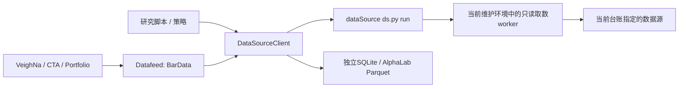

# dataSource → VeighNa 数据接入

已在本机安装并配置。面向个人的A股／ETF择时与轮动研究，提供标准历史行情接口和策略用研究数据接口。

> **2026-09-21 起默认读本地回测库**：`D:\repo\dataSource\data\backtest` 的固定快照（DuckDB 读 Parquet，毫秒级、离线、带 `snapshot_id`）。标准 Datafeed 先查本地库，本地没有的数据集（如 A 股个股 1 分钟线）再走原在线路径。批量灌库用 `load-warehouse`。本地库的覆盖区间和口径以 [dataSource warehouse README](../../../dataSource/warehouse/README.md) 的"数据覆盖与可用区间"为准。

## 现在可以怎么用

在 `D:\repo\vnpy` 打开PowerShell：

```powershell
# 从本地回测库快照批量灌一批标的到独立 SQLite（正式回测离线读它；换快照就换目录）
.\integrations\vnpy_datasource\datasource.ps1 load-warehouse --symbols 159915.SZSE 510300.SSE 600519.SSE --start 2024-01-01 --end 2026-09-18 --target sqlite --output D:\repo\vnpy\research_data\wh_etf_sqlite
# 固定某个快照复现旧实验
.\integrations\vnpy_datasource\datasource.ps1 load-warehouse --symbols 159915.SZSE --start 2024-01-01 --end 2026-09-18 --snapshot 20260920T173637Z-c6cc6b2e --target sqlite --output D:\repo\vnpy\research_data\wh_repro
# 端到端：本地库 → SQLite → vnpy 数据库层 → CTA 回测（进程内指定 database.database，不改全局配置）
& D:\veighna_studio\python.exe -X utf8 .\integrations\vnpy_datasource\examples\warehouse_backtest.py

# 看当前台账、已实现配方及未就绪原因
.\integrations\vnpy_datasource\datasource.ps1 capabilities

# 下载ETF日线到一个明确的独立回测库
.\integrations\vnpy_datasource\datasource.ps1 download --symbol 159915.SZSE --start 2025-01-01 --end 2026-09-15 --target sqlite --output D:\repo\vnpy\research_data\etf_sqlite

# 同样的数据可直接用于AlphaLab
.\integrations\vnpy_datasource\datasource.ps1 download --symbol 159915.SZSE --start 2025-01-01 --end 2026-09-15 --target alpha --output D:\repo\vnpy\research_data\etf_alpha

# 或写入不可变研究库（research_store）：保留真实NULL与历史元数据，快照读回校验
.\integrations\vnpy_datasource\datasource.ps1 download --symbol 159915.SZSE --start 2025-01-01 --end 2026-09-15 --target store --output D:\repo\vnpy\research_data\etf_store

# 运行最小研究示例：标准Datafeed + ETF数据 + 交易日历
& D:\veighna_studio\python.exe -X utf8 .\integrations\vnpy_datasource\examples\research_data.py
```

`download`创建独立数据目录，保存后读回校验，并记录来源、复权和缺失字段。它拒绝向不受本插件管理的非空目录写入。同一目录不能混用SQLite／Alpha或原价／不同复权口径。

### `--target store`：不可变研究库

`store`目标把下载结果写入 [vnpy_researchstore](../vnpy_researchstore) 的不可变research_store，而不是SQLite／Parquet：

- 原始结果JSON（records、metadata、attempts、request、registry_sha256、fetched_at 全部原样，不改写历史取值）先落盘到库内 `captures/`，以内容SHA-256登记为导入资产；相同载荷重复下载幂等重放，不产生重复行。
- 缺失成交额等字段保持真实NULL（不写0占位），每行缺失字段记入`field_quality` JSON；日线边界为上海当日00:00至次日00:00的UTC纳秒区间。
- 每次发布后冻结快照并真实读回，逐行比对OHLCV／成交额／交易日；同键不同值返回`status: conflict`（退出码1），绝不静默覆盖。
- 数据源回执写在库内 `reports/`；库根只有store自己的`store.json`身份，不写`datasource-manifest.json`。
- 需要research_store可导入：`D:\repo\vnpy\integrations\vnpy_researchstore\.venv` 的解释器已带research_store、pyarrow、duckdb、zstandard；否则报带安装指引的RuntimeError。对应测试只能用该解释器运行（其他解释器下整组跳过）。

安装前备份为 `D:\repo\vnpy\.vntrader\vt_setting.before_datasource.json`。当前配置只新增非秘密键：

```json
{
  "datafeed.name": "datasource",
  "datafeed.datasource_root": "D:/repo/dataSource",
  "datafeed.datasource_timeout": 120
}
```

可选键：`datafeed.datasource_prefer_warehouse`（默认 `true`，设 `false` 强制走在线源）、`datafeed.datasource_snapshot`（固定本地库快照编号，默认读当前指针）。

### 本地回测库路径（`WarehouseReader`）

- 代码映射：`600519.SSE`↔`600519.XSHG`、`159915.SZSE`↔`159915.XSHE`；周期 `d/1m/5m/15m/30m/1h`↔`1d/1m/5m/15m/30m/60m`；资产由 `history_params` 判定（可 `--asset` 指定）。
- 本地分钟线是**区间结束**标签，读出时按周期减去一根转换为 vnpy 的**开始**标签（09:31→09:30），`metadata.time_label="start"`。分钟请求的 `end` 若只给日期会按 00:00 截断，与原在线路径一致，要含当日请给到 15:00。
- 只提供未复权价；`adjust!=none` 返回 `unsupported`，不会静默改走在线复权源。
- 停牌占位行（`paused=1`）不进入 BarData，`metadata.paused_rows_dropped` 记数量；指数在线段 `volume` 为空的行按 0 写入并在 `missing_fields`/`volume_missing_at` 标出（深成指/创业板指 2026-08 起）；缺成交额同原规则用 0 占位并记回执。
- 每个结果与回执都带 `snapshot_id`；`load-warehouse` 的目录 manifest/receipts 里同样有，回测结果应记录它。
- 本地没有的数据集（A 股个股 1 分钟、可转债日线等）返回 `no_data: dataset_not_in_warehouse:*`，Datafeed 随后按原逻辑尝试在线源。
- 需要 Studio Python 装有 `duckdb`、`pyarrow`（2026-09-21 已装 1.5.5 / 25.0.1）；缺依赖时 `WarehouseReader.available()` 为 False，Datafeed 自动退回在线路径。

已打开的Trader需要正常关闭后重新打开，新的进程才会加载该Datafeed。运行目录继续选 `D:\repo\vnpy`。插件未启动交易接口或策略。

## 两条调用路径



- Studio使用Python **3.13**；供应商查询由 `D:\repo\dataSource` 当前维护环境执行。环境升级后下一次查询会重新读活动环境指针。
- 每次调用重新读取台账、验证时间、能力观测、禁用函数和端点。源级verified不等于全部配方可用。
- 源库中的 `invoke.call` 是示例文本。本插件用固定只读函数名单执行，不执行这些字符串。
- 凭证只在隔离worker中从dataSource根目录`.env`读取。请求参数、日志和结果不携带凭证。
- A股免费源直连；Yahoo使用台账对应代理。设置只影响短时worker。
- 子进程有超时、整棵进程树清理和固定错误码。失败及后备尝试保留在`attempts`。

### 1. 标准VeighNa接口

```python
from datetime import datetime
from vnpy.trader.constant import Exchange, Interval
from vnpy.trader.datafeed import get_datafeed
from vnpy.trader.object import HistoryRequest

feed = get_datafeed()
bars = feed.query_bar_history(HistoryRequest(
    symbol="159915", exchange=Exchange.SZSE, interval=Interval.DAILY,
    start=datetime(2025, 1, 1), end=datetime(2026, 9, 15),
))
if not bars:
    raise RuntimeError(feed.last_result)
print(bars[-1].close_price, feed.last_result["source"])
```

标准Datafeed固定返回**不复权**行情。本地库命中时日线、ETF/指数 1 分钟、已导入证券的 60 分钟均可用；A 股个股 1 分钟本地没有，在线也没有通过质量验证的来源，会明确失败。5／15／30分钟可由Client读取，但VeighNa原生没有这些独立`Interval`枚举，不能写成`1m`冒充一分钟。

已有模块的行为：

| 入口 | 如何消费 |
|---|---|
| DataManager、CTA Backtester下载 | 无可查询历史的Gateway时使用Datafeed，随后写当前Database |
| CTA／Portfolio初始化 | 无历史Gateway时走Datafeed；空结果可能回退既有Database，须检查失败日志 |
| CTA／Portfolio正式回测 | 读取Database；应先下载，或在运行配置中选择独立研究库 |
| Alpha研究 | 使用明确指定的AlphaLab目录，不会自动读取SQLite |
| `MainEngine.query_history` | 仍是Gateway方法，不会因为Datafeed配置而自动改路由 |

GUI／策略查询会在 `.vntrader/datasource_receipts/` 留下简短来源回执，因为原生SQLite会丢掉`BarData.extra`。

独立SQLite库可以在Trader全局配置的`database.database`中指定完整路径，例如`D:/repo/vnpy/research_data/etf_sqlite/database.db`，然后重启。此次未替换当前默认数据库。

### 2. 直接调用研究数据

```python
from vnpy_datasource import DataSourceClient

client = DataSourceClient("D:/repo/dataSource", timeout=120)

calendar = client.query("交易日历", {
    "start": "2026-09-01", "end": "2026-09-15",
})
quotes = client.query("实时行情_批量", {
    "symbols": ["159915.SZSE", "510300.SSE"],
})
five_minute = client.history(
    "159915.SZSE", "2026-09-14", "2026-09-14", interval="5m", asset="etf",
)
profit = client.query_source("baostock", "financial_profit", {
    "symbol": "600519.SSE", "year": 2025, "quarter": 4,
})
if profit["status"] != "ok":
    raise RuntimeError(profit["attempts"])
```

返回结构为`status/source/recipe/kind/records/metadata/attempts/request/fetched_at/registry_sha256`。财务及选股表格保留源端字段，不能当作统一财务数据模型。一个路由列出多个配方时须给`recipe=`，或直接指定`query_source`；宏观、财表、成分与权重之间不做语义不同的自动替代。

`ok`表示本次调用返回数据，**不表示全区间完整、PIT历史或策略有效性已验证**。`no_data`、`unsupported`、`source_unavailable`和`error`分别保留。CLI分别使用退出码2、3、4和1；成功为0。

## 已适配范围

当前实现 **7个源、54个配方分支**；其中52个在当前台账中有可用配方，仍受市场／周期／参数限制。这不是全部40个台账源、58条路由或全部配方的无差别执行器。完整清单用`capabilities`查询，未实现项会显示`adapter_not_implemented`。

| 源 | 本插件覆盖 | 重要边界 |
|---|---|---|
| 新浪 | 股票／ETF／指数日线、日历、ETF列表／快照、个股快照 | ETF不提供复权承诺；可能缺成交额 |
| 腾讯 | 股票原价／复权、指数、批量报价、分时点 | 分时点不是完整OHLCV；数量单位按具体接口修正 |
| BaoStock | 日线、5/15/30/60分钟、日历、证券资料、财务、估值、分红、因子、行业、指数成分 | 不提供原生1分钟；各资料表不能自动宣称PIT |
| Tushare既有网关 | 原价股票日线、因子、日历、基础资料、income、资金流、两融 | 不调用分钟线；`daily`不冒充复权；其他财表尚未适配 |
| 雪球 | 批量快照 | 实时快照不能用于过去时点回测 |
| 妙想 | 选股、DDX、涨停、资金、基本面关键词查询 | 保留partialResults及是否截断；没有历史可知时点保证 |
| Yahoo | 原价日线、海外原生行情、资料、财报、公司行动、批量 | A股／ETF分钟因真实质量问题禁用；海外数据保留原生时区和单位，不转换成中国BarData |

未实现的已登记源、尚无权限的miniQMT/PTrade/Wind等均不会被标成已接通。新增配方时只扩展provider白名单和针对性测试，不修改vnpy核心或dataSource台账。

Yahoo的159915原价日线补测也遇到上游`YFPricesMissingError`，已保留失败证据；因此不要把已实现适配或源级verified等同于任意标的、窗口都能取得数据。

## 数据语义

- 证券代码显式带交易所，例如`159915.SZSE`。自动识别常用ETF／指数前缀；不明确时传`asset=`。
- 无时区时间按上海解释；日线是交易日期标签，不代表开盘时数据已知。当前日线须到上海15:15后才接纳；分钟线必须完成，并留一分钟确认缓冲。
- 分钟时间使用K线开始时刻。BaoStock的结束标签会按周期向前转换。
- 不前向补齐缺失行情，不生成虚拟成交K线，不承诺完整交易日覆盖。
- 中国股票／ETF规范化成交量为股／份，成交额为人民币元。腾讯指数和AKShare1.18.94中`sz000`股票的100倍量纲问题已有实测修正及测试；升级SDK后应复核这些样本。
- 源端缺失成交额时Client保留`None`。转换成BarData／SQLite／Alpha时为兼容既有浮点接口使用0占位，同时回执记录缺失日期。需要成交额的策略应先拒绝`missing_fields`含`turnover`的输入。
- qfq/hfq是源端复权口径，历史查询结果可能随新公司行动重算。保留抓取时点，更新复权研究快照时使用新目录，避免分批拼接不同基准。原价ETF价格收益不自动包含分红再投资。
- 此插件没有实现历史逐笔、L2或对新缠论引擎的信号适配。`examples/czsc_strategy`继续归档；缠论择时项目仍是`D:\repo\czsc-timing-engine`。

## 安装、依赖与撤回

本机已执行可编辑安装，因此本目录代码更新后新Python进程可直接使用：

```powershell
& D:\veighna_studio\python.exe -m pip install --no-deps -e D:\repo\vnpy\integrations\vnpy_datasource
```

为真实验证AlphaLab读取，已补装Polars、PyArrow、Alphalens及其缺少依赖。安装时固定了Studio所有既有发行包版本，核对确认没有修改既有包；`pip check`通过。Alpha最小依赖选择保存在`requirements-studio-alpha.txt`。

此处固定`empyrical-reloaded==0.5.9`是因为更新版本的`peewee<3.17.4`约束会与已装`vnpy_sqlite`要求的`peewee>=3.17.9`冲突；未降级Studio数据库依赖。依赖事实可在[PyPI元数据](https://pypi.org/pypi/empyrical-reloaded/0.5.12/json)核对。

撤回数据服务配置时，从备份恢复上述三个`datafeed.*`键，并正常重启Trader；保留其他后续配置。插件可通过Studio Python执行`-m pip uninstall vnpy_datasource`卸载。研究数据和回执不会因卸载插件而删除。

## 验证与入口文件

- [验证记录](VERIFICATION.md)
- [命令行入口](datasource.ps1)
- [最小研究例子](examples/research_data.py)
- [只读CTA例子](examples/cta_data_probe.py)
- [显式运行的真实取数检查](tools/verify_live.py)

```powershell
& D:\veighna_studio\python.exe -m pytest .\integrations\vnpy_datasource\tests -q
& D:\veighna_studio\python.exe -m ruff check .\integrations\vnpy_datasource
# store目标测试需要research_store依赖，用其.venv解释器真实运行：
& D:\repo\vnpy\integrations\vnpy_researchstore\.venv\Scripts\python.exe -m pytest .\integrations\vnpy_datasource\tests -q
```

这些测试不调用网络。真实检查脚本会单独执行小窗口取数并写入本插件忽略的`output/`目录。
